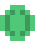

<p align="center">
  
</p>

# 🕹️ 16 Classic C++ Games: A Classic Adventure! 👾

Get ready for a nostalgic journey! This is an epic collection of 16 classic games, reimagined and implemented in C++ with the power of SFML (Simple and Fast Multimedia Library). Dive into pixelated graphics and addictive gameplay that harks back to the golden age of arcades!

## 🎮 The Pixelated Game Collection!

Explore our gallery of classics, each with its pixel art charm and unique challenges:

1. **Tetris** - The legendary falling blocks puzzle. Fit them perfectly!
2. **Doodle Jump** - Jump endlessly in this vertical adventure. How high can you go?
3. **Arkanoid** - Break all the bricks with your ball and paddle. A classic arcade!
4. **Snake** - Guide your hungry snake, eat and grow, but be careful not to bite your tail!
5. **Minesweeper** - Uncover the minefield! Mark the bombs and clear the board.
6. **Fifteen Puzzle** - Slide the numbered tiles and organize the puzzle. A challenge for the mind!
7. **Racing (Top Down)** - Go full throttle in this top-down arcade racing game. Hit the gas!
8. **Outrun** - Feel the speed in a classic 3D race. The asphalt awaits you!
9. **Xonix** - Conquer territory, but escape from enemies. Expand your domain!
10. **Bejeweled** - Match 3 or more gems and make them disappear. Sparkle and strategy!
11. **NetWalk (Pipe Puzzle)** - Connect the pipes and complete the network. A plumbing puzzle!
12. **Mahjong Solitaire** - Find the pairs and clear the board. Relax with this oriental classic.
13. **Tron** - Create light walls and surround your opponents. The Tron arena awaits you!
14. **Chess** - The game of kings and queens. Challenge your mind in chess!
15. **Volleyball** - Serve, receive, and attack! A fun and simple volleyball match.
16. **Asteroids** - Pilot your ship, dodge and destroy asteroids. The galaxy needs you!

## 🛠️ Prerequisites

To embark on this pixelated adventure, you'll need a few tools:

- **C++ Compiler** (supporting C++11 or later)
- **SFML Library** (Simple and Fast Multimedia Library)
- **SQLite3 Library** (for games requiring data persistence)
- **CMake** (optional, but highly recommended for building)

### Installing SFML

Getting SFML ready is straightforward. Choose your operating system:

#### Ubuntu/Debian:
```bash
sudo apt-get install libsfml-dev
```

#### macOS (with Homebrew):
```bash
brew install sfml
```

#### Windows:
- Download SFML from the [official website](https://www.sfml-dev.org/download.php)
- Follow the installation guide for your compiler

## 🚀 How to Build and Run

Ready to jump into the action? Each game is self-contained and can be compiled independently.

### Using g++ directly:
For a quick start, navigate to a game's directory and compile with g++:
```bash
cd "01 Tetris"
g++ -o tetris main.cpp -lsfml-graphics -lsfml-window -lsfml-system
./tetris
```

### Using CMake (Recommended for all games):
For a more robust build process, especially if you plan to build all games, CMake is your friend:
```bash
mkdir build
cd build
cmake ..
make
```

## 🎯 Game Controls

Mastering the controls is key to victory! While specific controls vary per game, here are the common patterns you'll encounter:

- **Arrow Keys** - Movement/Navigation
- **Space** - Action/Shoot
- **Mouse** - Selection/Interaction
- **ESC** - Pause/Menu

For detailed controls, keep an eye on the game window itself or peek into the source code comments!

## 📁 Project Structure

This project is organized into several modules, with each game residing in its own dedicated directory. Below is a high-level overview of the project's package structure:

```
.
├── 01 Tetris/
│   ├── main.cpp
│   └── images/
├── 02 Doodle Jump/
│   ├── main.cpp
│   └── images/
├── ...
├── build/
├── cmake-build-debug/
├── docs/
├── scripts/
├── Writerside/
└── README.md
```

Each game directory (e.g., `01 Tetris/`, `02 Doodle Jump/`) typically contains:
- `main.cpp` - The main source code file for the game.
- `images/` - A directory holding game assets like sprites and textures.
- `fonts/` (optional) - A directory for custom fonts used in the game.
- Other specific files (e.g., `shader.frag` for Tron, `Connector.hpp` for Chess) as needed by the game.

The top-level directories include:
- `build/` and `cmake-build-debug/`: Directories for build artifacts generated by CMake.
- `docs/`: Contains project documentation.
- `scripts/`: Utility scripts for various tasks.
- `Writerside/`: Related to documentation generation using JetBrains Writerside.
- `README.md`: This very file, providing an overview of the project.

## 🔧 Development Notes

A peek behind the pixelated curtain:

- All games are crafted using **SFML** for seamless graphics, audio, and input handling.
- Some games utilize **SQLite3** for data persistence, such as high scores.
- Each game follows a consistent structure, featuring robust game loops, efficient event handling, and smooth rendering.
- Most games boast charming sprite-based graphics, powered by their respective image assets.
- Keep an eye out! Some games might require additional files like custom fonts or unique sound effects to complete the experience.

## 🤝 Contributing

Want to join the pixel art development team? Your contributions are highly welcome! Feel free to enhance this collection by:

- Improving existing games (e.g., adding new levels, power-ups)
- Adding exciting new features
- Squashing pesky bugs
- Optimizing performance for even smoother gameplay
- Integrating awesome sound effects or background music

## 📝 License

This project is open source, just like the best retro games! Please check individual game files for specific licensing information.

## 🙏 Acknowledgments

A huge shout-out to:

- The **SFML Team** for providing such an excellent and fast multimedia library. You're the real MVPs!
- The brilliant classic game developers who laid the foundation for these timeless concepts.
- The amazing gaming community for continuous inspiration and valuable feedback.

---

**Now, go forth and enjoy playing these classic games! 🎮**
