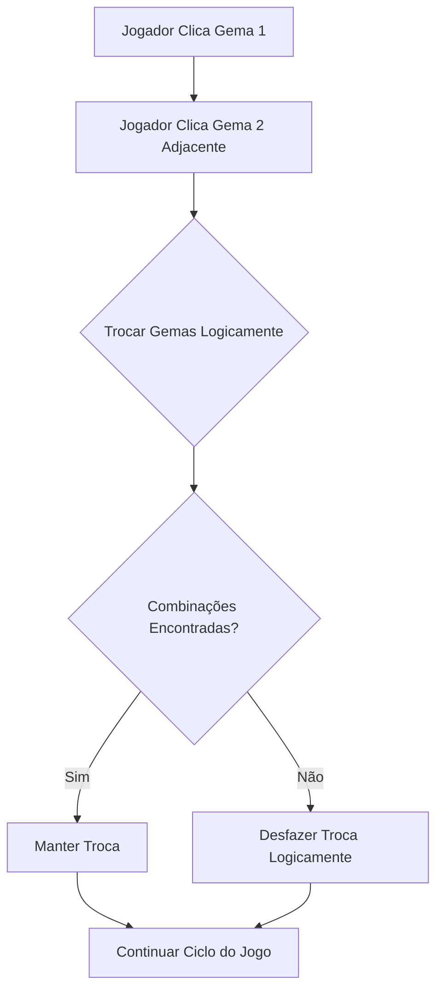
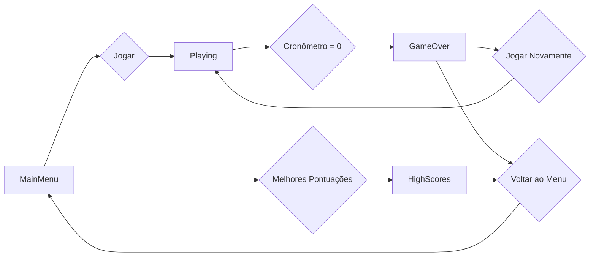

# Bejeweled

Este tutorial explora a fundo a criação do jogo Bejeweled, um clássico "match-3", utilizando C++ e SFML. Abordaremos desde os conceitos fundamentais do design de jogos até a implementação de mecânicas complexas e a integração com um sistema de pontuação persistente usando SQLite.

## O que é Bejeweled?

Bejeweled é um jogo de quebra-cabeça onde o objetivo é combinar três ou mais gemas da mesma cor, seja na horizontal ou na vertical. Ao fazer uma combinação, as gemas desaparecem, novas gemas caem para preencher os espaços vazios, e o jogador ganha pontos. O jogo continua até que o tempo se esgote ou não haja mais movimentos possíveis.

### Conceitos Fundamentais:
- **Grade de Jogo**: Um tabuleiro 8x8 (ou similar) preenchido com gemas.
- **Gemas**: Peças coloridas que o jogador manipula.
- **Combinações (Matches)**: Três ou mais gemas idênticas alinhadas.
- **Troca (Swap)**: O jogador troca a posição de duas gemas adjacentes.
- **Queda (Gravity)**: Gemas acima de espaços vazios caem para preenchê-los.
- **Preenchimento (Refill)**: Novas gemas aparecem no topo para completar a grade.

## O Ciclo de Jogo (Game Loop)

Todo jogo é construído em torno de um ciclo de execução contínuo, conhecido como "Game Loop". Este ciclo é responsável por processar as entradas do jogador, atualizar o estado do jogo e renderizar os gráficos na tela. No Bejeweled, este ciclo é fundamental para a fluidez das animações e a resposta às interações.

```mermaid
graph TD
    A[Início do Jogo] --> B{Loop Principal do Jogo};
    B --> C[Processar Eventos (Input do Jogador)];
    C --> D[Atualizar Lógica do Jogo (Mecânicas, Tempo, Estados)];
    D --> E[Renderizar Gráficos (Desenhar na Tela)];
    E --> B;
    B -- Fim do Jogo --> F[Encerrar Aplicação];
```

## A Concepção do Jogo: "Think Hard"

Para construir um jogo como Bejeweled, precisamos pensar em cada etapa, desde a representação dos dados até a lógica de animação e persistência.

### 1. Representação da Grade e das Gemas

Como vamos armazenar as gemas na grade? Uma matriz 2D é a escolha natural. Cada elemento da matriz representará uma célula da grade, e seu valor indicará o tipo (cor) da gema.

```cpp
// Estrutura para representar cada peça (gema) na grade
struct piece
{
  int x, y, col, row, kind, match, alpha, special;
  piece(){match=0; alpha=255; special=0;}
} grid[10][10]; // Usamos 10x10 para facilitar bordas e cálculos
```
A escolha de uma matriz `grid[10][10]` para um tabuleiro de 8x8 não é arbitrária. As linhas e colunas extras (índices 0 e 9) servem como "bordas sentinela" ou "padding". Isso simplifica significativamente a lógica de verificação de vizinhos e limites, evitando a necessidade de múltiplas verificações `if` para os cantos e bordas do tabuleiro real (índices 1 a 8).

Cada campo da `struct piece` tem um propósito crucial:
- `x`, `y`: Coordenadas em pixels na tela. Estas são as posições visuais da gema. Elas são atualizadas durante as animações de queda e troca.
- `col`, `row`: Coordenadas lógicas da gema na matriz `grid`. `col` refere-se à coluna e `row` à linha. Estas são as posições "reais" da gema no tabuleiro lógico do jogo.
- `kind`: O tipo da gema, geralmente representando sua cor ou design. Um valor inteiro (0-6) é eficiente para mapear a texturas ou cores.
- `match`: Uma flag booleana (0 ou 1) que indica se esta gema faz parte de uma combinação detectada. Gemas marcadas com `match = 1` serão removidas.
- `alpha`: O canal alfa (transparência) da gema. Usado para criar efeitos de desaparecimento suaves. Um valor de 255 significa totalmente opaco, 0 significa totalmente transparente.
- `special`: Uma flag para indicar se a gema é um tipo especial (ex: uma bomba que explode gemas adjacentes, uma gema que limpa uma linha/coluna). Isso permite a criação de mecânicas mais avançadas.

### 2. Mecânicas Principais

As mecânicas de um jogo "match-3" operam em um ciclo contínuo: jogador interage -> jogo processa -> jogo reage -> jogo se prepara para próxima interação.

#### a) Troca de Gemas (Swap)

A troca é a interação fundamental do jogador. Quando duas gemas são clicadas, suas posições na grade são trocadas.

```cpp
void swap(piece p1,piece p2)
{
  std::swap(p1.col,p2.col);
  std::swap(p1.row,p2.row);

  grid[p1.row][p1.col]=p1;
  grid[p2.row][p2.col]=p2;
}
```
**Análise Detalhada da Troca:**
1.  **Identificação da Troca**: O jogador clica em uma gema (`click=1`), e depois em uma segunda gema adjacente (`click=2`). As coordenadas dessas gemas são capturadas.
2.  **Validação da Adjacência**: Antes de qualquer troca, o jogo verifica se as duas gemas selecionadas são adjacentes (horizontal ou verticalmente). Se não forem, a segunda gema clicada se torna a primeira, e o processo recomeça (`click=1`).
3.  **Troca Lógica**: A função `swap` é chamada. É importante notar que a função `std::swap` dentro de `swap(piece p1, piece p2)` está trocando os *valores* das cópias `p1` e `p2`, não as gemas diretamente na `grid`. O código fornecido é uma simplificação. Na implementação real, você precisaria trocar os elementos da matriz `grid` diretamente, ou passar `p1` e `p2` por referência, ou, mais comumente, trocar os `kind` (tipo/cor) das gemas nas posições `(y0, x0)` e `(y, x)` e então atualizar suas coordenadas `col` e `row` para refletir a nova posição.
    ```cpp
    // Exemplo de como a troca real deveria ser implementada no contexto do jogo
    // Assumindo que (y0, x0) e (y, x) são as coordenadas das gemas clicadas
    piece temp = grid[y0][x0];
    grid[y0][x0] = grid[y][x];
    grid[y][x] = temp;

    // Atualizar as propriedades col/row das peças que foram movidas
    grid[y0][x0].col = x0; grid[y0][x0].row = y0;
    grid[y][x].col = x; grid[y][x].row = y;
    ```
4.  **Verificação Pós-Troca**: Após a troca lógica, o jogo imediatamente verifica se essa troca resultou em *qualquer* combinação.
5.  **Desfazer a Troca (se necessário)**: Se a troca não gerar nenhuma combinação válida, ela deve ser desfeita. Isso é crucial para a jogabilidade do Bejeweled, onde apenas trocas que resultam em matches são permitidas. O estado `isSwap` e a verificação `!hasMatches` no loop principal são usados para isso: `if (isSwap && !isMoving) { if (!hasMatches) swap(grid[y0][x0],grid[y][x]); else score += currentMatchScore * 10; isSwap=0; }`.

**Fluxo da Troca de Gemas (Tentar e Desfazer):**


#### b) Detecção de Combinações (Match Finding)

Após cada troca, o jogo deve varrer a grade para encontrar combinações de 3 ou mais gemas.

```cpp
// Simplificação da lógica de detecção de combinações
bool hasMatches = false;
for(int i=1;i<=8;i++) { // Iterar sobre a grade (ignorar bordas)
    for(int j=1;j<=8;j++) {
        // Verificar combinações horizontais
        if (j<=6 && grid[i][j].kind==grid[i][j+1].kind && grid[i][j].kind==grid[i][j+2].kind) {
            for(int k=0;k<3;k++) grid[i][j+k].match = 1; // Marcar como combinada
            hasMatches = true;
        }
        // Verificar combinações verticais
        if (i<=6 && grid[i][j].kind==grid[i+1][j].kind && grid[i][j].kind==grid[i+2][j].kind) {
            for(int k=0;k<3;k++) grid[i+k][j].match = 1; // Marcar como combinada
            hasMatches = true;
        }
    }
}
```
**Análise Detalhada da Detecção de Combinações:**
1.  **Varredura Exaustiva**: O algoritmo percorre cada célula do tabuleiro (ignorando as bordas sentinela, daí `i=1` a `8` e `j=1` a `8`). Para cada célula, ele verifica se há uma combinação de 3 ou mais gemas idênticas começando naquela posição, tanto na horizontal quanto na vertical.
2.  **Condições de Verificação**:
    *   `j<=6`: Garante que há pelo menos duas células à direita para verificar uma combinação horizontal de 3.
    *   `i<=6`: Garante que há pelo menos duas células abaixo para verificar uma combinação vertical de 3.
    *   `grid[i][j].kind==grid[i][j+1].kind && grid[i][j].kind==grid[i][j+2].kind`: Compara os tipos (cores) das gemas.
3.  **Marcação de Combinações**: Se uma combinação é encontrada, as gemas envolvidas são marcadas com `grid[...].match = 1`. Esta marcação é crucial para as fases subsequentes de desaparecimento e queda.
4.  **Complexidade**: A complexidade deste algoritmo é O(N*M), onde N é o número de linhas e M é o número de colunas. Para um tabuleiro 8x8, isso é 8*8 = 64 verificações por tipo de combinação (horizontal/vertical), o que é extremamente rápido.
5.  **Gemas Especiais (Think Ultra Hard)**:
    *   **Criação**: Se uma combinação de 4 gemas é feita, a gema que foi trocada para formar a combinação (ou uma gema central) pode se tornar uma gema especial (ex: `grid[y][x].special = 1`). O código já tem a flag `special`.
    *   **Ativação**: Quando uma gema especial marcada com `match = 1` é processada, ela pode ativar um efeito secundário. Por exemplo, uma gema "bomba" pode marcar todas as gemas adjacentes (3x3) com `match = 1`, criando uma reação em cadeia. O código já tem uma lógica de "Bomb activation" que faz isso.
    *   **Reações em Cadeia**: A detecção de combinações e a ativação de gemas especiais podem ser iterativas. Após uma rodada de matches e ativações, o jogo pode precisar re-verificar por novas combinações criadas pelas explosões, até que não haja mais matches.

**Visualização da Detecção de Combinações:**
Imagine o tabuleiro. O algoritmo varre cada célula e "olha" para a direita e para baixo para encontrar 3 gemas iguais.

```
[G1] [G1] [G1] [G2] ...  (Horizontal Match)
[G3]
[G3]
[G3]
[G4]
...                      (Vertical Match)
```

#### c) Animação de Desaparecimento e Pontuação

Gemas combinadas não desaparecem instantaneamente. Elas diminuem a transparência (`alpha`) para criar um efeito visual suave. Durante essa fase, a pontuação é atualizada.

```cpp
// Lógica de animação de desaparecimento
if (!isMoving) // Se não houver gemas caindo
    for (int i=1;i<=8;i++)
        for (int j=1;j<=8;j++)
            if (grid[i][j].match) // Se a gema faz parte de uma combinação
                if (grid[i][j].alpha>10) {grid[i][j].alpha-=10; isMoving=true;} // Diminuir alpha
```
**Análise Detalhada da Animação de Desaparecimento:**
1.  **Controle de Fluxo (`isMoving`)**: A animação de desaparecimento só ocorre se `!isMoving` for verdadeiro. Isso garante que as gemas não desapareçam enquanto outras gemas ainda estão caindo ou se movendo.
2.  **Diminuição Gradual do `alpha`**: Para cada gema marcada com `match = 1`, seu valor `alpha` é gradualmente reduzido (ex: `alpha-=10`). Isso cria um efeito de "fade out".
3.  **Sinalização de Animação**: Se qualquer gema estiver em processo de desaparecimento (`alpha > 10`), a flag `isMoving` é definida como `true`. Isso impede que outras fases do jogo (como a queda de gemas) comecem antes que a animação atual termine.
4.  **Pontuação**: A pontuação é geralmente calculada e adicionada ao `score` quando as gemas são marcadas como `match = 1`, ou quando a animação de desaparecimento está completa. O código mostra `score += currentMatchScore * 10;` após a verificação de matches, o que é um bom ponto para adicionar a pontuação.

#### d) Queda de Gemas (Gravity)

Após as gemas combinadas desaparecerem, as gemas acima delas devem cair para preencher os espaços vazios.

```cpp
// Atualização da grade após combinações
if (!isMoving) // Se não houver animações de movimento
{
    // Mover gemas para baixo para preencher espaços vazios
    for(int i=8;i>0;i--) // De baixo para cima
        for(int j=1;j<=8;j++) // Da esquerda para a direita
            if (grid[i][j].match) // Se a gema foi combinada (espaço vazio)
                for(int n=i;n>0;n--) // Procurar gema acima
                    if (!grid[n][j].match) {swap(grid[n][j],grid[i][j]); break;}; // Trocar com a gema acima
    // ... (lógica para preencher o topo com novas gemas)
}
```
**Análise Detalhada da Queda de Gemas:**
1.  **Iteração de Baixo para Cima**: O loop externo (`for(int i=8;i>0;i--)`) itera as linhas de baixo para cima. Isso é crucial. Se iterássemos de cima para baixo, uma gema poderia cair em um espaço vazio, mas o espaço vazio abaixo dela não seria preenchido na mesma iteração.
2.  **Identificação de Espaços Vazios**: Uma célula é considerada "vazia" se sua gema foi marcada com `match = 1` (e já desapareceu).
3.  **Busca por Gema Acima**: Para cada espaço vazio, o loop interno (`for(int n=i;n>0;n--)`) procura a primeira gema *não combinada* (`!grid[n][j].match`) diretamente acima na mesma coluna.
4.  **Troca e Deslocamento**: Uma vez encontrada uma gema acima, ela é trocada com o espaço vazio. Isso efetivamente faz a gema "cair". O `break` é importante para que apenas a primeira gema acima caia para aquele espaço.
5.  **Animação de Queda (Think Ultra Hard)**: A troca lógica (`swap`) apenas atualiza as posições na matriz. Para uma animação suave, as coordenadas `x` e `y` em pixels das gemas precisam ser atualizadas gradualmente ao longo do tempo. A flag `isMoving` seria definida como `true` durante essa animação, e as gemas se moveriam pixel a pixel até suas novas posições `(row*ts, col*ts)`.

**Visualização da Queda de Gemas:**
Imagine uma coluna de gemas. O algoritmo encontra um espaço vazio (X) e move a gema acima (G) para baixo.

```
[G]   [ ]
[ ]   [G]
[X]   [X]
[B]   [B]
```

#### e) Preenchimento da Grade (Refill)

Finalmente, os espaços vazios no topo da grade são preenchidos com novas gemas geradas aleatoriamente.

```cpp
// Preencher o topo com novas gemas
for(int j=1;j<=8;j++) // Para cada coluna
    for(int i=8,n=0;i>0;i--) // De baixo para cima
        if (grid[i][j].match) // Se a gema foi combinada (espaço vazio)
        {
            grid[i][j].kind = rand()%7; // Nova gema aleatória
            grid[i][j].y = -ts*n++; // Posição inicial acima da tela para animação de queda
            grid[i][j].match=0; // Resetar flag de combinação
            grid[i][j].alpha = 255; // Resetar transparência
            grid[i][j].special = 0; // Resetar flag de especial
        }
```
**Análise Detalhada do Preenchimento da Grade:**
1.  **Identificação de Espaços Vazios Remanescentes**: Após a queda das gemas existentes, ainda pode haver espaços vazios no topo da grade (onde as gemas caíram de fora da tela ou onde as gemas originais foram removidas). Estes são identificados novamente pela flag `match = 1`.
2.  **Geração Aleatória**: Para cada um desses espaços, uma nova gema é gerada com um `kind` aleatório (`rand()%7`).
3.  **Posicionamento para Animação de "Chuva"**: A linha `grid[i][j].y = -ts*n++;` é a chave para a animação de "chuva".
    *   `ts`: Tamanho do tile (gema) em pixels.
    *   `n++`: Um contador que garante que cada nova gema na mesma coluna comece progressivamente mais acima da tela. Por exemplo, a primeira gema a ser preenchida no topo de uma coluna pode ter `y = -ts`, a próxima `y = -2*ts`, e assim por diante. Isso cria um efeito visual de que as gemas estão caindo de fora da tela.
4.  **Reset de Flags**: As flags `match`, `alpha` e `special` são resetadas para as novas gemas, preparando-as para futuras interações.
5.  **Ciclo Contínuo**: Após o preenchimento, o jogo pode precisar re-verificar por novas combinações, pois as gemas recém-caídas podem ter formado novos matches. Este ciclo de "detecção -> desaparecimento -> queda -> preenchimento -> re-detecção" continua até que não haja mais combinações.

**Visualização da Animação de "Chuva":**
Imagine novas gemas (N) aparecendo acima da tela e caindo para preencher os espaços vazios (X).

```
[N]
[N]
[X]
[X]
[G]
```

### 3. Sistema de Pontuação e Tempo

O jogo tem um cronômetro regressivo (`gameTimer`) e uma pontuação (`score`).

```cpp
float gameTimer; // Tempo restante de jogo
int score = 0;   // Pontuação atual
```
**Análise Detalhada do Sistema de Pontuação e Tempo:**
1.  **`gameTimer`**: Inicializado com um valor (ex: 60 segundos). A cada frame, o `deltaTime` (tempo decorrido desde o último frame) é subtraído de `gameTimer`.
2.  **Game Over**: Quando `gameTimer` atinge ou passa de zero, o `gameState` muda para `GameOver`. Neste ponto, a pontuação final do jogador é salva no sistema de persistência.
3.  **`score`**: Incrementado com base no número de gemas combinadas. Combinações maiores ou reações em cadeia podem conceder bônus de pontuação.

### 4. Estados do Jogo (Game State Management)

Para gerenciar as diferentes telas (menu, jogo, game over, high scores), usamos um `enum`.

```cpp
enum GameState { MainMenu, Playing, GameOver, HighScores };
GameState gameState = MainMenu;
```
**Análise Detalhada dos Estados do Jogo:**
1.  **Máquina de Estados Finitos (FSM)**: A utilização de um `enum GameState` é uma implementação simples de uma FSM. Isso é um padrão de design crucial em jogos para organizar o fluxo do programa.
2.  **Transições**: As transições entre os estados são controladas por eventos do usuário (cliques em botões do menu) ou por condições do jogo (cronômetro zerado).
    *   `MainMenu`: Exibe opções como "Jogar", "Melhores Pontuações", "Sair". Um clique em "Jogar" muda para `Playing`.
    *   `Playing`: O estado ativo do jogo. Toda a lógica de mecânicas (troca, matches, queda, etc.) é executada apenas neste estado.
    *   `GameOver`: Exibido quando o jogo termina. Mostra a pontuação final e opções como "Jogar Novamente" (volta para `Playing` após reset) ou "Voltar ao Menu" (volta para `MainMenu`).
    *   `HighScores`: Exibe a lista das melhores pontuações carregadas do banco de dados. Um botão "Voltar ao Menu" permite retornar.
3.  **Benefícios da FSM**:
    *   **Organização**: O código fica mais limpo, pois a lógica de cada estado é encapsulada.
    *   **Controle**: Evita que lógicas de diferentes telas se misturem ou executem em momentos inadequados.
    *   **Manutenção**: Facilita a adição de novos estados ou a modificação de estados existentes.

**Diagrama da Máquina de Estados:**


### 5. Persistência de Dados: SQLite

Um recurso avançado implementado é o sistema de pontuação persistente usando SQLite. Isso permite que as pontuações sejam salvas e carregadas entre as sessões do jogo.

```cpp
sqlite3 *db; // Ponteiro para o banco de dados SQLite

void openDatabase() { /* ... */ }
void createTable() { /* ... */ }
void saveHighScore(int score) { /* ... */ }
void loadHighScores() { /* ... */ }
```
**Análise Detalhada da Persistência com SQLite:**
1.  **SQLite como Banco de Dados Embarcado**: SQLite é uma biblioteca de banco de dados SQL leve, sem servidor, que pode ser incorporada diretamente em um aplicativo. É ideal para jogos e aplicativos móveis que precisam de persistência de dados local sem a complexidade de um servidor de banco de dados.
2.  **`sqlite3 *db`**: Um ponteiro para a estrutura `sqlite3` que representa a conexão com o banco de dados.
3.  **`openDatabase()`**:
    *   Chama `sqlite3_open("bejeweled_scores.db", &db)`. Se o arquivo `bejeweled_scores.db` não existir, ele será criado. Caso contrário, a conexão será estabelecida com o banco de dados existente.
    *   Inclui tratamento de erros para verificar se a abertura foi bem-sucedida.
4.  **`createTable()`**:
    *   Executa uma instrução SQL `CREATE TABLE IF NOT EXISTS highscores (...)`. O `IF NOT EXISTS` é crucial para evitar erros se a tabela já existir.
    *   A tabela `highscores` armazena `id` (chave primária auto-incrementada), `score` (pontuação do jogador) e `timestamp` (data e hora em que a pontuação foi registrada).
    *   Usa `sqlite3_exec` para executar a instrução SQL.
5.  **`saveHighScore(int score)`**:
    *   Formata uma instrução `INSERT` usando `sprintf` para incluir a pontuação e um timestamp atual.
    *   O timestamp é gerado usando funções de tempo do C (`time`, `localtime`, `strftime`).
    *   Executa a instrução `INSERT` via `sqlite3_exec`.
6.  **`loadHighScores()`**:
    *   Executa uma instrução `SELECT score, timestamp FROM highscores ORDER BY score DESC LIMIT 10;` para obter as 10 maiores pontuações.
    *   Usa um *callback function* (`static int callback(...)`) que é invocada para cada linha de resultado. Dentro do callback, os dados são lidos e armazenados em uma estrutura de dados (ex: `std::vector<std::pair<int, std::string>> highScores`).
7.  **Fechamento da Conexão**: É fundamental chamar `sqlite3_close(db)` ao final do programa para liberar os recursos do banco de dados.

## Estrutura do Código (`main.cpp`)

O arquivo `main.cpp` do Bejeweled segue uma estrutura comum para jogos SFML, organizada para clareza e modularidade.

1.  **Includes**:
    *   `SFML/Graphics.hpp`: Para todas as funcionalidades gráficas (janela, texturas, sprites, texto).
    *   `time.h`: Para funções de tempo (geração de números aleatórios, timestamps).
    *   `vector`, `iostream`, `string`, `iomanip`: Utilitários C++ padrão.
    *   `sqlite3.h`: Para a integração com o banco de dados SQLite.
2.  **Constantes e Estruturas Globais**:
    *   `ts`: Tamanho do tile (gema) em pixels.
    *   `offset`: Um `Vector2i` para ajustar a posição de desenho da grade na tela, centralizando-a ou posicionando-a conforme o design da UI.
    *   `struct piece`: A estrutura que define as propriedades de cada gema.
    *   `grid[10][10]`: A matriz global que representa o tabuleiro de jogo.
    *   `enum GameState`: Define os estados possíveis do jogo.
    *   `sqlite3 *db`: O ponteiro global para a conexão com o banco de dados.
3.  **Funções Auxiliares**:
    *   `swap(piece p1, piece p2)`: Lógica para trocar duas gemas.
    *   `resetGame()`: Inicializa o tabuleiro com gemas aleatórias e reinicia o cronômetro.
    *   Funções SQLite (`openDatabase`, `createTable`, `saveHighScore`, `loadHighScores`): Gerenciam a interação com o banco de dados.
4.  **Função `main()`**: O ponto de entrada do programa.
    *   **Inicialização**:
        *   `srand(time(0))`: Inicializa o gerador de números aleatórios.
        *   `RenderWindow app(...)`: Cria a janela do jogo.
        *   `app.setFramerateLimit(60)`: Limita o FPS para garantir consistência.
        *   Carregamento de `Texture` (fundo, gemas), criação de `Sprite`.
        *   Carregamento de `Font` e criação de objetos `Text` para todos os elementos da UI (títulos, botões, pontuação, tempo, mensagens de game over, high scores).
        *   `openDatabase()` e `createTable()`: Inicializam o sistema de persistência.
        *   `resetGame()`: Prepara o tabuleiro inicial.
    *   **Loop Principal do Jogo (`while (app.isOpen())`)**: Este é o coração do jogo, executando continuamente enquanto a janela está aberta.
        *   **Controle de Tempo (`deltaTime`)**: Calcula o tempo decorrido entre os frames para garantir que as animações e o cronômetro sejam independentes da taxa de quadros.
        *   **Processamento de Eventos (`while (app.pollEvent(e))`)**: Captura e responde a eventos do usuário (cliques do mouse, fechamento da janela). A lógica de resposta varia de acordo com o `gameState` atual.
        *   **Atualização da Lógica do Jogo (`if (gameState == Playing)`)**: Toda a lógica de jogo (movimento de gemas, detecção de matches, animações, atualização do cronômetro) é executada apenas quando o jogo está no estado `Playing`.
        *   **Renderização (`app.draw(...)`)**: Limpa a tela e desenha todos os elementos visuais. A interface desenhada também depende do `gameState` atual.
    *   **Fechamento**: `sqlite3_close(db)`: Garante que a conexão com o banco de dados seja encerrada corretamente.

## Conceitos de Programação Aprendidos

Ao estudar e modificar o código do Bejeweled, você aprenderá uma vasta gama de conceitos essenciais em desenvolvimento de jogos e programação geral:

1.  **Programação Orientada a Eventos**: Compreender como o jogo reage de forma assíncrona às interações do usuário (cliques do mouse, pressionamento de teclas). O loop de eventos (`app.pollEvent`) é o cerne dessa abordagem.
2.  **Gerenciamento de Estados (Máquina de Estados Finitos - FSM)**: A utilização do `enum GameState` demonstra um padrão de design fundamental para organizar o fluxo do jogo. Você aprenderá a controlar as transições entre diferentes telas (menu, jogo, game over) e a executar lógicas específicas para cada estado, tornando o código mais modular e fácil de depurar.
3.  **Manipulação de Matrizes 2D**: O tabuleiro de jogo é uma matriz 2D (`grid[10][10]`). Você aprenderá a acessar, modificar e iterar sobre elementos em uma estrutura bidimensional, essencial para jogos baseados em grade. A técnica de "bordas sentinela" (usando uma matriz 10x10 para um tabuleiro 8x8) é um exemplo prático de como simplificar a lógica de limites.
4.  **Algoritmos de Busca e Varredura**: A detecção de combinações (`Match Finding`) envolve varrer a matriz em busca de padrões. Você entenderá como implementar algoritmos eficientes para identificar grupos de gemas idênticas na horizontal e na vertical.
5.  **Animação e Interpolação**: O controle de `alpha` para o desaparecimento e a atualização gradual das coordenadas `x` e `y` para a queda de gemas são exemplos de técnicas de animação. Você aprenderá a criar movimentos e transições visuais suaves, essenciais para uma boa experiência de usuário.
6.  **Persistência de Dados com SQLite**: A integração com SQLite é uma introdução prática a bancos de dados embarcados. Você aprenderá a abrir/criar um banco de dados, definir esquemas de tabela, inserir dados (pontuações) e consultar informações (melhores pontuações), permitindo que o jogo salve o progresso entre as sessões.
7.  **Timing e Controle de Jogo**: O uso de `sf::Clock` e `deltaTime` é crucial para garantir que a velocidade do jogo e das animações seja consistente, independentemente da taxa de quadros do computador. Você aprenderá a gerenciar cronômetros e a sincronizar eventos baseados no tempo.
8.  **Design de UI/UX Básico**: A criação de menus interativos, botões e a exibição de informações como pontuação e tempo são elementos fundamentais de UI (User Interface) e UX (User Experience). Você verá como organizar e renderizar esses elementos para fornecer feedback claro ao jogador.
9.  **Geração de Conteúdo Procedural**: A geração aleatória de gemas no início do jogo e durante o preenchimento da grade é um exemplo simples de geração procedural, onde o conteúdo do jogo é criado algoritmicamente em tempo de execução.

Bejeweled é um excelente projeto para aprofundar seus conhecimentos em desenvolvimento de jogos, combinando lógica de quebra-cabeça com elementos visuais e persistência de dados.
