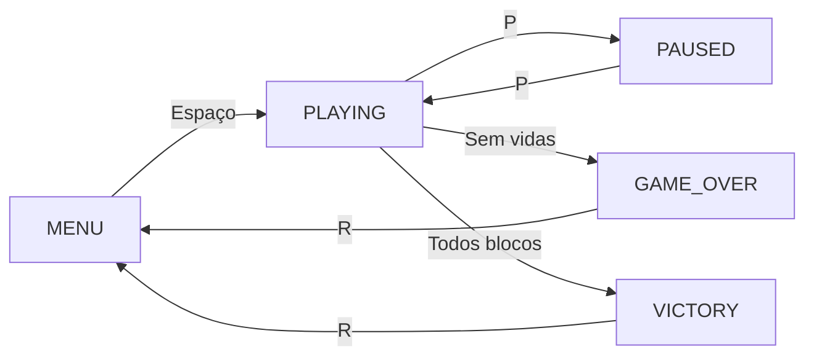
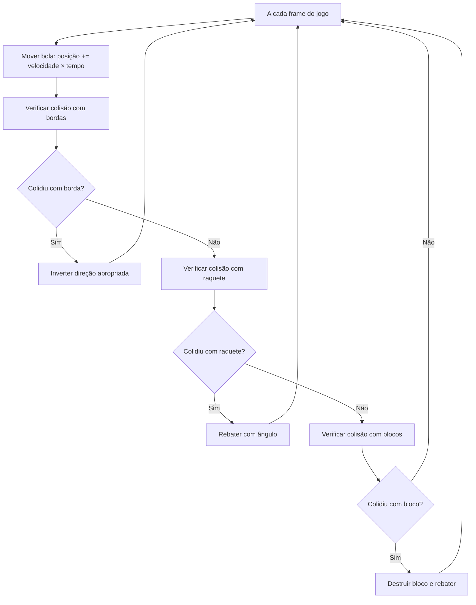
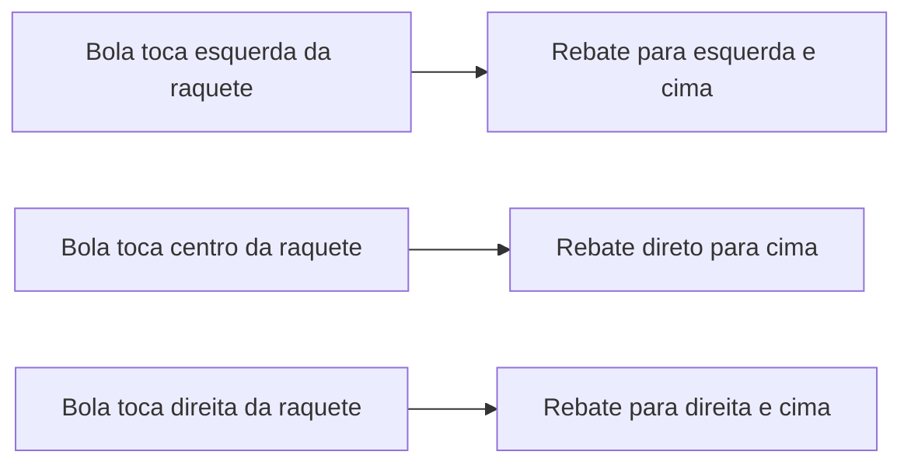

# Arkanoid

Este tutorial ensina como criar o jogo Arkanoid do zero usando C++ e SFML. Vamos começar com conceitos básicos e construir o conhecimento passo a passo, explicando cada parte de forma clara e detalhada.

## O que é Arkanoid

Imagine um jogo onde você controla uma raquete na parte inferior da tela, e precisa usar uma bola para destruir todos os blocos coloridos que estão organizados na parte superior. É como se você estivesse jogando tênis, mas em vez de rebater a bola para o outro lado, você a usa para quebrar tijolos em uma parede:

- Uma bola ricocheia pela tela seguindo leis da física
- Você controla uma raquete que pode se mover para esquerda e direita
- A bola deve rebater na raquete para não cair fora da tela
- Cada bloco destruído dá pontos
- O objetivo é destruir todos os blocos sem deixar a bola cair

Este jogo nos permite aprender vários conceitos importantes de programação de jogos, incluindo física de colisões, programação orientada a objetos e gerenciamento de estados.

## Como Organizar um Jogo Complexo

### Estados do Jogo - Diferentes Telas

O Arkanoid tem mais estados que jogos simples, pois precisa gerenciar situações como pausa e vitória:

- **Menu**: A tela inicial com instruções
- **Jogando**: Quando o jogo está ativo
- **Pausado**: Quando o jogador pausa o jogo
- **Game Over**: Quando o jogador perde todas as vidas
- **Vitória**: Quando o jogador completa todos os níveis



No código, implementamos isso com um enum mais completo:

```cpp
enum GameState {
    MENU,        // Tela inicial
    PLAYING,     // Jogando ativamente
    PAUSED,      // Jogo pausado
    GAME_OVER,   // Perdeu todas as vidas
    VICTORY      // Completou todos os níveis
};
```

### Programação Orientada a Objetos

Diferente de jogos simples, o Arkanoid usa classes para organizar melhor o código. Cada elemento importante do jogo tem sua própria classe:

#### Classe Block - Representando os Blocos

```cpp
class Block {
public:
    Sprite sprite;      // Como o bloco aparece na tela
    bool isDestroyed;   // Se foi destruído ou não
    int points;         // Quantos pontos vale
    
    Block() : isDestroyed(false), points(10) {} // Construtor
    
    void destroy() { isDestroyed = true; }      // Marcar como destruído
    FloatRect getBounds() const;                // Área de colisão
    void draw(RenderWindow& window);            // Desenhar na tela
};
```

**Por que usar uma classe?**
- Cada bloco tem suas próprias propriedades (posição, cor, se foi destruído)
- Podemos ter muitos blocos facilmente
- O código fica mais organizado e reutilizável

#### Classe Ball - A Bola Física

```cpp
class Ball {
public:
    Sprite sprite;        // Aparência da bola
    Vector2f velocity;    // Velocidade (direção e rapidez)
    float speed;          // Velocidade base
    
    void update(float deltaTime, const Vector2u& windowSize);  // Atualizar posição
    void reverseX() { velocity.x = -velocity.x; }             // Inverter direção X
    void reverseY() { velocity.y = -velocity.y; }             // Inverter direção Y
    bool isOutOfBounds(const Vector2u& windowSize) const;     // Verificar se saiu da tela
};
```

A bola é mais complexa porque precisa simular física realista.

## As Principais Mecânicas do Jogo

### Física da Bola - Movimento e Colisões

A bola do Arkanoid segue leis físicas simples. Ela se move em linha reta até colidir com algo, então muda de direção.



#### Movimento Básico

```cpp
void Ball::update(float deltaTime, const Vector2u& windowSize) {
    Vector2f pos = getPosition();
    pos += velocity * deltaTime;  // Mover baseado na velocidade
    
    // Colisão com bordas laterais e superior
    if (pos.x <= 0 || pos.x + getBounds().width >= windowSize.x) {
        velocity.x = -velocity.x;  // Inverter direção horizontal
    }
    if (pos.y <= 0) {
        velocity.y = -velocity.y;  // Inverter direção vertical
    }
    
    sprite.setPosition(pos);
}
```

**Entendendo o deltaTime:**
- `deltaTime` é o tempo que passou desde o último frame
- Multiplicar por `deltaTime` faz o movimento ser suave independente da velocidade do computador
- Se o jogo roda a 60 FPS, `deltaTime` será aproximadamente 0.0167 segundos

### Controle Inteligente da Raquete

A raquete responde aos comandos do jogador, mas tem limitações realistas:

```cpp
void Paddle::update(float deltaTime, const Vector2u& windowSize) {
    Vector2f pos = getPosition();
    
    // Movimento baseado nas teclas pressionadas
    if (Keyboard::isKeyPressed(Keyboard::Left) || Keyboard::isKeyPressed(Keyboard::A)) {
        pos.x -= speed * deltaTime;  // Mover para esquerda
    }
    if (Keyboard::isKeyPressed(Keyboard::Right) || Keyboard::isKeyPressed(Keyboard::D)) {
        pos.x += speed * deltaTime;  // Mover para direita
    }
    
    // Não permitir sair da tela
    pos.x = std::max(0.0f, std::min(pos.x, (float)windowSize.x - getBounds().width));
    sprite.setPosition(pos);
}
```

**Por que usar `speed * deltaTime`?**
- Garante movimento suave
- A raquete se move na mesma velocidade em qualquer computador
- Permite controle responsivo

### O Truque do Rebote na Raquete

Uma das partes mais inteligentes do jogo é como a bola rebate na raquete. Não é apenas um rebote simples - o ângulo depende de onde a bola toca a raquete:

```cpp
// Verificar colisão bola-raquete
if (ball.getBounds().intersects(paddle.getBounds())) {
    ball.reverseY();  // Sempre rebater para cima
    
    // Calcular ângulo baseado na posição da colisão
    float ballCenter = ball.getPosition().x + ball.getBounds().width / 2;
    float paddleCenter = paddle.getPosition().x + paddle.getBounds().width / 2;
    float offset = (ballCenter - paddleCenter) / (paddle.getBounds().width / 2);
    
    // Ajustar velocidade horizontal baseada no offset
    ball.velocity.x = ball.speed * offset * 0.75f;
    ball.velocity.y = -std::abs(ball.velocity.y);  // Sempre para cima
}
```



**Como funciona o cálculo:**
- **offset** varia de -1 (extrema esquerda) a +1 (extrema direita)
- **offset = 0** significa que a bola tocou o centro da raquete
- A velocidade horizontal é proporcional ao offset
- Multiplicamos por 0.75 para não deixar o rebote muito extremo

### Detecção de Colisão com Blocos

Detectar qual lado do bloco a bola tocou é crucial para um rebote realista:

```cpp
for (auto& block : blocks) {
    if (!block.isDestroyed && ball.getBounds().intersects(block.getBounds())) {
        block.destroy();  // Destruir o bloco
        score += block.points;  // Adicionar pontos
        
        // Determinar de que lado a bola colidiu
        Vector2f ballCenter = Vector2f(ball.getPosition().x + ball.getBounds().width / 2,
                                     ball.getPosition().y + ball.getBounds().height / 2);
        Vector2f blockCenter = Vector2f(block.getBounds().left + block.getBounds().width / 2,
                                       block.getBounds().top + block.getBounds().height / 2);
        
        float dx = std::abs(ballCenter.x - blockCenter.x);  // Distância horizontal
        float dy = std::abs(ballCenter.y - blockCenter.y);  // Distância vertical
        
        if (dx > dy) {
            ball.reverseX();  // Colidiu pela lateral
        } else {
            ball.reverseY();  // Colidiu por cima/baixo
        }
        
        break;  // Só colidir com um bloco por frame
    }
}
```

**Por que esse método funciona?**
- Se `dx > dy`, a bola está mais próxima da lateral do bloco
- Se `dy > dx`, a bola está mais próxima do topo/base do bloco
- Isso determina se devemos inverter a velocidade X ou Y

## Criando o Mundo do Jogo

### Geração Procedural de Blocos

O jogo cria uma grade organizada de blocos coloridos:

```cpp
void createBlocks() {
    blocks.clear();
    const int rows = 8;      // 8 fileiras de blocos
    const int cols = 10;     // 10 colunas de blocos
    const float blockWidth = 60;
    const float blockHeight = 25;
    const float spacing = 5;  // Espaço entre blocos
    
    // Centralizar a grade na tela
    const float startX = (800 - (cols * blockWidth + (cols - 1) * spacing)) / 2;
    const float startY = 50;
    
    for (int row = 0; row < rows; row++) {
        for (int col = 0; col < cols; col++) {
            Block block;
            
            // Calcular posição
            float x = startX + col * (blockWidth + spacing);
            float y = startY + row * (blockHeight + spacing);
            block.setPosition(x, y);
            
            // Blocos superiores valem mais pontos
            block.points = (rows - row) * 10;
            
            // Cores diferentes para cada fileira
            Color blockColor = blockColors[row % blockColors.size()];
            block.sprite.setColor(blockColor);
            
            blocks.push_back(block);
        }
    }
}
```

**Por que essa organização?**
- **Centralizamos** a grade para ficar visualmente equilibrada
- **Blocos superiores** valem mais pontos (mais difíceis de alcançar)
- **Cores diferentes** tornam o jogo mais atrativo
- **Espaçamento uniforme** cria uma aparência profissional

### Sistema de Vidas e Progressão

O jogo implementa um sistema de vidas realista:

```cpp
// Verificar se bola saiu da tela
if (ball.isOutOfBounds(window.getSize())) {
    lives--;  // Perder uma vida
    if (lives <= 0) {
        gameState = GAME_OVER;  // Fim de jogo
    } else {
        ball.reset(400, 300);   // Reposicionar bola
    }
}
```

E um sistema de progressão por níveis:

```cpp
// Verificar vitória (todos os blocos destruídos)
bool allDestroyed = true;
for (const auto& block : blocks) {
    if (!block.isDestroyed) {
        allDestroyed = false;
        break;
    }
}

if (allDestroyed) {
    level++;
    score += 1000 * level;     // Bônus por completar nível
    if (level <= 3) {          // Máximo 3 níveis
        createBlocks();        // Criar novos blocos
        ball.reset(400, 300);  // Reposicionar bola
        ball.speed += 50;      // Aumentar dificuldade
    } else {
        gameState = VICTORY;   // Vitória total!
    }
}
```

## Texturas Procedurais - Gráficos Sem Arquivos

Uma característica inteligente do jogo é criar gráficos automaticamente se não encontrar arquivos de imagem:

### Criando uma Bola Redonda

```cpp
if (!ballTexture.loadFromFile("images/ball.png")) {
    // Criar textura de bola procedural
    Image ballImage;
    ballImage.create(20, 20, Color::White);
    
    for (int x = 0; x < 20; x++) {
        for (int y = 0; y < 20; y++) {
            int dx = x - 10;  // Distância do centro
            int dy = y - 10;
            
            // Se está dentro do círculo (raio = 10)
            if (dx*dx + dy*dy <= 100) {
                ballImage.setPixel(x, y, Color::White);
            } else {
                ballImage.setPixel(x, y, Color::Transparent);
            }
        }
    }
    ballTexture.loadFromImage(ballImage);
}
```

**Como funciona a matemática:**
- `dx*dx + dy*dy` é a distância ao quadrado do centro
- Se for ≤ 100, está dentro de um círculo de raio 10
- Pixels dentro do círculo ficam brancos, fora ficam transparentes

### Criando um Fundo com Estrelas

```cpp
// Criar fundo procedural com gradiente e estrelas
Image bgImage;
bgImage.create(800, 600, Color::Black);

// Criar um gradiente do azul escuro para preto
for (int y = 0; y < 600; y++) {
    for (int x = 0; x < 800; x++) {
        float factor = (float)y / 600.0f;  // 0 no topo, 1 na base
        Uint8 blue = (Uint8)(30 * (1.0f - factor));
        Uint8 green = (Uint8)(10 * (1.0f - factor));
        bgImage.setPixel(x, y, Color(0, green, blue));
    }
}

// Adicionar algumas "estrelas" aleatórias
std::random_device rd;
std::mt19937 gen(rd());
std::uniform_int_distribution<> xDist(0, 799);
std::uniform_int_distribution<> yDist(0, 399);  // Apenas na parte superior
std::uniform_int_distribution<> brightDist(100, 255);

for (int i = 0; i < 100; i++) {
    int x = xDist(gen);
    int y = yDist(gen);
    Uint8 brightness = brightDist(gen);
    bgImage.setPixel(x, y, Color(brightness, brightness, brightness));
}
```

**Por que fazer isso?**
- O jogo funciona mesmo sem arquivos de imagem
- Reduz dependências externas
- Permite personalização fácil
- Ensina como criar gráficos programaticamente

## Sistema de Pontuação Inteligente

O jogo tem múltiplas formas de ganhar pontos:

### 1. Pontos por Bloco Destruído
```cpp
score += block.points;  // Cada bloco tem valor diferente
```
Blocos superiores valem mais pontos pois são mais difíceis de alcançar.

### 2. Bônus por Completar Nível
```cpp
score += 1000 * level;  // Bônus aumenta a cada nível
```
Completar níveis mais altos dá bônus maiores.

### 3. Sistema de Vidas
```cpp
int lives = 3;  // Começar com 3 vidas
```
Cada vida perdida significa uma nova chance, mas a pontuação não reseta.

## Efeitos Visuais Avançados

### Mostrar Pontos Ganhados

Quando um bloco é destruído, o jogo mostra os pontos ganhos:

```cpp
// Mostrar bonus de pontos
lastScoreGain = block.points;
showScoreBonus = true;
effectClock.restart();

// Na renderização:
if (showScoreBonus) {
    bonusText.setString("+" + std::to_string(lastScoreGain));
    bonusText.setPosition(ball.getPosition().x, ball.getPosition().y - 30);
    window.draw(bonusText);
}

// Esconder após 1 segundo
if (showScoreBonus && effectClock.getElapsedTime().asSeconds() > 1.0f) {
    showScoreBonus = false;
}
```

### Interface de Usuário Dinâmica

```cpp
void updateUI() {
    std::stringstream ss;
    ss << "Score: " << score;
    scoreText.setString(ss.str());
    
    ss.str("");
    ss << "Lives: " << lives;
    livesText.setString(ss.str());
    
    ss.str("");
    ss << "Level: " << level;
    levelText.setString(ss.str());
}
```

## A Matemática Por Trás do Jogo

### Velocidade da Bola

A bola tem uma velocidade constante, mas sua direção muda:

```cpp
float speed = 300.0f;  // Pixels por segundo
Vector2f velocity = Vector2f(speed, -speed);  // Diagonal inicial
```

**Calculando a velocidade real:**
```
Velocidade diagonal = sqrt(speed² + speed²) = sqrt(2) × speed
Para speed = 300: velocidade real = 424.26 pixels/segundo
```

### Progressão de Dificuldade

A cada nível, a velocidade da bola aumenta:

```cpp
ball.speed += 50;  // +50 pixels/segundo por nível
```

**Velocidades por nível:**
- Nível 1: 300 px/s
- Nível 2: 350 px/s  
- Nível 3: 400 px/s

### Cálculo de Pontuação Máxima

Com 8 fileiras de 10 blocos cada:

```cpp
// Pontos por fileira (de cima para baixo): 80, 70, 60, 50, 40, 30, 20, 10
// Total por nível: (80+70+60+50+40+30+20+10) × 10 = 3600 pontos
// Bônus por nível: 1000, 2000, 3000
// Pontuação máxima: (3600 × 3) + (1000 + 2000 + 3000) = 16,800 pontos
```

## Por que o Jogo Funciona Bem

### Organização com Classes

Usar classes torna o código:
- **Mais legível**: Cada classe tem uma responsabilidade clara
- **Mais reutilizável**: Podemos criar múltiplos blocos facilmente
- **Mais fácil de debugar**: Problemas ficam isolados em classes específicas
- **Mais expansível**: Podemos adicionar novos tipos de blocos facilmente

### Gerenciamento Inteligente de Memória

```cpp
std::vector<Block> blocks;  // Vetor dinâmico de blocos
```

- **Crescimento automático**: O vetor cresce conforme necessário
- **Memória contígua**: Melhor performance para iteração
- **Limpeza automática**: RAII garante que a memória seja liberada

### Estados Bem Definidos

O sistema de estados evita bugs comuns:
- Só processa entrada do jogo quando `gameState == PLAYING`
- Só atualiza física quando necessário
- Interface limpa entre diferentes telas

### Separação de Responsabilidades

```cpp
void handleEvents();  // Só lida com entrada do usuário
void update();        // Só atualiza lógica do jogo  
void render();        // Só desenha na tela
```

Esta separação torna o código mais fácil de manter e expandir.

## Extensões Possíveis

O código está estruturado para permitir extensões fáceis:

### Novos Tipos de Blocos
```cpp
class SpecialBlock : public Block {
    int hitCount;  // Blocos que precisam de múltiplos hits
    bool hasBonus; // Blocos que dão power-ups
};
```

### Power-ups
```cpp
class PowerUp {
    enum Type { BIGGER_PADDLE, SLOWER_BALL, EXTRA_LIFE };
    // Implementar lógica de power-ups
};
```

### Mais Níveis
```cpp
void createBlocks(int levelNumber) {
    // Criar padrões diferentes para cada nível
    // Blocos mais resistentes em níveis altos
}
```

### Salvamento de Pontuação
```cpp
void saveHighScore(int score) {
    // Salvar em arquivo para persistir entre sessões
}
```

## Conceitos Importantes Aprendidos

Este tutorial ensina:

1. **Programação Orientada a Objetos**: Classes, herança, encapsulamento
2. **Física de Jogos**: Movimento, colisões, rebotes realistas
3. **Gerenciamento de Estados**: Como organizar diferentes telas de um jogo
4. **Geração Procedural**: Criar conteúdo automaticamente
5. **Interface de Usuário**: Feedback visual e informações para o jogador
6. **Otimização**: Como escrever código eficiente para jogos

O Arkanoid é um exemplo perfeito de como jogos aparentemente simples podem ensinar conceitos avançados de programação de forma divertida e prática.