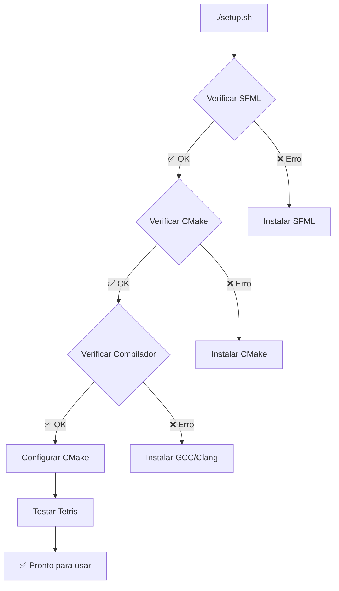

# Compilar e Executar Jogos

Este guia mostra como compilar e executar os jogos de forma prática e eficiente. Aprenda desde comandos básicos até técnicas avançadas de execução.

## Compilação Rápida

### Configuração Inicial (Apenas Uma Vez)

Antes de compilar qualquer jogo, execute a configuração inicial:

```bash
# Na pasta raiz do projeto
./setup.sh
```

Este comando:
- Verifica se todas as dependências estão instaladas
- Configura o ambiente de compilação
- Testa a compilação com um jogo simples
- Prepara o sistema para uso



## Métodos de Compilação

### Método 1: Makefile Simplificado (Recomendado)

O método mais fácil para iniciantes:

```bash
# Compilar todos os jogos
make build

# Compilar um jogo específico
make build-tetris
make build-doodle_jump
make build-snake

# Executar diretamente
make run-tetris
make run-doodle_jump
make run-snake
```

### Método 2: CMake Direto

Para usuários mais avançados:

```bash
# Entrar na pasta de build
cd build

# Compilar todos os jogos
make all_games

# Compilar um jogo específico
make tetris
make doodle_jump
make snake

# Executar um jogo
make run_tetris
make run_doodle_jump
make run_snake
```

### Método 3: Execução Direta

Após compilar, você pode executar diretamente:

```bash
# Navegar para o jogo
cd build/games/tetris

# Executar
./tetris
```

## Compilação por Categoria

### Jogos de Puzzle

```bash
# Tetris - O clássico jogo de blocos
make build-tetris && make run-tetris

# Fifteen Puzzle - Quebra-cabeça numérico  
make build-fifteen_puzzle && make run-fifteen_puzzle

# Minesweeper - Campo minado
make build-minesweeper && make run-minesweeper

# NetWalk - Conectar tubulações
make build-netwalk && make run-netwalk

# Mahjong Solitaire - Paciência com peças
make build-mahjong && make run-mahjong
```

### Jogos de Ação

```bash
# Doodle Jump - Pular nas plataformas
make build-doodle_jump && make run-doodle_jump

# Snake - A serpente clássica
make build-snake && make run-snake

# Arkanoid - Quebrar blocos com a bola
make build-arkanoid && make run-arkanoid

# Asteroids - Destruir asteroides no espaço
make build-asteroids && make run-asteroids
```

### Jogos de Estratégia

```bash
# Chess - Xadrez com IA
make build-chess && make run-chess

# Bejeweled - Combinar joias
make build-bejeweled && make run-bejeweled

# Xonix - Conquistar território
make build-xonix && make run-xonix
```

## Verificação de Compilação

### Status dos Jogos

Nem todos os jogos podem estar funcionais. Vamos verificar o status:

```bash
# Tentar compilar todos e ver quais funcionam
make build 2>&1 | grep -E "(✅|❌|Error|error)"
```

### Teste Individual

Para testar se um jogo específico funciona:

```bash
# Testar Tetris
echo "Testando Tetris..."
if make build-tetris; then
    echo "✅ Tetris compilou com sucesso!"
    make run-tetris
else
    echo "❌ Erro na compilação do Tetris"
fi
```

### Script de Teste Automatizado

Crie um script para testar todos os jogos:

```bash
#!/bin/bash
# Salve como test_all_games.sh

games=("tetris" "doodle_jump" "arkanoid" "snake" "minesweeper" 
       "fifteen_puzzle" "racing" "xonix" "bejeweled" "netwalk")

echo "Testando compilação de todos os jogos..."
echo "======================================="

for game in "${games[@]}"; do
    echo -n "Testando $game... "
    if make build-$game &>/dev/null; then
        echo "✅"
    else
        echo "❌"
    fi
done
```

## Execução Avançada

### Execução com Parâmetros

Alguns jogos podem aceitar parâmetros de linha de comando:

```bash
# Executar com resolução específica (se suportado)
cd build/games/tetris
./tetris --width=800 --height=600

# Executar em modo fullscreen (se suportado)
./tetris --fullscreen
```

### Execução com Debugging

Para investigar problemas:

```bash
# Executar com GDB (debugger)
cd build/games/tetris
gdb ./tetris

# Comandos no GDB:
# (gdb) run          # Executar o programa
# (gdb) bt           # Ver stack trace se houver crash
# (gdb) quit         # Sair do GDB
```

### Execução com Profiling

Para medir performance:

```bash
# Medir tempo de execução
cd build/games/tetris
time ./tetris

# Profiling detalhado com valgrind
valgrind --tool=callgrind ./tetris
```

## Gerenciamento de Assets

### Verificar Assets

Os jogos dependem de arquivos de imagem e som. Para verificar se estão corretos:

```bash
# Verificar se as imagens foram copiadas
ls build/games/tetris/images/

# Verificar se as fontes foram copiadas (Doodle Jump)
ls build/games/doodle_jump/fonts/
```

### Recopiar Assets

Se algum asset não foi copiado corretamente:

```bash
# Limpar build e recompilar
make clean
make build-tetris
```

### Assets Customizados

Para usar seus próprios assets:

1. Substituir arquivos na pasta original:
```bash
# Exemplo: trocar a imagem de fundo do Tetris
cp minha_imagem.png "01  Tetris/images/background.png"
```

2. Recompilar o jogo:
```bash
make clean
make build-tetris
```

## Compilação em Lote

### Compilar Jogos Funcionais

Script para compilar apenas jogos que funcionam:

```bash
#!/bin/bash
# Lista de jogos que compilam sem erro
working_games=("tetris" "doodle_jump" "arkanoid" "snake" "minesweeper")

echo "Compilando jogos funcionais..."
for game in "${working_games[@]}"; do
    echo "Compilando $game..."
    make build-$game
done

echo "✅ Jogos funcionais compilados!"
```

### Compilação Paralela

Para acelerar a compilação usando múltiplos cores:

```bash
# Usar 4 cores
cd build
make -j4 all_games

# Usar todos os cores disponíveis
make -j$(nproc) all_games
```

## Resolução de Problemas

### Problemas Comuns de Compilação

#### Erro: SFML não encontrado

```
error: Package 'sfml-all' not found
```

**Solução:**
```bash
# Ubuntu/Debian
sudo apt-get install libsfml-dev

# Reconfigurar
make clean
./setup.sh
```

#### Erro: Arquivos não encontrados na execução

```
Failed to load images/background.png
```

**Soluções:**

1. **Verificar diretório de execução:**
```bash
# Sempre executar da pasta do jogo
cd build/games/tetris
./tetris
```

2. **Recompilar para recopiar assets:**
```bash
make clean
make build-tetris
```

#### Erro: Permissão negada

```
bash: ./tetris: Permission denied
```

**Solução:**
```bash
# Dar permissão de execução
chmod +x build/games/tetris/tetris
```

### Debugging de Problemas

#### Verificar Dependências

```bash
# Verificar se o executável foi linkado corretamente
ldd build/games/tetris/tetris

# Deve mostrar libsfml-* nas dependências
```

#### Verificar Assets

```bash
# Verificar se todos os assets estão presentes
find build/games/tetris/ -name "*.png" -o -name "*.jpg" -o -name "*.ttf"
```

#### Log de Execução

```bash
# Executar com output detalhado
cd build/games/tetris
./tetris 2>&1 | tee tetris.log

# Verificar o log
cat tetris.log
```

## Automação com Scripts

### Script Completo de Build e Test

```bash
#!/bin/bash
# build_and_test.sh

set -e  # Parar se houver erro

echo "🎮 Build e Test Automatizado"
echo "============================="

# Configuração inicial
echo "1️⃣ Configurando ambiente..."
./setup.sh

# Lista de jogos para testar
games=("tetris" "doodle_jump" "snake" "arkanoid" "minesweeper")

echo "2️⃣ Compilando jogos..."
for game in "${games[@]}"; do
    echo "   Compilando $game..."
    make build-$game
done

echo "3️⃣ Testando execução (5 segundos cada)..."
for game in "${games[@]}"; do
    echo "   Testando $game..."
    cd build/games/$game
    timeout 5s ./$game || echo "   (Fechado automaticamente)"
    cd - > /dev/null
done

echo "✅ Build e teste concluídos!"
```

### Script de Limpeza

```bash
#!/bin/bash
# clean_all.sh

echo "🧹 Limpando arquivos de build..."

# Remover diretório build
rm -rf build

# Remover arquivos temporários
find . -name "*.o" -delete
find . -name "*.so" -delete
find . -name "core" -delete

echo "✅ Limpeza concluída!"
```

## Performance e Otimização

### Compilação Otimizada

```bash
# Compilar em modo Release (otimizado)
cd build
cmake -DCMAKE_BUILD_TYPE=Release ..
make all_games
```

### Medição de Performance

```bash
# Medir tempo de compilação
time make all_games

# Medir uso de memória durante compilação
/usr/bin/time -v make tetris
```

### Compilação Incremental

Para desenvolvimento, compile apenas o que mudou:

```bash
# Depois de modificar código, apenas:
cd build
make tetris  # Só recompila se necessário
```

## Integração com Editor/IDE

### Visual Studio Code

Configurar tasks.json para compilação rápida:

```json
{
    "version": "2.0.0",
    "tasks": [
        {
            "label": "Build Tetris",
            "type": "shell",
            "command": "make",
            "args": ["build-tetris"],
            "group": "build"
        },
        {
            "label": "Run Tetris", 
            "type": "shell",
            "command": "make",
            "args": ["run-tetris"],
            "group": "test"
        }
    ]
}
```

### CLion

1. Abrir projeto (CLion detecta CMakeLists.txt automaticamente)
2. Configurar targets de build
3. Usar botões de Run/Debug diretamente na IDE

## Conclusão

Compilar e executar jogos é um processo que envolve várias etapas, mas com os métodos corretos torna-se simples e eficiente. O projeto oferece múltiplas formas de abordar a compilação:

- **Para iniciantes**: Use `make build` e `make run-nome_do_jogo`
- **Para desenvolvimento**: Use compilação incremental e debugging
- **Para distribuição**: Use compilação otimizada em modo Release

Dominar essas técnicas permitirá que você não apenas execute os jogos existentes, mas também modifique e crie novos jogos com confiança.