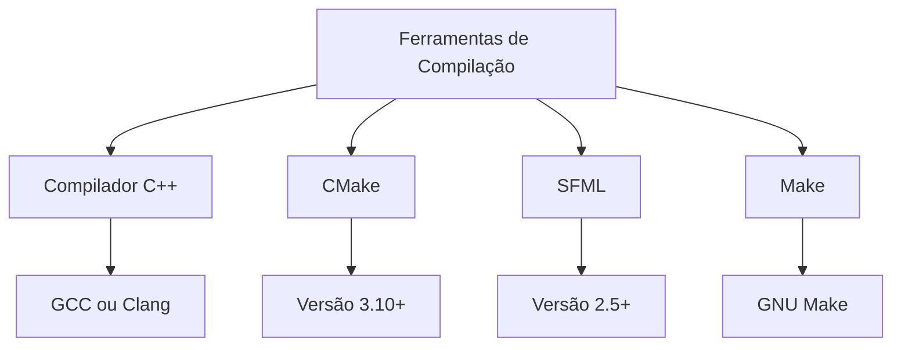
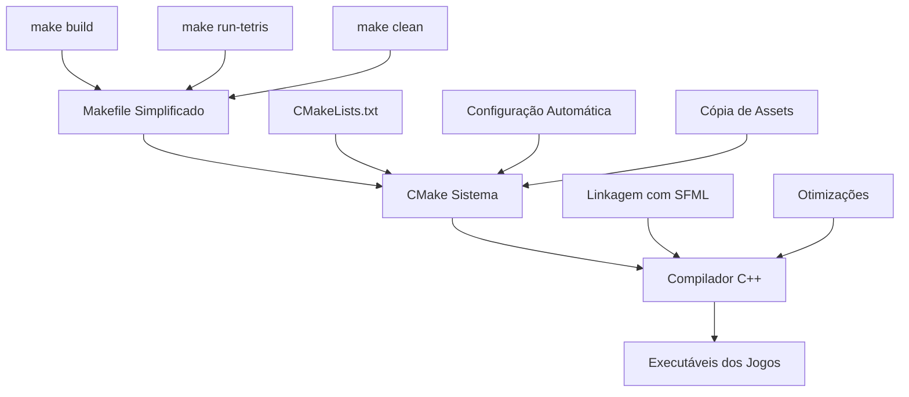

# Guia de Compilação

Este guia explica como compilar os jogos do projeto "16 Games in C++". Vamos abordar desde os conceitos básicos até técnicas avançadas de compilação.

## O que é Compilação

Compilação é o processo de transformar o código fonte que escrevemos (em C++) em um programa executável que o computador consegue entender e executar. É como traduzir um texto do português para uma linguagem que o computador entende.

## Pré-requisitos

Antes de compilar os jogos, você precisa ter algumas ferramentas instaladas no seu sistema:

### Ferramentas Necessárias



### 1. Compilador C++

Um compilador é o programa que converte seu código C++ em código executável.

**Opções disponíveis:**
- **GCC (GNU Compiler Collection)**: O compilador mais comum no Linux
- **Clang**: Compilador alternativo com ótimas mensagens de erro
- **MSVC**: Compilador da Microsoft para Windows

**Como verificar se está instalado:**
```bash
g++ --version      # Para GCC
clang++ --version  # Para Clang
```

### 2. CMake

CMake é uma ferramenta que facilita o processo de compilação de projetos complexos. Ele gera automaticamente os arquivos necessários para compilar seu projeto.

**Por que usar CMake:**
- Funciona em diferentes sistemas operacionais
- Gerencia dependências automaticamente
- Configura opções de compilação
- Organiza projetos com múltiplos arquivos

**Como verificar se está instalado:**
```bash
cmake --version
```

### 3. SFML (Simple and Fast Multimedia Library)

SFML é a biblioteca que usamos para criar os jogos. Ela fornece funcionalidades para:
- Criar janelas e interfaces gráficas
- Desenhar sprites e formas
- Reproduzir sons
- Capturar entrada do teclado e mouse

**Como verificar se está instalado:**
```bash
pkg-config --exists sfml-all && echo "SFML instalado" || echo "SFML não encontrado"
```

## Sistema de Compilação do Projeto

Nosso projeto usa um sistema de compilação em duas camadas:



### Camada 1: Makefile Simplificado

O Makefile fornece comandos fáceis de usar:

```bash
make setup          # Configuração inicial
make build          # Compilar todos os jogos
make build-tetris   # Compilar apenas o Tetris
make run-tetris     # Executar o Tetris
make clean          # Limpar arquivos temporários
```

### Camada 2: CMake

O CMake gerencia a compilação real:
- Encontra as bibliotecas necessárias (SFML)
- Configura opções de compilação
- Cria executáveis para cada jogo
- Copia assets (imagens, fontes) para os locais corretos

## Processo de Compilação Passo a Passo

### Configuração Inicial

```bash
# 1. Executar o script de configuração
./setup.sh
```

Este script:
1. Verifica se todas as dependências estão instaladas
2. Cria o diretório `build`
3. Configura o CMake
4. Testa a compilação com o jogo Tetris

### Compilação Individual

Para compilar um jogo específico:

```bash
# Método 1: Usando Makefile (mais simples)
make build-tetris

# Método 2: Usando CMake diretamente
cd build
make tetris
```

### Compilação de Todos os Jogos

```bash
# Método 1: Usando Makefile
make build

# Método 2: Usando CMake diretamente
cd build
make all_games
```

## Estrutura de Arquivos de Compilação

Quando você compila um jogo, o CMake organiza os arquivos assim:

```
build/
├── games/
│   ├── tetris/
│   │   ├── tetris              # Executável
│   │   └── images/             # Assets copiados
│   ├── doodle_jump/
│   │   ├── doodle_jump         # Executável
│   │   ├── images/             # Assets copiados
│   │   └── fonts/              # Fontes copiadas
│   └── ...
├── CMakeFiles/                 # Arquivos internos do CMake
└── Makefile                    # Makefile gerado pelo CMake
```

### Por que Essa Estrutura?

1. **Organização**: Cada jogo tem sua própria pasta
2. **Assets Isolados**: Imagens e recursos ficam junto ao executável
3. **Execução Simples**: Cada jogo pode ser executado de sua própria pasta
4. **Facilita Debug**: Problemas ficam isolados por jogo

## Entendendo o CMakeLists.txt

O arquivo `CMakeLists.txt` é o "manual de instruções" para o CMake. Vamos entender as partes principais:

### Configuração Básica

```cmake
cmake_minimum_required(VERSION 3.10)  # Versão mínima do CMake
project(16Games LANGUAGES CXX)        # Nome do projeto e linguagem
set(CMAKE_CXX_STANDARD 17)            # Usar C++17
```

### Encontrar Dependências

```cmake
find_package(PkgConfig REQUIRED)           # Ferramenta para encontrar bibliotecas
pkg_check_modules(SFML REQUIRED sfml-all)  # Encontrar SFML
```

### Função para Criar Jogos

```cmake
function(add_game GAME_NAME GAME_DIR)
    # Encontrar arquivos .cpp e .hpp
    file(GLOB_RECURSE GAME_SOURCES "${GAME_DIR}/*.cpp" "${GAME_DIR}/*.hpp")
    
    # Criar executável
    add_executable(${GAME_NAME} ${GAME_SOURCES})
    
    # Linkar com SFML
    target_link_libraries(${GAME_NAME} ${SFML_LIBRARIES})
    
    # Copiar assets
    # ...
endfunction()
```

## Tipos de Compilação

### Debug vs Release

**Debug Mode (Modo de Depuração):**
- Código mais lento
- Inclui informações para debugging
- Facilita encontrar erros

**Release Mode (Modo de Lançamento):**
- Código otimizado e mais rápido
- Menor tamanho de arquivo
- Sem informações de debug

```bash
# Compilar em modo debug (padrão)
cmake ..

# Compilar em modo release
cmake -DCMAKE_BUILD_TYPE=Release ..
```

### Compilação Paralela

Para acelerar a compilação, use múltiplos cores do processador:

```bash
# Usar 4 cores para compilar
make -j4

# Usar todos os cores disponíveis
make -j$(nproc)
```

## Resolvendo Problemas de Compilação

### Erro: SFML não encontrado

```
❌ Erro: Package 'sfml-all' not found
```

**Solução:**
```bash
# Ubuntu/Debian
sudo apt-get install libsfml-dev

# Fedora
sudo dnf install SFML-devel

# Arch Linux
sudo pacman -S sfml
```

### Erro: CMake muito antigo

```
❌ Erro: CMake 3.10 or higher is required
```

**Solução:**
```bash
# Ubuntu/Debian
sudo apt-get install cmake

# Ou instalar versão mais nova
sudo snap install cmake --classic
```

### Erro: Compilador não encontrado

```
❌ Erro: No CMAKE_CXX_COMPILER could be found
```

**Solução:**
```bash
# Ubuntu/Debian
sudo apt-get install build-essential

# Fedora
sudo dnf group install "Development Tools"
```

### Erro: Arquivo não encontrado durante execução

```
❌ Erro: Failed to load images/background.png
```

**Solução:**
- Verificar se os assets foram copiados corretamente
- Executar o jogo do diretório correto:

```bash
cd build/games/tetris
./tetris
```

## Compilação Customizada

### Adicionando Flags de Compilação

Para adicionar opções especiais de compilação, edite o `CMakeLists.txt`:

```cmake
# Adicionar flags de warning
set(CMAKE_CXX_FLAGS "${CMAKE_CXX_FLAGS} -Wall -Wextra")

# Adicionar otimizações específicas
set(CMAKE_CXX_FLAGS_RELEASE "${CMAKE_CXX_FLAGS_RELEASE} -O3 -march=native")
```

### Compilação Condicional

```cmake
# Compilar apenas jogos funcionais
if(EXISTS "${CMAKE_SOURCE_DIR}/${GAME_DIR}/main.cpp")
    add_game(${GAME_NAME} ${GAME_DIR})
endif()
```

## Scripts de Automação

### Script de Teste Rápido

```bash
#!/bin/bash
echo "Testando compilação de todos os jogos..."
make clean
make build

if [ $? -eq 0 ]; then
    echo "✅ Todos os jogos compilaram com sucesso!"
else
    echo "❌ Erro na compilação"
    exit 1
fi
```

### Script de Deploy

```bash
#!/bin/bash
echo "Criando pacote de distribuição..."
make clean
cmake -DCMAKE_BUILD_TYPE=Release ..
make all_games

# Criar arquivo tar com todos os jogos
tar -czf 16games-release.tar.gz build/games/
```

## Otimização de Performance

### Compilação Otimizada

```bash
# Configurar para máxima performance
cmake -DCMAKE_BUILD_TYPE=Release -DCMAKE_CXX_FLAGS="-O3 -march=native" ..
```

### Profile-Guided Optimization (PGO)

Para jogos com alta performance:

```bash
# 1. Compilar com instrumentação
cmake -DCMAKE_CXX_FLAGS="-fprofile-generate" ..
make tetris

# 2. Executar para coletar dados
./games/tetris/tetris

# 3. Recompilar com otimizações baseadas no perfil
cmake -DCMAKE_CXX_FLAGS="-fprofile-use" ..
make tetris
```

## Integração com IDEs

### CLion

1. Abrir o diretório do projeto
2. CLion detectará automaticamente o CMakeLists.txt
3. Configurar build profiles (Debug/Release)
4. Usar os targets automáticos para compilar e executar

### Visual Studio Code

1. Instalar extensões: C/C++, CMake Tools
2. Abrir o projeto
3. Configurar kit de compilação
4. Usar paleta de comandos: "CMake: Build"

### Code::Blocks

1. Criar projeto vazio
2. Adicionar arquivos fonte
3. Configurar linker para SFML
4. Configurar diretórios de include

## Conclusão

A compilação é um processo fundamental no desenvolvimento de jogos. Nosso projeto usa um sistema robusto que:

- **Automatiza** tarefas repetitivas
- **Organiza** arquivos de forma lógica  
- **Facilita** a manutenção e debugging
- **Funciona** em diferentes sistemas operacionais

Dominar esses conceitos te permitirá não apenas compilar os jogos existentes, mas também modificá-los, criar novos jogos e entender como projetos maiores são organizados.

**Próximos passos:**
1. Pratique com diferentes jogos
2. Experimente modificar opções de compilação
3. Tente adicionar novos arquivos a um jogo existente
4. Aprenda a usar ferramentas de debugging como GDB