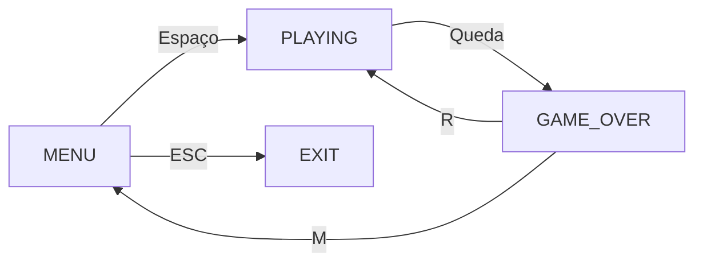
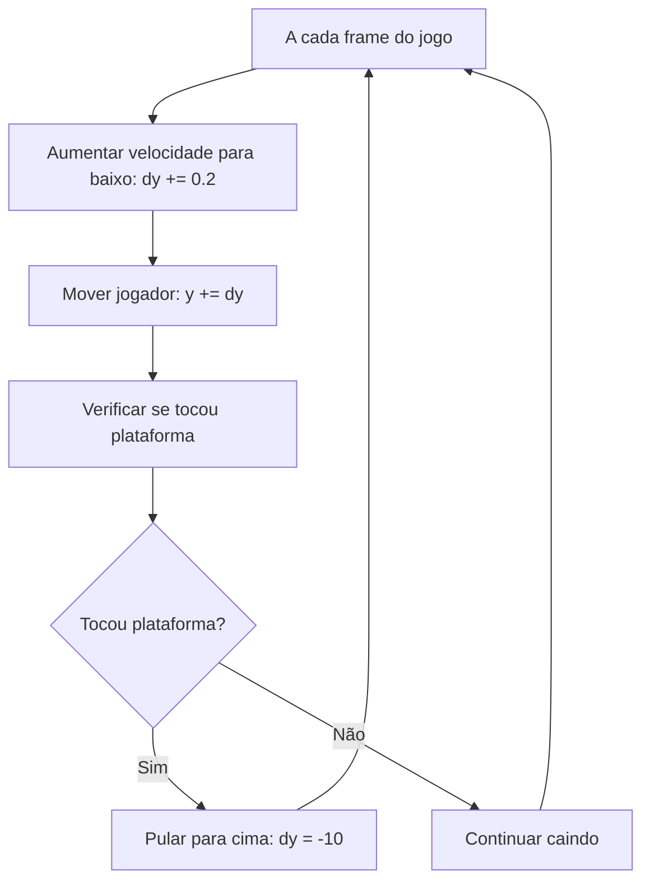
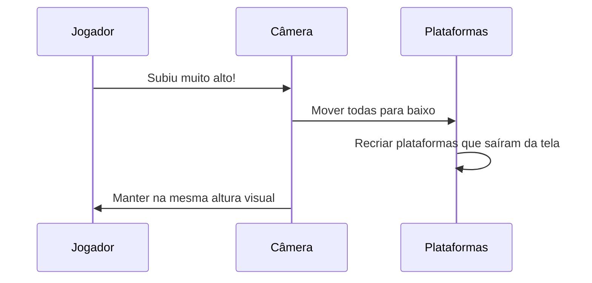
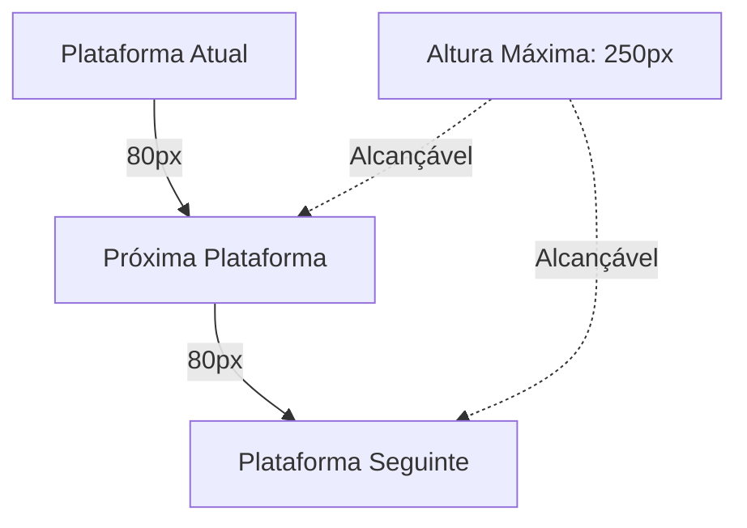
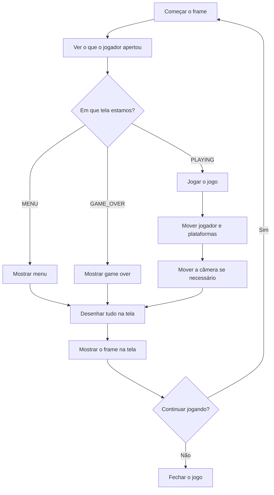

# Doodle Jump

Este tutorial ensina como criar o jogo Doodle Jump do zero usando C++ e SFML. Vamos começar com conceitos básicos e construir o conhecimento passo a passo, explicando cada parte de forma clara e detalhada.

## O que é Doodle Jump

Imagine um jogo onde você controla um pequeno personagem que precisa pular de uma plataforma para outra, tentando subir o mais alto possível. É como pular de degrau em degrau de uma escada infinita, mas com algumas regras especiais:

- O personagem sempre cai devido à gravidade (como na vida real)
- Ele só pode se mover para esquerda e direita
- Quando toca uma plataforma enquanto está caindo, automaticamente pula para cima
- Se cair muito para baixo, o jogo termina
- O objetivo é alcançar a maior altura possível

Este jogo nos permite aprender vários conceitos importantes de programação de jogos de forma simples e divertida.

## Como Organizar um Jogo

### Estados do Jogo - Diferentes Telas

Antes de começar a programar, precisamos pensar em como organizar nosso jogo. Todo jogo tem diferentes "telas" ou "estados". Por exemplo:

- **Menu**: A tela inicial onde o jogador decide se quer jogar
- **Jogando**: Quando o jogo está realmente acontecendo
- **Game Over**: Quando o jogador perde e vê sua pontuação

Chamamos isso de "estados do jogo". É como ter diferentes salas em uma casa - você só pode estar em uma sala por vez, mas pode se mover entre elas.



Este diagrama mostra como o jogador navega entre as telas:
- Do **Menu**, apertar Espaço leva para o jogo
- Durante o **Jogo**, se o jogador cair, vai para Game Over
- No **Game Over**, pode apertar R para jogar de novo ou M para voltar ao menu

Para implementar isso no código, usamos algo chamado "enum" - que é uma forma de dar nomes para números:

```cpp
enum GameState {
    MENU,        // Valor 0 - Tela inicial do jogo
    PLAYING,     // Valor 1 - Quando estamos jogando
    GAME_OVER    // Valor 2 - Quando o jogo termina
};
```

### Guardando Informações - Variáveis e Estruturas

Em qualquer jogo, precisamos guardar informações. Por exemplo, onde está o jogador? Onde estão as plataformas? Qual é a pontuação atual?

#### Posição das Plataformas

Para cada plataforma, precisamos saber sua posição na tela. Uma posição tem duas coordenadas: X (horizontal) e Y (vertical). Criamos uma estrutura para isso:

```cpp
struct point {
    int x, y;    // x = posição horizontal, y = posição vertical
};
```

Pense nisso como um endereço: "A plataforma está na posição X=100, Y=200".

#### Informações do Jogador

Para o jogador, precisamos guardar várias informações importantes:

```cpp
int x = 100, y = 100;  // Onde o jogador está na tela
int h = 200;           // Uma altura especial (explicaremos depois)
float dx = 0, dy = 0;  // Velocidade do jogador
int score = 0;         // Pontos que o jogador fez
int height = 0;        // Maior altura que o jogador alcançou
```

Vamos entender cada uma:
- **x, y**: A posição do jogador na tela (como coordenadas de um mapa)
- **dx, dy**: A velocidade do jogador (dx = velocidade horizontal, dy = velocidade vertical)
- **h**: Uma altura de referência especial que usamos para o sistema de câmera
- **score**: Os pontos que o jogador conquistou
- **height**: A maior altura que o jogador já alcançou no jogo

## As Principais Mecânicas do Jogo

### Como Funciona a Gravidade

Na vida real, quando você pula, a gravidade te puxa para baixo. No nosso jogo, precisamos simular essa gravidade de forma simples.

Imagine a gravidade como uma força que está sempre puxando o jogador para baixo. A cada momento do jogo (a cada "frame"), a gravidade faz o jogador cair um pouco mais rápido.



Vamos entender isso passo a passo:

```cpp
dy += 0.2;  // A cada frame, o jogador cai um pouco mais rápido
y += dy;    // Mover o jogador baseado na velocidade atual
```

**Como funciona:**
- **dy** é a velocidade vertical do jogador
- Quando **dy** é negativo (exemplo: -10), o jogador se move para cima
- Quando **dy** é positivo (exemplo: +5), o jogador se move para baixo
- A gravidade sempre adiciona +0.2 ao **dy**, fazendo o jogador cair mais rápido
- Quando o jogador toca uma plataforma, definimos **dy = -10**, fazendo ele pular para cima

### Movimento Horizontal - Esquerda e Direita

O jogador pode se mover para esquerda e direita usando as setas do teclado. Mas há um truque especial: quando o jogador sai de um lado da tela, ele aparece do outro lado.

Imagine que a tela é como um cilindro - se você andar para a direita e sair da tela, você aparece do lado esquerdo. Isso cria a sensação de um mundo infinito.

```cpp
if (Keyboard::isKeyPressed(Keyboard::Right)) {
    x += 3;                // Move 3 pixels para a direita
    if (x > 400) x = -50;  // Se saiu da direita, aparece na esquerda
}
if (Keyboard::isKeyPressed(Keyboard::Left)) {
    x -= 3;                // Move 3 pixels para a esquerda
    if (x < -50) x = 400;  // Se saiu da esquerda, aparece na direita
}
```

**Por que -50 e 400?**
- A tela tem 400 pixels de largura (de 0 a 400)
- Usamos -50 e 400 para criar uma transição suave
- O jogador desaparece gradualmente de um lado antes de aparecer do outro

### O Truque da Câmera - A Parte Mais Inteligente

Esta é a parte mais interessante do jogo. Em vez de fazer o jogador subir na tela quando ele pula alto, fazemos o contrário: mantemos o jogador no mesmo lugar e movemos todo o mundo para baixo!

Imagine que você está em uma esteira rolante que se move para baixo. Você está sempre na mesma posição na esteira, mas o mundo ao seu redor está se movendo.



**Como isso funciona no código:**

```cpp
if (y < h) {  // Se o jogador subiu acima da altura de referência
    int heightGain = h - y;        // Calcular quanto subiu
    height += heightGain;          // Contar para estatísticas
    score += heightGain / 5;       // Dar pontos por subir
    
    // Mover TODAS as plataformas para baixo
    for (int i = 0; i < 10; i++) {
        plat[i].y = plat[i].y - dy;
        
        // Se uma plataforma saiu da tela por baixo, criar uma nova no topo
        if (plat[i].y > 533) {
            plat[i].y = -50;           // Nova posição no topo
            plat[i].x = rand() % 332;  // Posição horizontal aleatória
        }
    }
    y = h; // Colocar o jogador de volta na altura de referência
}
```

**Por que fazer assim?**
- O jogador sempre fica visível na tela
- Podemos criar plataformas infinitamente
- É mais fácil de programar
- O jogo nunca "acaba" - sempre há mais plataformas aparecendo

### Como Detectar se o Jogador Tocou uma Plataforma

Para saber se o jogador tocou uma plataforma, precisamos verificar se eles estão "se sobrepondo" na tela. É como verificar se dois retângulos estão se tocando.

Mas há uma regra especial: só detectamos a colisão quando o jogador está **caindo** (não quando está subindo). Isso permite que o jogador passe através das plataformas quando está subindo, mas "aterrisse" nelas quando está descendo.

```cpp
for (int i = 0; i < 10; i++) {  // Verificar todas as 10 plataformas
    if ((x + 25 > plat[i].x) &&              // Jogador não está muito à esquerda
        (x + 25 < plat[i].x + 68) &&         // Jogador não está muito à direita
        (y + 70 > plat[i].y) &&              // Jogador não está muito acima
        (y + 70 < plat[i].y + 14) &&         // Jogador não está muito abaixo
        (dy > 0)) {                          // Jogador está caindo (não subindo)
        
        dy = -10;    // Fazer o jogador pular para cima
        score += 10; // Dar pontos por conseguir pular
    }
}
```

**Entendendo as condições:**
- **x + 25**: Usamos x + 25 porque queremos verificar o centro do jogador
- **plat[i].x + 68**: 68 é a largura da plataforma
- **y + 70**: 70 é aproximadamente a altura do jogador
- **plat[i].y + 14**: 14 é a altura da plataforma
- **dy > 0**: Só detecta colisão quando o jogador está caindo

**Por que só quando está caindo?**
- Se o jogador está subindo, ele deve passar através da plataforma
- Se o jogador está descendo, ele deve "aterrissar" na plataforma
- Isso evita que o jogador fique "grudado" na plataforma

## A Matemática Por Trás do Jogo

### Calculando a Altura dos Pulos

Vamos descobrir algumas coisas interessantes sobre o nosso jogo usando matemática simples.

No nosso jogo:
- A gravidade adiciona 0.2 à velocidade a cada frame
- Quando o jogador pula, sua velocidade inicial é -10

**Qual é a altura máxima que o jogador pode alcançar?**

Podemos calcular isso! Quando o jogador pula, ele começa com velocidade -10 e a gravidade vai diminuindo essa velocidade até chegar a 0 (quando ele para de subir).

```
Altura máxima = (velocidade inicial)² ÷ (2 × gravidade)
Altura máxima = 10² ÷ (2 × 0.2) = 100 ÷ 0.4 = 250 pixels
```

**Quanto tempo o jogador fica no ar?**

```
Tempo para subir = velocidade inicial ÷ gravidade = 10 ÷ 0.2 = 50 frames
Tempo total no ar = 2 × tempo para subir = 100 frames
```

Se o jogo roda a 60 fps, isso significa que cada pulo dura cerca de 1.67 segundos.

### Por que as Plataformas Estão a 80 Pixels de Distância?

As plataformas estão espaçadas de 80 pixels verticalmente. Como o jogador pode pular até 250 pixels de altura, ele sempre consegue alcançar as próximas plataformas. Isso mantém o jogo desafiador mas sempre possível de jogar.



## Como Criar Plataformas Infinitas

Uma das partes mais legais do jogo é que as plataformas nunca acabam. Isso é chamado de "geração procedural" - o computador cria novo conteúdo automaticamente conforme você joga.

### Criando as Primeiras Plataformas

Quando o jogo começa, criamos 10 plataformas:

```cpp
for (int i = 0; i < 10; i++) {
    plat[i].x = rand() % 332;    // Posição horizontal aleatória
    plat[i].y = i * 80 + 100;    // Espaçamento vertical de 80 pixels
}
```

**Por que usar 332?**
- Nossa tela tem 400 pixels de largura
- Cada plataforma tem 68 pixels de largura
- Para a plataforma caber completamente na tela: 400 - 68 = 332
- Então podemos colocar a plataforma em qualquer posição de 0 a 332

### Reciclando Plataformas

Quando uma plataforma sai da parte de baixo da tela, não a jogamos fora. Em vez disso, a "reciclamos" criando uma nova plataforma no topo:

```cpp
if (plat[i].y > 533) {         // Se a plataforma saiu da tela
    plat[i].y = -50;           // Colocar no topo da tela
    plat[i].x = rand() % 332;  // Nova posição horizontal aleatória
}
```

Isso significa que sempre temos exatamente 10 plataformas na tela, mas elas estão sempre mudando de posição.

## Como Funciona a Pontuação

O jogo tem três formas de ganhar pontos:

### 1. Pontos por Subir
```cpp
score += heightGain / 5;  // 1 ponto a cada 5 pixels que subir
```
Conforme você sobe no jogo, ganha pontos automaticamente. Quanto mais alto, mais pontos!

### 2. Pontos por Pular em Plataformas
```cpp
score += 10;  // 10 pontos cada vez que toca uma plataforma
```
Cada vez que você consegue pular em uma plataforma, ganha 10 pontos extras.

### 3. Bônus Especiais
```cpp
if (height % 1000 == 0 && height > 0) {
    score += 500;  // 500 pontos a cada 1000 unidades de altura
}
```
A cada 1000 unidades de altura, você ganha um bônus especial de 500 pontos!

## Melhorando a Aparência do Texto

### Texto com Contorno

Para que o texto seja sempre visível (independente da cor do fundo), criamos uma função especial que desenha um contorno ao redor das letras:

```cpp
void drawTextWithOutline(RenderWindow& window, Text& text, Color outlineColor) {
    Vector2f originalPos = text.getPosition();
    Color originalColor = text.getFillColor();
    
    // Desenhar "sombra" do texto em 8 posições ao redor
    text.setFillColor(outlineColor);
    for (int dx = -1; dx <= 1; dx++) {
        for (int dy = -1; dy <= 1; dy++) {
            if (dx != 0 || dy != 0) {
                text.setPosition(originalPos.x + dx, originalPos.y + dy);
                window.draw(text);
            }
        }
    }
    
    // Desenhar o texto principal por cima
    text.setFillColor(originalColor);
    text.setPosition(originalPos);
    window.draw(text);
}
```

Esta função desenha o texto em 8 posições ligeiramente diferentes ao redor da posição original, criando um efeito de contorno que torna o texto sempre legível.

## Por que o Jogo Funciona Bem

### Usando Apenas 10 Plataformas

O jogo só precisa de 10 plataformas ativas ao mesmo tempo. Isso é inteligente porque:
- Economiza memória do computador
- O jogo funciona sempre na mesma velocidade
- É mais fácil de programar e debugar

### Verificações Inteligentes

Só verificamos colisões quando o jogador está caindo, não quando está subindo. Isso torna o jogo mais rápido e evita problemas.

## Como o Jogo Funciona - O Loop Principal

Todo jogo tem um "loop principal" - um ciclo que se repete muitas vezes por segundo. A cada repetição (chamada de "frame"), o jogo:



### O que Cada Estado Faz

- **MENU**: Mostra o título do jogo e espera o jogador apertar Espaço para começar
- **PLAYING**: Roda toda a lógica do jogo (física, colisões, pontuação)
- **GAME_OVER**: Mostra a pontuação final e permite reiniciar ou voltar ao menu

## Como Executar o Jogo

### Compilar
```bash
cd build
make doodle_jump
```

### Jogar
```bash
make run_doodle_jump
```

### Arquivos Necessários
O jogo precisa destes arquivos para funcionar:
- `images/background.png`: A imagem de fundo
- `images/platform.png`: A imagem da plataforma
- `images/doodle.png`: A imagem do personagem
- `fonts/Carlito-Regular.ttf`: A fonte para os textos

## Ideias para Melhorar o Jogo

### Novas Mecânicas
- Power-ups como pulo duplo ou jetpack
- Plataformas especiais (que se movem, quebram, ou dão super pulo)
- Inimigos para evitar
- Efeitos sonoros e música

### Melhorias Técnicas
- Mais plataformas na tela
- Gráficos mais bonitos
- Animações suaves
- Sistema de save para lembrar da maior pontuação


## **Código do Jogo Completo** 

- [Repo](https://github.com/mrpunkdasilva/16Games-in-Cpp/tree/main/02%20%20Doodle%20Jump)

### Ver código {collapsible="true"}
```c++
#include <SFML/Graphics.hpp>
#include <time.h>
#include <iostream>
#include <string>

using namespace sf;

struct point {
	int x, y;
};

enum GameState {
	MENU,
	PLAYING,
	GAME_OVER
};

// Função para desenhar texto com borda para melhor visibilidade
void drawTextWithOutline(RenderWindow& window, Text& text, Color outlineColor = Color::Black) {
	Vector2f originalPos = text.getPosition();
	Color originalColor = text.getFillColor();
	
	// Desenhar sombra/borda em várias posições
	text.setFillColor(outlineColor);
	for (int dx = -1; dx <= 1; dx++) {
		for (int dy = -1; dy <= 1; dy++) {
			if (dx != 0 || dy != 0) {
				text.setPosition(originalPos.x + dx, originalPos.y + dy);
				window.draw(text);
			}
		}
	}
	
	// Desenhar o texto principal
	text.setFillColor(originalColor);
	text.setPosition(originalPos);
	window.draw(text);
}

int main() {
	srand(time(0));

	RenderWindow app(VideoMode(400, 533), "Doodle Game!");
	app.setFramerateLimit(60);

	Texture t1,t2,t3;
    
    // Verificação de carregamento de imagens
    if (!t1.loadFromFile("images/background.png")) {
        std::cout << "Erro ao carregar background.png" << std::endl;
        return -1;
    }
    if (!t2.loadFromFile("images/platform.png")) {
        std::cout << "Erro ao carregar platform.png" << std::endl;
        return -1;
    }
    if (!t3.loadFromFile("images/doodle.png")) {
        std::cout << "Erro ao carregar doodle.png" << std::endl;
        return -1;
    }

	Sprite sBackground(t1), sPlat(t2), sPers(t3);

	point plat[20];

	// Inicialização das plataformas com espaçamento adequado
	for (int i = 0; i < 10; i++) {
		plat[i].x = rand() % 332; // 400 - 68 (largura da plataforma)
		plat[i].y = i * 80 + 100; // Espaçamento vertical adequado
	}

	// Estado do jogo
	GameState gameState = MENU;
	
	// Variáveis do jogo
	int x = 100, y = 100, h = 200;
	float dx = 0, dy = 0;
	int score = 0;
	int highScore = 0;
	int height = 0; // Altura máxima alcançada
	
	// Configuração de fonte
	Font font;
	bool fontLoaded = false;
	
	// Carrega fonte local do projeto (incluída para distribuição)
	if (font.loadFromFile("fonts/Carlito-Regular.ttf")) {
		fontLoaded = true;
	}
	
	// Textos do menu
	Text titleText, startText, quitText, instructionsText;
	if (fontLoaded) {
		titleText.setFont(font);
		titleText.setCharacterSize(48);
		titleText.setFillColor(Color::Blue); // Azul para contraste com fundo branco
		titleText.setString("DOODLE JUMP");
		titleText.setPosition(80, 100);
		
		startText.setFont(font);
		startText.setCharacterSize(32);
		startText.setFillColor(Color::Black); // Preto para contraste
		startText.setString("Press SPACE to Start");
		startText.setPosition(70, 250);
		
		quitText.setFont(font);
		quitText.setCharacterSize(24);
		quitText.setFillColor(Color(64, 64, 64)); // Cinza escuro
		quitText.setString("Press ESC to Quit");
		quitText.setPosition(120, 350);
		
		instructionsText.setFont(font);
		instructionsText.setCharacterSize(20);
		instructionsText.setFillColor(Color(0, 100, 0)); // Verde escuro
		instructionsText.setString("Use LEFT/RIGHT arrows to move\nJump on platforms to go higher!");
		instructionsText.setPosition(40, 400);
	}
	
	// Textos do jogo
	Text scoreText, heightText;
	if (fontLoaded) {
		scoreText.setFont(font);
		scoreText.setCharacterSize(24);
		scoreText.setFillColor(Color::Black); // Preto para contraste
		scoreText.setPosition(10, 10);
		
		heightText.setFont(font);
		heightText.setCharacterSize(20);
		heightText.setFillColor(Color(0, 0, 150)); // Azul escuro
		heightText.setPosition(10, 40);
	}
	
	// Textos do game over
	Text gameOverText, finalScoreText, highScoreText, restartText;
	if (fontLoaded) {
		gameOverText.setFont(font);
		gameOverText.setCharacterSize(48);
		gameOverText.setFillColor(Color::Red); // Vermelho fica bom contra fundo branco
		gameOverText.setString("GAME OVER");
		gameOverText.setPosition(90, 150);
		
		finalScoreText.setFont(font);
		finalScoreText.setCharacterSize(28);
		finalScoreText.setFillColor(Color::Black); // Preto para contraste
		finalScoreText.setPosition(100, 220);
		
		highScoreText.setFont(font);
		highScoreText.setCharacterSize(24);
		highScoreText.setFillColor(Color(150, 100, 0)); // Marrom/dourado escuro
		highScoreText.setPosition(80, 260);
		
		restartText.setFont(font);
		restartText.setCharacterSize(20);
		restartText.setFillColor(Color(0, 100, 100)); // Verde-azul escuro
		restartText.setString("Press R to Restart\nPress M for Menu");
		restartText.setPosition(110, 320);
	}

	while (app.isOpen()) {
		Event e;
		while (app.pollEvent(e)) {
			if (e.type == Event::Closed)
				app.close();
			
			if (e.type == Event::KeyPressed) {
				switch (gameState) {
					case MENU:
						if (e.key.code == Keyboard::Space) {
							gameState = PLAYING;
							// Reiniciar variáveis do jogo
							x = 100;
							y = 100;
							h = 200;
							dy = 0;
							score = 0;
							height = 0;
							
							// Reiniciar plataformas
							for (int i = 0; i < 10; i++) {
								plat[i].x = rand() % 332;
								plat[i].y = i * 80 + 100;
							}
						}
						else if (e.key.code == Keyboard::Escape) {
							app.close();
						}
						break;
						
					case PLAYING:
						// Controles durante o jogo são tratados no loop principal
						break;
						
					case GAME_OVER:
						if (e.key.code == Keyboard::R) {
							gameState = PLAYING;
							// Reiniciar variáveis do jogo
							x = 100;
							y = 100;
							h = 200;
							dy = 0;
							score = 0;
							height = 0;
							
							// Reiniciar plataformas
							for (int i = 0; i < 10; i++) {
								plat[i].x = rand() % 332;
								plat[i].y = i * 80 + 100;
							}
						}
						else if (e.key.code == Keyboard::M) {
							gameState = MENU;
						}
						break;
				}
			}
		}

		// Lógica do jogo
		if (gameState == PLAYING) {
			// Controles horizontais com wrapping (movimento infinito)
			if (Keyboard::isKeyPressed(Keyboard::Right)) {
				x += 3;
				if (x > 400) x = -50; // Sai pela direita, aparece na esquerda
			}
			if (Keyboard::isKeyPressed(Keyboard::Left)) {
				x -= 3;
				if (x < -50) x = 400; // Sai pela esquerda, aparece na direita
			}

			// Aplicar gravidade
			dy += 0.2;
			y += dy;
			
			// Se o jogador cair muito baixo, game over
			if (y > 600) {
				gameState = GAME_OVER;
				// Atualizar high score
				if (score > highScore) {
					highScore = score;
				}
			}
			
			// Lógica de movimento do mundo (câmera)
			if (y < h) {
				// Calcular altura alcançada
				int heightGain = h - y;
				height += heightGain;
				
				// Aumenta o score quando o jogador sobe
				score += heightGain / 5; // Pontos por altura
				
				// Bônus por altura alcançada
				if (height % 1000 == 0 && height > 0) {
					score += 500; // Bônus a cada 1000 unidades de altura
				}
				
				// Move todas as plataformas para baixo
				for (int i = 0; i < 10; i++) {
					plat[i].y = plat[i].y - dy;
					// Se a plataforma sair da tela por baixo, reposiciona no topo
					if (plat[i].y > 533) {
						plat[i].y = -50; // Aparece no topo
						plat[i].x = rand() % 332; // Nova posição horizontal
					}
				}
				y = h; // Mantém o jogador na mesma altura visual
			}

			// Verificação de colisão corrigida
			for (int i = 0; i < 10; i++) {
				// Verifica se o jogador está caindo (dy > 0) e colidindo com a plataforma
				if ((x + 25 > plat[i].x) && (x + 25 < plat[i].x + 68) && 
				    (y + 70 > plat[i].y) && (y + 70 < plat[i].y + 14) && (dy > 0)) {
					dy = -10; // Faz o jogador pular
					score += 10; // Pontos por pular na plataforma
				}
			}
		}

		// Desenhar tudo
		app.draw(sBackground);
		
		switch (gameState) {
			case MENU:
				if (fontLoaded) {
					drawTextWithOutline(app, titleText, Color::White);
					drawTextWithOutline(app, startText, Color::White);
					drawTextWithOutline(app, quitText, Color::White);
					drawTextWithOutline(app, instructionsText, Color::White);
					
					// Mostrar high score no menu
					if (highScore > 0) {
						Text menuHighScore;
						menuHighScore.setFont(font);
						menuHighScore.setCharacterSize(20);
						menuHighScore.setFillColor(Color(150, 100, 0)); // Marrom/dourado escuro
						menuHighScore.setString("High Score: " + std::to_string(highScore));
						menuHighScore.setPosition(130, 300);
						drawTextWithOutline(app, menuHighScore, Color::White);
					}
				}
				break;
				
			case PLAYING:
				// Desenhar plataformas
				for (int i = 0; i < 10; i++) {
					sPlat.setPosition(plat[i].x, plat[i].y);
					app.draw(sPlat);
				}
				
				// Desenhar jogador
				sPers.setPosition(x, y);
				app.draw(sPers);
				
				// Desenhar UI do jogo
				if (fontLoaded) {
					scoreText.setString("Score: " + std::to_string(score));
					drawTextWithOutline(app, scoreText, Color::White);
					
					heightText.setString("Height: " + std::to_string(height));
					drawTextWithOutline(app, heightText, Color::White);
				}
				break;
				
			case GAME_OVER:
				// Desenhar estado final do jogo (sem movimento)
				for (int i = 0; i < 10; i++) {
					sPlat.setPosition(plat[i].x, plat[i].y);
					app.draw(sPlat);
				}
				
				sPers.setPosition(x, y);
				app.draw(sPers);
				
				// Desenhar UI do game over
				if (fontLoaded) {
					drawTextWithOutline(app, gameOverText, Color::White);
					
					finalScoreText.setString("Final Score: " + std::to_string(score));
					drawTextWithOutline(app, finalScoreText, Color::White);
					
					highScoreText.setString("High Score: " + std::to_string(highScore));
					drawTextWithOutline(app, highScoreText, Color::White);
					
					drawTextWithOutline(app, restartText, Color::White);
				}
				break;
		}

		app.display();
	}


	return 0;
}
```

## Conclusão

Parabéns! Você aprendeu como funciona um jogo completo. Doodle Jump pode parecer simples, mas ele ensina conceitos muito importantes:

- **Estados de jogo**: Como organizar diferentes telas
- **Física básica**: Como simular gravidade e movimento
- **Detecção de colisão**: Como saber quando objetos se tocam
- **Geração procedural**: Como criar conteúdo infinito
- **Sistema de câmera**: Como fazer o mundo se mover em vez do jogador

Estes conceitos são usados em jogos muito mais complexos. Agora que você entende como funciona, pode experimentar modificar os valores no código para ver o que acontece, ou até mesmo criar suas próprias mecânicas!