# Estrutura do Projeto

Este guia explica como o projeto "16 Games in C++" está organizado, facilitando a navegação, compreensão e modificação do código.

## Visão Geral da Estrutura

O projeto segue uma organização lógica que separa jogos, documentação, scripts e configurações:

```
16Games-in-Cpp/
├── 01  Tetris/                 # Jogo 1: Tetris
├── 02  Doodle Jump/            # Jogo 2: Doodle Jump  
├── 03  Arkanoid/               # Jogo 3: Arkanoid
├── ...                         # Jogos 4-16
├── Writerside/                 # Documentação
├── scripts/                    # Scripts de automação
├── build/                      # Arquivos compilados (gerado)
├── CMakeLists.txt              # Configuração de build
├── Makefile                    # Comandos simplificados
├── setup.sh                    # Script de configuração
└── README.md                   # Informações básicas
```

## Estrutura Detalhada

### Diretórios dos Jogos

Cada jogo tem sua própria pasta seguindo o padrão `NN Nome/`:


#### Estrutura Típica de um Jogo

```
01  Tetris/
├── main.cpp              # Código principal do jogo
├── images/               # Assets visuais
│   ├── tiles.png         # Sprites dos blocos
│   ├── background.png    # Imagem de fundo
│   └── ...
├── fonts/               # Fontes (quando necessário)
│   └── arial.ttf
└── files/               # Outros recursos (sons, configs)
    └── config.txt
```

### Arquivos de Configuração

#### CMakeLists.txt
O arquivo principal de configuração do sistema de build:

```cmake
# Configuração básica
cmake_minimum_required(VERSION 3.10)
project(16Games LANGUAGES CXX)
set(CMAKE_CXX_STANDARD 17)

# Função para adicionar jogos automaticamente
function(add_game GAME_NAME GAME_DIR)
    # Encontra arquivos fonte
    # Configura compilação
    # Copia assets
    # Cria targets de execução
endfunction()

# Lista de todos os jogos
add_game(tetris "01  Tetris")
add_game(doodle_jump "02  Doodle Jump")
# ... outros jogos
```

#### Makefile
Interface simplificada para comandos comuns:

```makefile
# Comandos básicos
setup:    # Configuração inicial
build:    # Compilar todos os jogos  
clean:    # Limpar arquivos temporários
test:     # Testar compilação

# Comandos específicos por jogo
build-%:  # Compilar jogo específico
run-%:    # Executar jogo específico
```

### Diretório de Build

Quando você compila o projeto, é criada a estrutura `build/`:

```
build/
├── games/                    # Executáveis organizados
│   ├── tetris/
│   │   ├── tetris           # Executável
│   │   └── images/          # Assets copiados
│   ├── doodle_jump/
│   │   ├── doodle_jump      # Executável
│   │   ├── images/          # Assets copiados
│   │   └── fonts/           # Fontes copiadas
│   └── ...
├── CMakeFiles/              # Arquivos internos do CMake
├── Makefile                 # Makefile gerado
└── cmake_install.cmake     # Script de instalação
```

## Organização por Categoria

### Jogos de Puzzle

```
Puzzle Games/
├── 01  Tetris/              # Blocos que caem
├── 05  Minesweeper/         # Campo minado
├── 06  Fifteen-Puzzle/      # Quebra-cabeça deslizante
├── 11  NetWalk/             # Conectar tubulações
└── 12  Mahjong Solitaire/   # Paciência com peças
```

### Jogos de Ação

```  
Action Games/
├── 02  Doodle Jump/         # Pular plataformas
├── 03  Arkanoid/            # Quebrar blocos
├── 04  Snake/               # Serpente clássica
├── 09  Xonix/               # Conquistar território
└── 16  Asteroids/           # Nave espacial
```

### Jogos de Corrida/Esporte

```
Racing/Sports Games/
├── 07  Racing (Top Down)/   # Corrida vista de cima
├── 08  Outrun/              # Corrida 3D
└── 15  Volleyball/          # Vôlei multiplayer
```

### Jogos de Estratégia

```
Strategy Games/
├── 10  Bejeweled/           # Combinar joias
├── 13  Tron/                # Batalha de motos
└── 14  Chess/               # Xadrez com IA
```

## Padrões de Código

### Estrutura Típica do main.cpp

```cpp
#include <SFML/Graphics.hpp>
#include <iostream>
// ... outras includes

using namespace sf;

// 1. Estruturas e variáveis globais
struct GameData {
    // dados do jogo
};

// 2. Funções auxiliares
void initializeGame() {
    // inicialização
}

void updateGame() {
    // lógica do jogo
}

void renderGame() {
    // desenhar na tela
}

// 3. Função principal
int main() {
    // Configuração inicial
    RenderWindow window(VideoMode(800, 600), "Nome do Jogo");
    
    // Loop principal
    while (window.isOpen()) {
        // Processar eventos
        Event event;
        while (window.pollEvent(event)) {
            // tratar entrada do usuário
        }
        
        // Atualizar lógica
        updateGame();
        
        // Renderizar
        window.clear();
        renderGame();
        window.display();
    }
    
    return 0;
}
```

### Convenções de Nomenclatura

#### Arquivos
- **Executáveis**: Nome do jogo em minúsculas com underscore
  - `tetris`, `doodle_jump`, `fifteen_puzzle`
- **Diretórios**: Número + nome em maiúsculas
  - `01  Tetris`, `12  Mahjong Solitaire`
- **Assets**: Nomes descritivos em minúsculas
  - `background.png`, `player_sprite.png`, `block_01.png`

#### Código
- **Variáveis**: camelCase
  - `gameState`, `playerPosition`, `currentScore`
- **Constantes**: UPPER_CASE
  - `SCREEN_WIDTH`, `MAX_PLAYERS`, `GRAVITY_FORCE`
- **Funções**: camelCase com verbos
  - `initializeGame()`, `handleInput()`, `drawSprites()`

## Sistema de Assets

### Organização de Imagens

```
images/
├── sprites/              # Personagens e objetos
│   ├── player.png
│   ├── enemy_01.png
│   └── powerup.png
├── backgrounds/          # Fundos
│   ├── menu_bg.png
│   └── game_bg.png
├── ui/                   # Interface
│   ├── button.png
│   ├── health_bar.png
│   └── score_panel.png
└── tiles/               # Elementos de cenário
    ├── wall.png
    ├── floor.png
    └── platform.png
```

### Gerenciamento de Assets

O CMake automaticamente copia assets durante a compilação:

```cmake
# Copiar imagens
if(EXISTS "${CMAKE_SOURCE_DIR}/${GAME_DIR}/images")
    file(COPY "${CMAKE_SOURCE_DIR}/${GAME_DIR}/images/" 
         DESTINATION "${CMAKE_BINARY_DIR}/games/${GAME_NAME}/images")
endif()

# Copiar fontes
if(EXISTS "${CMAKE_SOURCE_DIR}/${GAME_DIR}/fonts")
    file(COPY "${CMAKE_SOURCE_DIR}/${GAME_DIR}/fonts/" 
         DESTINATION "${CMAKE_BINARY_DIR}/games/${GAME_NAME}/fonts")
endif()
```

## Scripts e Automação

### Scripts Principais

```
scripts/
├── main.sh                    # Script principal de automação
├── push_remote_repo.sh        # Deploy/publicação
└── unzip_writerside.sh        # Processamento de documentação
```

### Scripts na Raiz

```
./
├── setup.sh                   # Configuração inicial do ambiente
├── fix_games.sh              # Correção de problemas comuns
└── test_games.sh             # Teste automatizado dos jogos
```

#### Exemplo: setup.sh
```bash
#!/bin/bash
echo "🎮 Configurando ambiente para 16 Games in C++"

# Verificar dependências
echo "📋 Verificando dependências..."
check_sfml() { ... }
check_cmake() { ... }

# Configurar build
echo "🔨 Configurando projeto..."
mkdir -p build
cd build && cmake ..

# Testar compilação
echo "🎯 Testando compilação..."
make tetris
```

## Documentação

### Estrutura do Writerside

```
Writerside/
├── cfg/                      # Configurações do Writerside
├── images/                   # Imagens da documentação
├── topics/                   # Arquivos de documentação
│   ├── inicio.md            # Página inicial
│   ├── system-requirements.md
│   ├── compilation-guide.md
│   ├── tetris.md           # Tutorial do Tetris
│   ├── doodle-jump.md      # Tutorial do Doodle Jump
│   └── ...
├── gc.tree                  # Estrutura de navegação
└── writerside.cfg          # Configuração principal
```

### Organização de Tópicos

A documentação está organizada hierarquicamente:

```mermaid
graph TD
    A[Início] --> B[Configuração do Ambiente]
    A --> C[Compilação]
    A --> D[Estrutura do Projeto]
    A --> E[Jogos]
    A --> F[Troubleshooting]
    
    B --> B1[Requisitos do Sistema]
    B --> B2[Instalação SFML]
    B --> B3[Configuração IDE]
    
    C --> C1[Guia de Compilação]
    C --> C2[Build e Execução]
    C --> C3[Executando Jogos]
    
    E --> E1[Tetris]
    E --> E2[Doodle Jump]
    E --> E3[...outros jogos]
```



## Boas Práticas

### Organização de Código

1. **Separação de Responsabilidades**
   - Um arquivo main.cpp por jogo
   - Funções específicas para cada aspecto (input, update, render)
   - Estruturas de dados bem definidas

2. **Gerenciamento de Recursos**
   - Assets organizados por tipo
   - Verificação de carregamento de arquivos
   - Liberação adequada de memória

3. **Configuração Flexível**
   - Constantes para valores importantes
   - Separação entre lógica e configuração
   - Facilidade de modificação

### Extensibilidade

Para adicionar um novo jogo:

1. **Criar diretório** seguindo o padrão `NN Nome/`
2. **Implementar** main.cpp com estrutura padrão
3. **Adicionar assets** na pasta images/
4. **Registrar** no CMakeLists.txt:
   ```cmake
   add_game(novo_jogo "17 Novo Jogo")
   ```
5. **Atualizar** lista no Makefile se necessário

### Manutenção

1. **Backup Regular**
   - Versionar código com Git
   - Backup de assets importantes
   - Documentar mudanças significativas

2. **Testes Regulares**
   - Verificar compilação de todos os jogos
   - Testar funcionalidade básica
   - Validar assets e dependências

3. **Documentação Atualizada**
   - Manter tutoriais sincronizados com código
   - Documentar mudanças na estrutura
   - Atualizar guias de instalação

## Navegação Eficiente

### Comandos de Terminal

```bash
# Navegar rapidamente para um jogo
cd "01  Tetris"            # Usar aspas por causa do espaço
cd build/games/tetris      # Executável compilado

# Encontrar arquivos específicos
find . -name "*.png"       # Todas as imagens
find . -name "main.cpp"    # Todos os arquivos principais
grep -r "SFML" .          # Procurar por SFML no código
```

### Atalhos Úteis

```bash
# Aliases para .bashrc ou .zshrc
alias games='cd ~/path/to/16Games-in-Cpp'
alias buildgames='cd ~/path/to/16Games-in-Cpp/build'
alias rungames='cd ~/path/to/16Games-in-Cpp && make run-'

# Funções úteis
runGame() {
    cd ~/path/to/16Games-in-Cpp
    make run-$1
}
# Uso: runGame tetris
```

## Conclusão

A estrutura do projeto "16 Games in C++" foi projetada para ser:

- **Intuitiva**: Fácil de navegar e entender
- **Escalável**: Fácil de adicionar novos jogos
- **Mantível**: Código e assets bem organizados  
- **Flexível**: Suporta diferentes tipos de jogos
- **Automatizada**: Build e deploy simplificados

Compreender essa estrutura é fundamental para:
- **Modificar** jogos existentes
- **Criar** novos jogos
- **Contribuir** para o projeto
- **Usar** como base para outros projetos

Use este guia como referência para navegar eficientemente pelo projeto e aproveitar ao máximo sua organização.