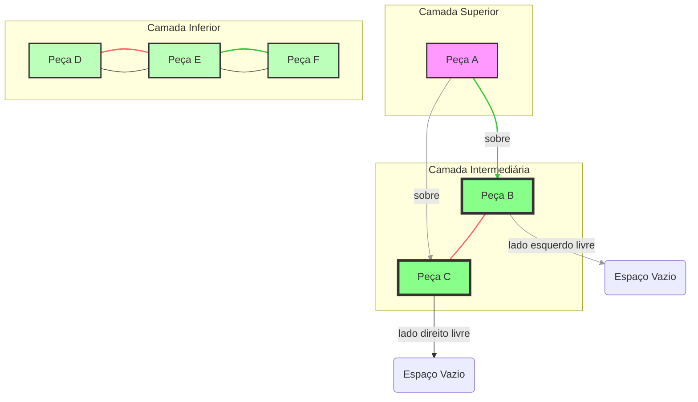
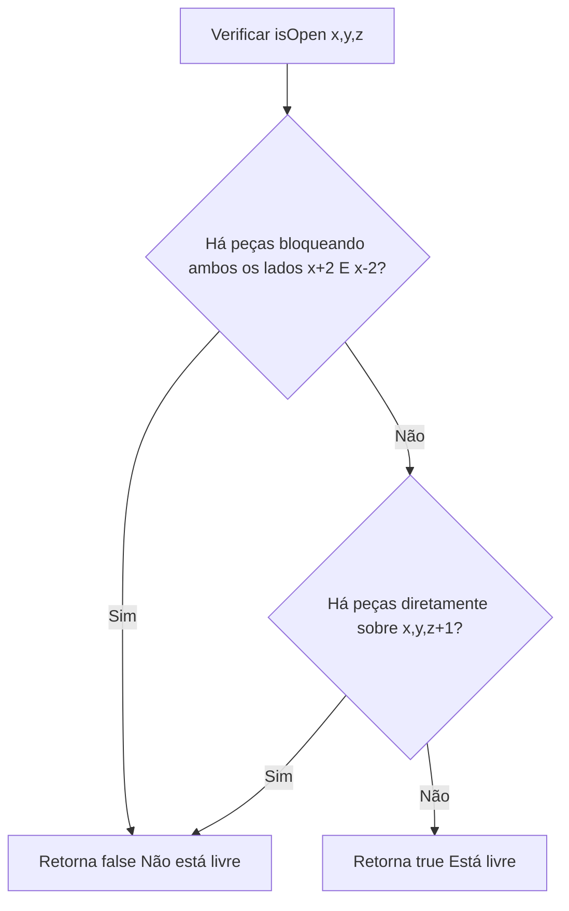
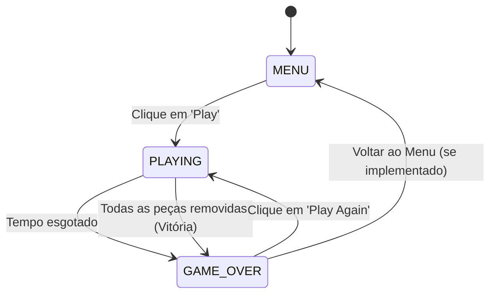
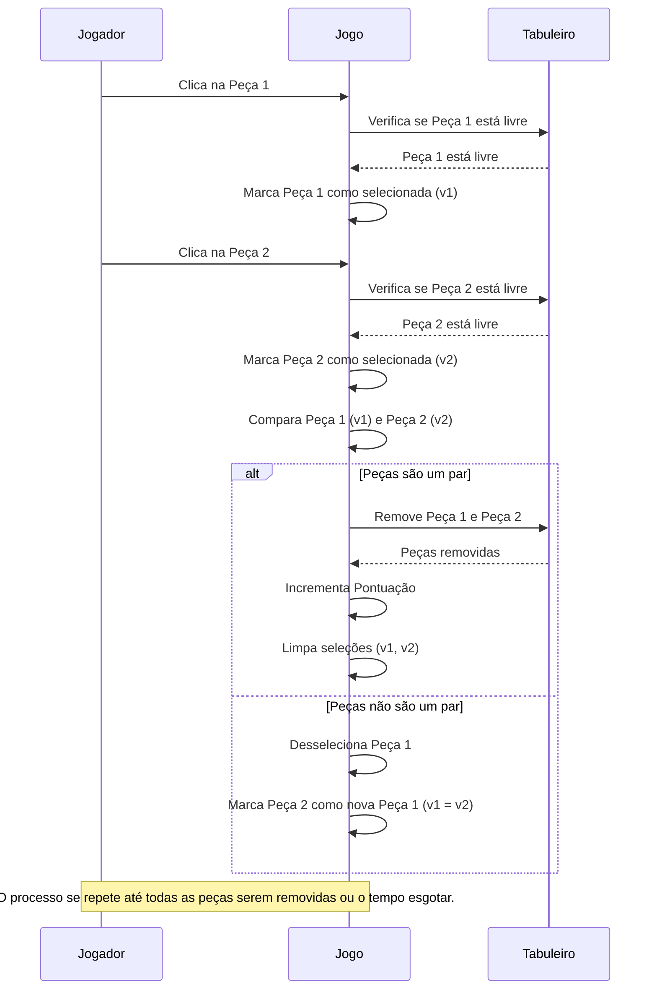

# Mahjong Solitaire

Imagine um quebra-cabeça tridimensional onde você precisa encontrar pares de peças idênticas para removê-las, revelando novas oportunidades por baixo. Assim como um arqueólogo que remove camadas de terra para descobrir artefatos escondidos, no Mahjong Solitaire você remove peças para desvendar o que está por baixo, sempre buscando o próximo par "livre".

Este tutorial explora a fundo a implementação do clássico jogo Mahjong Solitaire, também conhecido como Mahjong Patience, utilizando C++ e a biblioteca SFML (Simple and Fast Multimedia Library). Abordaremos a lógica do jogo, a estrutura do código, e as funcionalidades adicionadas recentemente, como menu, temporizador e pontuação, que transformaram o jogo em uma experiência mais completa e desafiadora.

## O que é Mahjong Solitaire?

Mahjong Solitaire é um jogo de paciência para um jogador que utiliza um conjunto de peças de Mahjong. O objetivo é remover todas as peças do tabuleiro, combinando pares de peças idênticas que estejam "livres".

### Regras Básicas:
- **Pares**: Duas peças são consideradas um par se tiverem o mesmo desenho.
- **Peça Livre**: Uma peça está livre se não houver outras peças diretamente sobre ela e se ela tiver pelo menos um lado (esquerdo ou direito) completamente desobstruído.

Para ilustrar o conceito de "Peça Livre", considere o diagrama abaixo:



No diagrama acima, podemos ver exemplos de peças livres e bloqueadas:
- **Peça A**: Não está livre, pois as peças B e C estão sob ela.
- **Peça B**: Está livre, pois não há nenhuma peça sobre ela e seu lado esquerdo está desobstruído.
- **Peça C**: Está livre, pois não há nenhuma peça sobre ela e seu lado direito está desobstruído.
- **Peça D**: Não está livre. No contexto do jogo, a peça B (da camada intermediária) estaria sobre ela, bloqueando-a.

- **Objetivo**: Remover todas as peças do tabuleiro.

## Estrutura do Código (`main.cpp`)

O arquivo `main.cpp` contém toda a lógica do jogo, desde a inicialização da janela e dos elementos gráficos até o manuseio das interações do usuário e a renderização na tela.

### 1. Inclusões e Variáveis Globais

O jogo utiliza a biblioteca **SFML** (Simple and Fast Multimedia Library) para todas as operações gráficas, de áudio e de entrada. SFML é uma biblioteca C++ que simplifica o desenvolvimento de jogos 2D, fornecendo módulos para gráficos, janelas, áudio e entrada do usuário. Além disso, `fstream` é usado para carregar o layout do tabuleiro de arquivos, e `time.h` para a geração de números aleatórios. `sstream` (para manipulação de strings) e `iostream` (para entrada/saída padrão) foram adicionados para o sistema de pontuação e temporizador.

```c#
#include <SFML/Graphics.hpp> // Módulo gráfico da SFML
#include <fstream>           // Para manipulação de arquivos (leitura do mapa)
#include <time.h>            // Para inicializar o gerador de números aleatórios (srand)
#include <sstream>           // Para formatar strings (usado no score e timer)
#include <iostream>          // Para entrada/saída padrão (ex: depuração)

using namespace sf; // Simplifica o uso de classes da SFML (ex: RenderWindow, Texture)

// Representação 3D do tabuleiro do Mahjong.
// Cada elemento armazena o tipo de peça ou 0 se estiver vazio.
// As dimensões são maiores (50x50x50) para acomodar bordas de segurança e evitar acessos inválidos.
int field[50][50][50] = {0};
```

**Termos Técnicos Explicados:**
- **SFML (Simple and Fast Multimedia Library)**: Uma biblioteca C++ de código aberto que facilita a criação de jogos e aplicações multimídia, abstraindo as complexidades de APIs gráficas e de áudio.
- **`#include`**: Diretiva de pré-processador em C++ que inclui o conteúdo de outro arquivo no código-fonte atual, permitindo o uso de funcionalidades definidas nesses arquivos.
- **`fstream`**: Biblioteca padrão do C++ para operações de entrada/saída com arquivos.
- **`time.h`**: Biblioteca padrão do C que fornece funções para manipulação de tempo, como `time()` para obter o tempo atual do sistema, frequentemente usado para semear geradores de números aleatórios.
- **`sstream`**: Biblioteca padrão do C++ que permite manipular strings como se fossem fluxos de entrada/saída, útil para construir strings formatadas (como as do score e timer).
- **`iostream`**: Biblioteca padrão do C++ para operações de entrada/saída, como imprimir no console (`std::cout`).
- **`using namespace sf;`**: Declaração que permite usar os nomes das classes e funções da SFML diretamente (ex: `RenderWindow` em vez de `sf::RenderWindow`).
- **`int field[50][50][50]`**: Um array tridimensional de inteiros. No Mahjong, ele representa o tabuleiro de jogo, onde cada `field[y][x][z]` indica a presença e o tipo de uma peça em uma coordenada específica (coluna `x`, linha `y`, camada `z`). O valor `0` geralmente indica um espaço vazio.

### 2. Funções Auxiliares

#### `f(x, y, z)`

Esta é uma função auxiliar simples que fornece uma maneira mais conveniente de acessar os elementos do array tridimensional `field`. Em vez de escrever `field[y + 2][x + 2][z]` repetidamente, podemos usar `f(x, y, z)`. Os offsets `+2` são usados para criar uma "borda" ao redor do tabuleiro lógico, simplificando as verificações de limites em outras funções.

```c#
int& f(int x,int y,int z){return field[y+2][x+2][z];}
int& f(Vector3i v){return f(v.x,v.y,v.z);}
```

**Termos Técnicos Explicados:**
- **`int&`**: Indica que a função retorna uma referência para um inteiro. Isso significa que a função não retorna uma cópia do valor, mas sim o próprio local na memória, permitindo que você modifique o elemento do array diretamente através da função `f`.
- **`Vector3i`**: Uma estrutura de dados da SFML que representa um vetor tridimensional de inteiros, com componentes `x`, `y` e `z`. É útil para agrupar coordenadas.

#### `isOpen(x, y, z)`

Esta função é crucial para a lógica do jogo, pois determina se uma peça na posição `(x, y, z)` está "livre" e pode ser selecionada pelo jogador. Uma peça é considerada livre se:
1.  Não houver **nenhuma peça diretamente sobre ela** (na camada `z+1`).
2.  Tiver pelo menos **um lado (esquerdo ou direito) completamente desobstruído**, ou seja, não há peças adjacentes que a bloqueiem em ambos os lados.

```c#
bool isOpen(int x,int y,int z)
{
  // Verifica se há peças bloqueando os lados (esquerda e direita)
  // Se houver peças em (x+2, y+i, z) E (x-2, y+j, z) para qualquer i,j de -1 a 1,
  // significa que a peça está "presa" entre outras duas.
  for(int i=-1;i<=1;i++)
   for(int j=-1;j<=1;j++)
    if (f(x+2,y+i,z)>0 && f(x-2,y+j,z)>0) return false; // Retorna false se ambos os lados estão bloqueados

  // Verifica se há peças diretamente sobre ela (na camada superior)
  // Se houver qualquer peça em (x+i, y+j, z+1) para qualquer i,j de -1 a 1,
  // significa que há uma peça sobre ela.
  for(int i=-1;i<=1;i++)
   for(int j=-1;j<=1;j++)
    if ( f(x+i,y+j,z+1)>0 ) return false; // Retorna false se houver peça sobre ela

  return true; // Se nenhuma das condições acima for verdadeira, a peça está livre
}
```

**Diagrama da Lógica `isOpen`:**



**Termos Técnicos Explicados:**
- **`bool`**: Um tipo de dado que pode ter apenas dois valores: `true` (verdadeiro) ou `false` (falso). Usado para indicar sucesso ou falha de uma condição.
- **`for` loop**: Uma estrutura de controle de fluxo que permite executar um bloco de código repetidamente um número específico de vezes. Essencial para iterar sobre vizinhos ou camadas.
- **`return`**: Uma palavra-chave que encerra a execução de uma função e, opcionalmente, retorna um valor para o chamador.

#### `resetGame(score, timer, moves)`

Esta função é o ponto de partida para cada nova partida de Mahjong Solitaire. Ela é responsável por inicializar ou reiniciar completamente o estado do jogo, garantindo um tabuleiro fresco e solucionável.

**Passos da Função `resetGame`:**
1.  **Reinicialização de Variáveis**: A pontuação (`score`) é zerada, o temporizador (`timer`) é configurado para 5 minutos (300 segundos), e o histórico de movimentos (`moves`) é limpo.
2.  **Limpeza do Tabuleiro**: O array `field` (que representa o tabuleiro 3D) é completamente zerado, removendo todas as peças de uma partida anterior.
3.  **Carregamento do Layout do Tabuleiro**: O jogo lê um arquivo de texto (por exemplo, `files/map.txt`) que define a estrutura básica do tabuleiro. Cada caractere no arquivo representa a altura das pilhas de peças em uma determinada posição `(x, y)`. Isso permite criar layouts de tabuleiro pré-definidos.

    ```c++
    // Carrega o layout do tabuleiro a partir de um arquivo (ex: files/map.txt)
    std::fstream myfile("files/map.txt");
    for(int y=0;y<18;y++)
     for(int x=0;x<30;x++)
      {
        char a;  myfile >> a;
        int n = a - '0'; // Converte o caractere para um número (altura da pilha)
        for(int z=0;z<n;z++)
          // Preenche as camadas inferiores com 1 (indicando peça presente)
          if (f(x-1,y-1,z)) f(x-1,y,z)=f(x,y-1,z)=0; // Lógica original, pode ser simplificada
          else f(x,y,z)=1;
      }
    ```

4.  **Geração Aleatória de Pares de Peças**: Esta é a parte mais inteligente da função. Em vez de simplesmente preencher o tabuleiro com peças aleatórias, o algoritmo garante que cada peça tenha um par correspondente e que o tabuleiro seja solucionável. Ele faz isso encontrando posições "abertas" (`opens`) e atribuindo pares de IDs de peças (`-k`) a elas. O `k` é incrementado e modulado para ciclar pelos diferentes tipos de peças.

    ```c#
    // Cria o mapa de peças, garantindo que cada peça tenha um par e o tabuleiro seja solucionável
    for(int k=1;;k++) // k representa o ID do tipo de peça
    {
     std::vector<Vector3i> opens; // Armazena posições de peças "abertas" (livres)
     for(int z=0;z<10;z++)
      for(int y=0;y<18;y++)
       for(int x=0;x<30;x++)
        if (f(x,y,z)>0 && isOpen(x,y,z)) opens.push_back(Vector3i(x,y,z));

     int n=opens.size();
     if (n<2) break; // Se menos de 2 peças abertas, não há mais pares para formar
     int a=0,b=0;
     while(a==b){a=rand()%n;b=rand()%n;} // Seleciona duas posições abertas aleatoriamente
     f(opens[a])=-k;  if (k>34) k++; // Atribui o ID da peça (negativo para indicar que é um tipo de peça)
     f(opens[b])=-k; // Atribui o mesmo ID para o par
     k%=42; // Cicla pelos IDs de peças (42 tipos diferentes)
    }

    // Converte os IDs de peça para valores positivos para o jogo
    for(int z=0;z<10;z++)
     for(int y=0;y<18;y++)
      for(int x=0;x<30;x++) f(x,y,z)*=-1;
    ```

**Termos Técnicos Explicados:**
- **`std::fstream`**: Um objeto para lidar com operações de arquivo, como leitura (`myfile >> a;`).
- **`srand(time(0))`**: Função usada para "semear" o gerador de números pseudoaleatórios. `time(0)` fornece um valor baseado no tempo atual, garantindo que a sequência de números aleatórios seja diferente a cada execução do programa.
- **`std::vector<Vector3i> opens`**: Um `std::vector` é um contêiner dinâmico que pode armazenar uma coleção de objetos (neste caso, `Vector3i`). Ele cresce e encolhe automaticamente conforme necessário. Aqui, ele armazena as coordenadas de todas as peças que estão "livres" no momento da geração do tabuleiro.
- **`rand()%n`**: Gera um número pseudoaleatório entre 0 e `n-1`. Usado para selecionar aleatoriamente as posições das peças.

### 3. Estados do Jogo (`GameState`)

Para gerenciar as diferentes telas e fluxos do jogo, utilizamos um `enum` (enumeração) para definir os estados. Isso é uma prática comum em desenvolvimento de jogos para controlar o que está acontecendo no jogo a qualquer momento e como ele deve reagir às interações do jogador.

```c++
enum GameState {
    MENU,      // O jogo está na tela inicial, aguardando o jogador iniciar.
    PLAYING,   // O jogo está em andamento, com a lógica de jogo ativa.
    GAME_OVER  // O jogo terminou, exibindo a pontuação final e opções de reinício.
};
```

**Diagrama de Estados do Jogo:**



**Termos Técnicos Explicados:**
- **`enum` (Enumeração)**: Um tipo de dado que permite definir um conjunto de constantes nomeadas. É útil para criar um código mais legível e menos propenso a erros, usando nomes significativos em vez de números "mágicos" para representar estados ou opções.

### 4. Loop Principal (`main` function)

A função `main` é o coração de qualquer aplicação SFML e de muitos jogos. Ela contém o **loop principal do jogo**, que é um ciclo contínuo que se repete muitas vezes por segundo. A cada repetição (chamada de "frame"), o jogo realiza as seguintes etapas:

1.  **Processamento de Eventos**: Captura as interações do usuário (cliques do mouse, fechamento da janela) e eventos do sistema.
2.  **Atualização da Lógica do Jogo**: Calcula o tempo, atualiza o temporizador, verifica condições de vitória/derrota, e processa a lógica de seleção e remoção de peças.
3.  **Renderização**: Desenha todos os elementos visuais na tela (fundo, peças, score, timer, mensagens).

```c++
int main() {
    srand(time(0)); // Inicializa o gerador de números aleatórios

    RenderWindow app(VideoMode(940, 570), "Mahjong Solitaire!"); // Cria a janela do jogo
    app.setFramerateLimit(60); // Limita a taxa de quadros a 60 FPS

    // ... Carregamento de Texturas (peças, fundo) e Sprites ...
    // ... Configuração de Fontes e Textos (score, timer, menu, game over) ...

    // Variáveis de estado do jogo
    GameState gameState = MENU;
    int score = 0;
    float timer = 300; // 5 minutos
    Clock clock; // Cronômetro para o jogo

    resetGame(score, timer, moves); // Inicializa o tabuleiro e variáveis

    while (app.isOpen()) { // Loop principal do jogo
        Event e; // Objeto para eventos
        while (app.pollEvent(e)) { // Processa todos os eventos pendentes
            if (e.type == Event::Closed) // Se o evento for fechar a janela
                app.close(); // Fecha a aplicação

            // Lógica de manuseio de eventos baseada no estado atual do jogo
            if (gameState == MENU) {
                // ... (lógica para clique no botão 'Play') ...
            } else if (gameState == PLAYING) {
                // ... (lógica para cliques do mouse para selecionar peças e desfazer) ...
            } else if (gameState == GAME_OVER) {
                // ... (lógica para clique no botão 'Play Again') ...
            }
        }

        app.clear(); // Limpa a tela
        app.draw(sBackground); // Desenha o fundo

        // Lógica de desenho baseada no estado atual do jogo
        if (gameState == MENU) {
            // ... (desenha o menu 'Play') ...
        } else if (gameState == PLAYING) {
            // ... (atualiza e desenha o timer e score, desenha as peças do tabuleiro) ...
        } else if (gameState == GAME_OVER) {
            // ... (desenha a tela de 'Game Over' com pontuação final) ...
        }

        app.display(); // Exibe o que foi desenhado na tela
    }
    return 0;
}
```

**Diagrama de Sequência: Seleção e Remoção de Peças**



**Termos Técnicos Explicados:**
- **`RenderWindow`**: Uma classe da SFML que representa a janela principal do aplicativo, onde todo o conteúdo gráfico é desenhado.
- **`VideoMode`**: Define a resolução (largura e altura) da janela do jogo.
- **`app.setFramerateLimit(60)`**: Define o número máximo de quadros por segundo (FPS) que o jogo tentará renderizar. Isso ajuda a garantir que o jogo rode de forma consistente em diferentes máquinas.
- **`Texture`**: Um objeto da SFML que armazena dados de imagem na memória da GPU, otimizado para renderização rápida. Usado para carregar `tiles.png` e `background.png`.
- **`Sprite`**: Um objeto da SFML que representa uma imagem 2D que pode ser desenhada na tela. Um `Sprite` usa uma `Texture` como sua fonte de imagem.
- **`Event e`**: Um objeto da SFML que representa um evento do usuário (como um clique do mouse, pressionar uma tecla, ou fechar a janela) ou um evento do sistema.
- **`app.pollEvent(e)`**: Uma função que verifica se há eventos pendentes na fila de eventos da janela. Se houver, ela preenche o objeto `e` com os detalhes do evento e retorna `true`.
- **`e.type`**: Um membro do objeto `Event` que indica o tipo de evento que ocorreu (ex: `Event::Closed`, `Event::MouseButtonPressed`).
- **`e.mouseButton.button`**: Um membro do objeto `Event` (usado quando `e.type` é um evento de mouse) que indica qual botão do mouse foi pressionado (ex: `Mouse::Left`, `Mouse::Right`).
- **`Mouse::getPosition(app)`**: Retorna a posição atual do cursor do mouse em relação à janela do aplicativo.
- **`getGlobalBounds()`**: Um método de objetos `sf::Text` (e outros objetos desenháveis) que retorna um retângulo (`FloatRect`) que envolve o objeto na tela, útil para detecção de cliques em botões.
- **`Clock clock`**: Um objeto da SFML usado para medir o tempo. `clock.restart()` zera o cronômetro e `clock.getElapsedTime().asSeconds()` retorna o tempo decorrido desde o último `restart`.
- **`std::stringstream ss`**: Um objeto que permite construir strings de forma eficiente, concatenando diferentes tipos de dados (inteiros, floats, etc.) em uma única string, usada para exibir o score e o timer.
- **`static_cast<int>(timer)`**: Uma operação de *type casting* que converte o valor `float` de `timer` para um `int`, truncando a parte decimal. Usado para exibir o tempo em segundos inteiros.
- **`app.clear()`**: Limpa o conteúdo da janela, geralmente preenchendo-a com uma cor sólida (padrão é preto).
- **`app.draw()`**: Desenha um objeto (`Sprite`, `Text`, etc.) na janela. Os objetos são desenhados na ordem em que `app.draw()` é chamado.
- **`app.display()`**: Atualiza a janela, mostrando todo o conteúdo que foi desenhado desde a última chamada a `app.clear()`.
- **`srand(time(0))`**: Função usada para "semear" o gerador de números pseudoaleatórios. `time(0)` fornece um valor baseado no tempo atual, garantindo que a sequência de números aleatórios seja diferente a cada execução do programa.

#### Funcionalidades Adicionadas:
- **Menu Inicial**: Permite ao jogador iniciar o jogo.
- **Temporizador**: Um contador regressivo de 5 minutos. Se o tempo acabar, o jogo termina.
- **Pontuação**: Aumenta a cada par de peças combinado.
- **Tela de Game Over**: Exibida quando o tempo se esgota, mostrando a pontuação final e a opção de jogar novamente.
- **Redimensionamento da Janela**: A janela do jogo foi ampliada para acomodar o temporizador e a pontuação sem sobrepor o tabuleiro.
- **Escala do Background**: A imagem de fundo agora se ajusta ao novo tamanho da janela.

## Conceitos de Programação Aprendidos

Ao explorar o código do Mahjong Solitaire, você terá a oportunidade de aprender e aplicar diversos conceitos fundamentais em desenvolvimento de software e jogos:

- **Gerenciamento de Estados (Finite State Machine - FSM)**: A utilização do `enum GameState` e a lógica condicional (`if/else if`) no loop principal demonstram como organizar o fluxo de um aplicativo em diferentes "modos" (menu, jogo, game over). Isso torna o código mais modular, fácil de entender e de manter, pois cada estado tem responsabilidades bem definidas.

- **Manipulação de Arrays 3D**: O tabuleiro do Mahjong é representado por um array tridimensional (`int field[50][50][50]`). Você aprenderá a acessar, modificar e iterar sobre dados em três dimensões, o que é essencial para jogos com elementos empilhados ou em camadas.

- **Lógica de Jogo Complexa**: A implementação das regras de Mahjong Solitaire, especialmente a função `isOpen()` para determinar se uma peça está "livre" e a lógica de geração de tabuleiros solucionáveis em `resetGame()`, oferece um excelente estudo de caso sobre como traduzir regras complexas de um jogo para algoritmos de programação.

- **Gerenciamento de Tempo (`sf::Clock`)**: A utilização da classe `sf::Clock` para criar um temporizador de contagem regressiva (`timer`) e para controlar a taxa de atualização do jogo (`app.setFramerateLimit()`) é fundamental para garantir que a experiência de jogo seja consistente, independentemente da velocidade do hardware do usuário.

- **Sistema de Pontuação e UI Básica (`sf::Text`)**: A implementação de um sistema de pontuação simples e a exibição de informações na tela (score, timer, mensagens de menu/game over) usando `sf::Text` e `std::stringstream` ensinam os fundamentos da criação de uma interface de usuário (UI) funcional e informativa.

- **Geração Procedural (Tabuleiro Solucionável)**: A lógica em `resetGame()` que garante que o tabuleiro gerado aleatoriamente seja sempre solucionável é um exemplo de geração procedural de conteúdo. Em vez de criar manualmente todos os layouts de tabuleiro, o jogo os gera dinamicamente, mas de forma inteligente para garantir a jogabilidade.

- **Programação Orientada a Eventos**: O loop `while (app.pollEvent(e))` é o cerne da programação orientada a eventos, onde o programa reage a ações do usuário (cliques do mouse) e eventos do sistema (fechar janela) de forma assíncrona.

Mahjong Solitaire é um excelente projeto para entender a aplicação de estruturas de dados complexas e a implementação de regras de jogo detalhadas em um ambiente gráfico, preparando você para desafios maiores no desenvolvimento de jogos.
