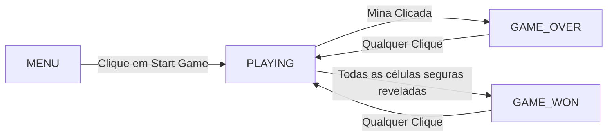
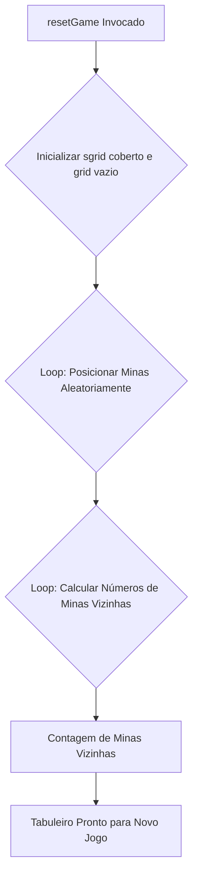
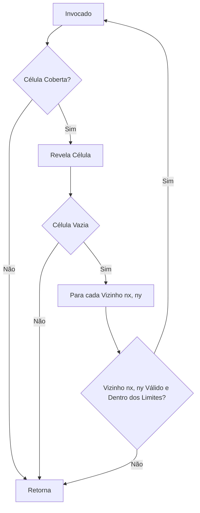
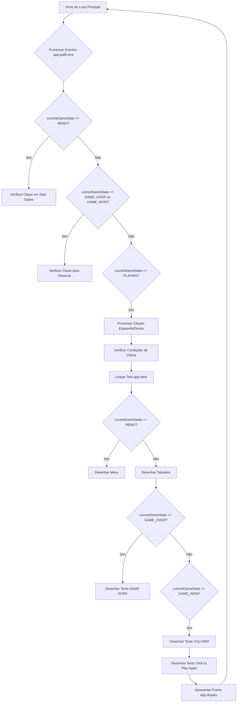

# Minesweeper

Este tutorial aprofunda a implementação do clássico jogo Campo Minado (Minesweeper) utilizando C++ e a biblioteca SFML. Abordaremos a arquitetura do jogo, as estruturas de dados subjacentes, os algoritmos centrais e a gestão da interface do utilizador de forma técnica e detalhada.

## Visão Geral Técnica

Minesweeper é um jogo de lógica baseado em uma grade, onde o jogador deve deduzir a localização de minas ocultas. A implementação foca na gestão eficiente de estados, manipulação de grades 2D e um algoritmo recursivo de "flood fill" para revelar áreas do tabuleiro.

## Organizacão do Jogo

### Estados do Jogo - Uma Máquina de Estados Finitos

O fluxo do jogo é controlado por uma máquina de estados simples, definida por um `enum` e uma variável global `currentGameState`. Isso permite que o programa se comporte de maneira diferente dependendo do contexto (menu, jogo ativo, fim de jogo).

```cpp
enum GameState {
    MENU,        // Tela inicial, aguardando o jogador iniciar
    PLAYING,     // Jogo em andamento, processando interações do tabuleiro
    GAME_OVER,   // Jogo finalizado por derrota (mina detonada)
    GAME_WON     // Jogo finalizado por vitória (todas as células seguras reveladas)
};

GameState currentGameState = MENU; // O jogo sempre inicia no estado de menu
```

As transições de estado são acionadas por eventos do utilizador (cliques) ou por condições de jogo (detonar mina, revelar todas as células seguras).



### Estruturas de Dados - Representação do Tabuleiro

O tabuleiro do Minesweeper é modelado por duas matrizes bidimensionais de inteiros, ambas de tamanho `12x12` para acomodar uma borda invisível de células (índices 0 e 11) que simplifica a lógica de verificação de vizinhos.

- `int grid[12][12]`: Esta matriz armazena o estado *lógico* de cada célula:
    - `0` a `8`: Indica o número de minas adjacentes.
    - `9`: Representa uma mina.
    - As células na borda (índices 0 e 11) são geralmente inicializadas com `0` e não são exibidas ao jogador.

- `int sgrid[12][12]`: Esta matriz armazena o estado *visível* de cada célula para o jogador:
    - `10`: Célula coberta (não revelada).
    - `11`: Célula marcada com uma bandeira.
    - `0` a `9`: Célula revelada, exibindo o número de minas adjacentes ou uma mina (se detonada).

```cpp
int w = 32; // Tamanho em pixels de cada célula (largura e altura)
int grid[12][12]; // Armazena o layout das minas e contagens
int sgrid[12][12]; // Armazena o que é visível para o jogador
```

### Sistema de Coordenadas

O jogo opera com dois sistemas de coordenadas:

1.  **Coordenadas Lógicas (Grid)**: Pares de inteiros `(i, j)` que representam a posição da célula na matriz (ex: `grid[i][j]`). Estas são usadas para toda a lógica do jogo (cálculo de minas, verificação de vizinhos).
2.  **Coordenadas Visuais (Pixel)**: Pares de inteiros `(x, y)` em pixels, usadas para renderização na janela SFML. A conversão é feita multiplicando as coordenadas lógicas pelo tamanho da célula (`w`).

```cpp
// Conversão de coordenadas de pixel para grid
int x_grid = pos.x / w;
int y_grid = pos.y / w;

// Conversão de coordenadas de grid para pixel para posicionamento de sprites
s.setPosition(i * w, j * w);
```

## Mecânicas e Algoritmos Centrais

### `resetGame()` - Inicialização e Reconfiguração do Tabuleiro

Esta função é invocada no início de cada nova partida. Seu algoritmo é:

1.  **Inicialização de `sgrid`**: Todas as células visíveis são definidas como `10` (cobertas).
2.  **Inicialização de `grid`**: Todas as células lógicas são definidas como `0` (sem minas).
3.  **Posicionamento de Minas**: Um loop duplo itera sobre as células `(1,1)` a `(10,10)`. Para cada célula, um número aleatório é gerado (`rand() % 5 == 0`). Se a condição for verdadeira (aproximadamente 20% de chance), a célula em `grid[i][j]` é definida como `9` (mina).
4.  **Cálculo de Números**: Outro loop duplo itera sobre as células `(1,1)` a `(10,10)`. Se uma célula *não* contiver uma mina (`grid[i][j] != 9`), ela verifica seus 8 vizinhos (incluindo diagonais). Para cada vizinho que contém uma mina (`grid[vizinho_x][vizinho_y] == 9`), um contador é incrementado. O valor final do contador é atribuído a `grid[i][j]`. A borda invisível (`0` e `11`) garante que as verificações de vizinhos não saiam dos limites da matriz.

```cpp
void resetGame() {
    // ... inicialização de grids ...
    for (int i = 1; i <= 10; i++) {
        for (int j = 1; j <= 10; j++) {
            if (grid[i][j] == 9) continue; // Ignora minas
            int n = 0;
            for (int dx = -1; dx <= 1; dx++) { // Itera sobre vizinhos
                for (int dy = -1; dy <= 1; dy++) {
                    if (grid[i + dx][j + dy] == 9) n++; // Conta minas vizinhas
                }
            }
            grid[i][j] = n;
        }
    }
}
```



### `openCells()` - Algoritmo Recursivo de Flood Fill

Esta função é a espinha dorsal da mecânica de revelação de células vazias. É uma implementação clássica do algoritmo de *flood fill*:

1.  **Condição de Parada**: A recursão para se a célula `(i, j)` já não estiver coberta (`sgrid[i][j] != 10`). Isso evita loops infinitos e reprocessamento de células já reveladas.
2.  **Revelação**: A célula `sgrid[i][j]` é atualizada para o valor correspondente em `grid[i][j]`, tornando-a visível.
3.  **Propagação (para células vazias)**: Se a célula revelada for `0` (vazia, sem minas adjacentes), a função chama a si mesma recursivamente para todos os seus 8 vizinhos (incluindo diagonais). As chamadas recursivas são protegidas por verificações de limites (`i + dx >= 1 && i + dx <= 10`, etc.) para garantir que não acessem índices inválidos da matriz.

```cpp
void openCells(int i, int j) {
    if (sgrid[i][j] == 10) { // Se a célula está coberta
        sgrid[i][j] = grid[i][j]; // Revela
        if (grid[i][j] == 0) { // Se for vazia, propaga
            for (int dx = -1; dx <= 1; dx++) {
                for (int dy = -1; dy <= 1; dy++) {
                    // Verifica limites e chama recursivamente
                    if (i + dx >= 1 && i + dx <= 10 && j + dy >= 1 && j + dy <= 10) {
                        openCells(i + dx, j + dy);
                    }
                }
            }
        }
    }
}
```



### Processamento de Entrada do Utilizador

O jogo responde a cliques do mouse, com o comportamento variando de acordo com o `currentGameState`:

-   **Estado `MENU`**: Um clique esquerdo dentro da área do texto "Start Game" transiciona o jogo para o estado `PLAYING` e inicia uma nova partida via `resetGame()`.
-   **Estados `GAME_OVER` / `GAME_WON`**: Qualquer clique esquerdo reinicia o jogo, transicionando para `PLAYING` e chamando `resetGame()`.
-   **Estado `PLAYING`**: 
    -   **Clique Esquerdo**: Se a célula clicada estiver coberta (`sgrid[x][y] == 10`):
        -   Se `grid[x][y] == 9` (mina): O estado muda para `GAME_OVER`. Todas as minas são reveladas em `sgrid`.
        -   Se `grid[x][y] == 0` (vazia): `openCells(x, y)` é chamada para iniciar a revelação recursiva.
        -   Caso contrário (número `1-8`): A célula é simplesmente revelada (`sgrid[x][y] = grid[x][y]`).
    -   **Clique Direito**: Alterna o estado da célula entre coberta (`10`) e bandeira (`11`), mas apenas se a célula estiver coberta ou já tiver uma bandeira.

### Condições de Vitória e Derrota

-   **Derrota**: Detectada imediatamente quando um clique esquerdo revela uma mina (`grid[x][y] == 9`). O `currentGameState` é definido como `GAME_OVER`.
-   **Vitória**: Verificada a cada frame no estado `PLAYING`. O jogo é ganho se:
    1.  O número de células *cobertas* (`sgrid[i][j] == 10` ou `sgrid[i][j] == 11`) for igual ao número total de minas no tabuleiro.
    2.  E o número de minas *corretamente* marcadas com bandeiras (`sgrid[i][j] == 11 && grid[i][j] == 9`) for igual ao número total de minas.

    Esta lógica garante que o jogador não apenas revele todas as células seguras, mas também identifique corretamente todas as minas. Se a condição for satisfeita, `currentGameState` é definido como `GAME_WON`.

## Interface do Utilizador (UI) e Renderização

O SFML é utilizado para desenhar todos os elementos visuais do jogo.

### Uso de Sprite Sheet (`images/tiles.jpg`)

O arquivo `tiles.jpg` é uma *sprite sheet* contendo todas as imagens para os diferentes estados das células. Cada imagem é um quadrado de `32x32` pixels. A função `s.setTextureRect(IntRect(sgrid[i][j] * w, 0, w, w))` é crucial aqui: ela seleciona a porção correta da sprite sheet (`sgrid[i][j] * w` pixels a partir da esquerda) para desenhar a célula correspondente ao seu estado visível.

-   **Índices da Sprite Sheet:**
    -   `0` a `8`: Sprites para células reveladas com 0 a 8 minas adjacentes.
    -   `9`: Sprite da mina (exibida ao perder o jogo).
    -   `10`: Sprite da célula coberta.
    -   `11`: Sprite da bandeira.

### Renderização de Texto (`sf::Font`, `sf::Text`)

A fonte `Carlito-Regular.ttf` é carregada para renderizar mensagens de status (`GAME OVER`, `YOU WIN!`, `Click to Play Again`) e elementos do menu (`MINESWEEPER`, `Start Game`).

-   `sf::Font::loadFromFile()`: Carrega o arquivo da fonte.
-   `sf::Text`: Objeto usado para configurar o texto (string, fonte, tamanho, cor, contorno).
-   `setTextureRect()`: Não aplicável a texto, mas `setPosition()` e `getGlobalBounds()` são usados para centralizar e posicionar o texto dinamicamente na janela.

### Estrutura do Loop Principal (`main` function)

O loop principal do jogo é o coração da aplicação SFML, seguindo o padrão comum de jogos:



## Conceitos de Programação Avançados

### 1. Máquinas de Estado Finitos (FSM)
-   A implementação do `GameState` é um exemplo claro de FSM, um padrão de design fundamental em desenvolvimento de jogos para gerenciar complexidade e fluxo de aplicação.

### 2. Recursão e Algoritmos de Busca (Flood Fill)
-   A função `openCells()` é uma aplicação prática e eficiente da recursão para implementar o algoritmo de *flood fill*. É essencial para a jogabilidade do Minesweeper, revelando grandes áreas do tabuleiro com um único clique.

### 3. Manipulação de Matrizes 2D e Verificação de Limites
-   O uso de `grid` e `sgrid` demonstra a manipulação de dados em estruturas 2D. A inclusão de uma borda invisível (`12x12` para um tabuleiro `10x10`) é uma técnica comum para simplificar a lógica de verificação de vizinhos, evitando a necessidade de múltiplas verificações de `if` para os cantos e bordas do tabuleiro real.

### 4. Programação Orientada a Eventos
-   O loop principal do SFML é um exemplo clássico de programação orientada a eventos, onde o programa reage a interações do utilizador e eventos do sistema, em vez de seguir um fluxo linear.

### 5. Geração Procedural Simples
-   A colocação aleatória de minas no `resetGame()` é uma forma básica de geração procedural de conteúdo, onde elementos do jogo são criados algoritmicamente em tempo de execução.

Este projeto de Minesweeper serve como um excelente estudo de caso para entender a aplicação de algoritmos fundamentais, padrões de design e técnicas de renderização em um contexto de desenvolvimento de jogos.