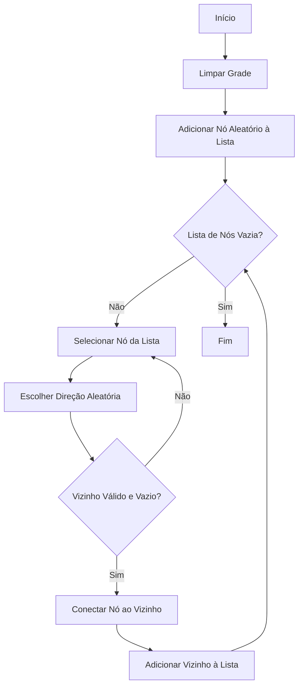
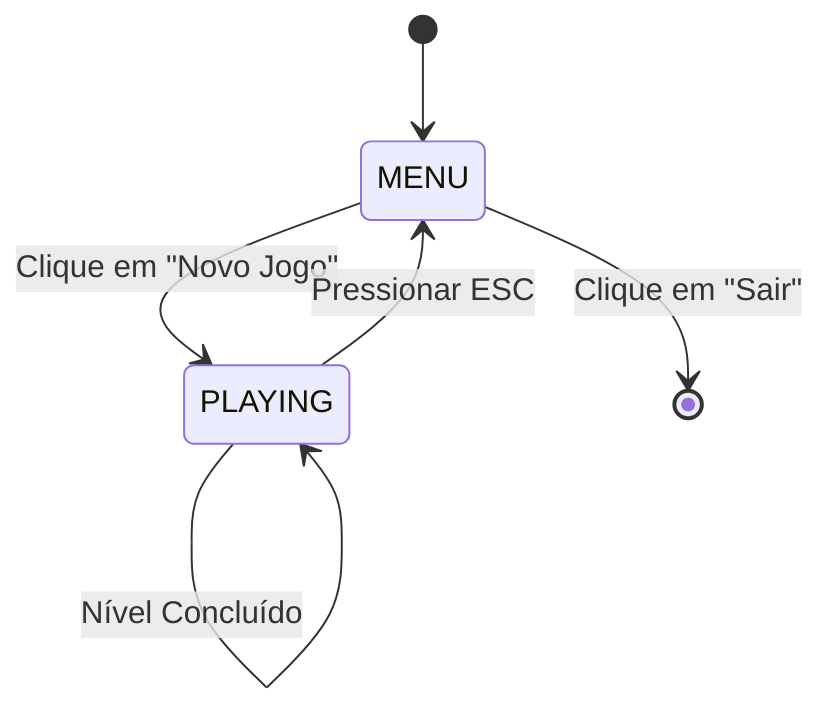

# NetWalk

## Introdução

Bem-vindo ao guia de desenvolvimento do NetWalk! Este documento detalha o processo de criação do jogo, desde a ideia inicial até a implementação do código em C++ com a biblioteca SFML. O objetivo é fornecer um passo a passo claro para desenvolvedores júnior que desejam entender a lógica por trás de um jogo de quebra-cabeça.

### O que é o NetWalk?

NetWalk é um jogo de quebra-cabeça onde o jogador deve rotacionar peças de canos em uma grade para conectar todos os computadores a um servidor central. É um teste de lógica e visão espacial.

### Tecnologias Utilizadas

- **C++**: A linguagem de programação principal, escolhida por sua performance e controle.
- **SFML (Simple and Fast Multimedia Library)**: Uma biblioteca de multimídia fácil de usar para criar jogos 2D, cuidando de gráficos, áudio, janelas e eventos.

## 2. Da Concepção ao Design

Todo jogo começa com uma ideia. A concepção do NetWalk foi baseada em quebra-cabeças de conexão clássicos.

### A Ideia Central

A ideia era criar uma rede. O jogador não move as peças, mas muda sua orientação para formar um caminho contínuo. Isso cria uma mecânica de jogo simples, mas com um potencial de complexidade crescente.

### Elementos de Design

- **Grade**: Uma grade 2D foi a escolha natural para organizar as peças de forma clara.
- **Peças (Canos)**: As peças são os elementos que o jogador manipula. Elas podem ser retas, curvas ou ter múltiplas conexões (T, cruzamento).
- **Servidor e Computadores**: Para dar um objetivo claro, definimos um ponto de partida (o servidor) e pontos de chegada (os computadores). O desafio é conectar todos os computadores ao servidor.
- **Rotação**: A interação principal do jogador é a rotação das peças, uma ação simples que tem um impacto direto na rede.

## 3. Estruturas de Dados: A Base do Jogo

Para implementar a lógica, precisamos de estruturas de dados eficientes.

### A Estrutura `pipe`

Cada peça na grade é representada pela struct `pipe`. Ela contém toda a informação necessária sobre uma peça individual.

```c#
struct pipe
{
  // Vetor que armazena as direções para onde o cano aponta.
  // Ex: um cano reto vertical teria os vetores Up e Down.
  std::vector<Vector2i> dirs;

  // A orientação da peça em múltiplos de 90 graus. Usado para animação.
  int orientation;

  // O ângulo atual da peça. Usado para a animação suave de rotação.
  float angle;

  // Um booleano que indica se a peça está recebendo energia do servidor.
  bool on;
};
```

### A Grade `grid`

A grade é uma matriz 2D que armazena todas as peças do jogo.

```c#
// N é uma constante que define o tamanho da grade (6x6)
const int N = 6;
pipe grid[N][N];
```

### Vetores de Direção

Para facilitar o trabalho com direções, definimos vetores `Vector2i` para representar Cima, Baixo, Esquerda e Direita.

```c#
Vector2i Up(0,-1);
Vector2i Down(0,1);
Vector2i Right(1,0);
Vector2i Left(-1,0);

Vector2i DIR[4] = {Up,Right,Down,Left};
```

## 4. Lógica do Jogo em Detalhes

Esta seção detalha os algoritmos centrais do jogo.

### Geração do Quebra-Cabeça (`generatePuzzle`)

Criar um quebra-cabeça que tenha solução é crucial. Usamos um algoritmo de geração procedural:

1.  **Início**: Começamos com uma grade vazia e uma lista de "nós ativos", adicionando uma célula aleatória a ela.
2.  **Expansão**: Enquanto a lista de nós não estiver vazia, pegamos um nó e tentamos conectá-lo a um vizinho aleatório que ainda não faz parte da rede.
3.  **Criação de Conexões**: Se uma conexão é feita, o vizinho é adicionado à lista de nós ativos, e o processo continua. Isso cria um caminho contínuo e garante que todas as peças estejam conectadas.



### Energizando a Rede (`drop`)

Para saber quais peças estão conectadas ao servidor, usamos uma função recursiva chamada `drop`.

1.  A função começa no servidor (`servPos`).
2.  Ela marca a peça atual como energizada (`on = true`).
3.  Em seguida, ela olha para todos os vizinhos. Se um vizinho está conectado à peça atual (e vice-versa), a função `drop` é chamada para o vizinho.
4.  Este processo continua até que todos os canos conectados ao servidor estejam marcados como `on`.

### Condição de Vitória (`checkWin`)

A vitória ocorre quando todos os computadores (peças com apenas uma conexão) estão energizados. A função `checkWin` simplesmente itera pela grade e retorna `false` se encontrar qualquer computador com `on == false`.

### Gerenciamento de Estado

O fluxo do jogo é controlado por uma máquina de estados simples.



## 5. Implementação com SFML

A SFML torna a parte gráfica relativamente simples.

- **Janela e Loop Principal**: A `RenderWindow` da SFML cria a janela, e o `while (app.isOpen())` forma o loop principal do jogo.
- **Carregamento de Recursos**: Texturas para os canos, fundo, servidor e computadores, bem como a fonte para o texto, são carregadas no início do `main`.
- **Renderização**: A cada frame, a tela é limpa (`app.clear()`) e todos os elementos visíveis (sprites e textos) são desenhados (`app.draw()`).
- **Eventos**: O loop `while (app.pollEvent(e))` captura as ações do jogador, como cliques do mouse e pressionamento de teclas, permitindo que o jogo responda a elas.

## Conclusão

O NetWalk é um exemplo de como mecânicas simples podem criar um jogo de quebra-cabeça desafiador e divertido. A combinação de um algoritmo de geração procedural com uma lógica de verificação de vitória clara e uma implementação gráfica limpa com SFML resulta em uma experiência de jogo completa.

Como próximos passos, você pode tentar expandir o jogo:
- Aumentar o tamanho da grade (`N`) a cada nível.
- Adicionar novos tipos de peças.
- Implementar um sistema de pontuação baseado em tempo.
