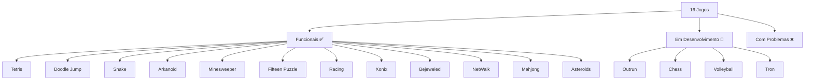

# Executando os Jogos

Este guia completo mostra como executar cada um dos 16 jogos, incluindo controles, objetivos e dicas para cada jogo.

## Formas de Executar

### Método Rápido (Recomendado)

```bash
# Compilar e executar em um comando
make run-tetris
make run-doodle_jump
make run-snake
make run-arkanoid
```

### Método Manual

```bash
# 1. Compilar primeiro
make build-tetris

# 2. Navegar para a pasta do jogo  
cd build/games/tetris

# 3. Executar
./tetris
```

### Método Direto (Após compilação)

```bash
# Se já compilou antes, pode executar diretamente
cd build/games/tetris && ./tetris
```

## Jogos Disponíveis

### Status de Funcionamento



## Guia Individual dos Jogos

### 1. Tetris
**Como executar:**
```bash
make run-tetris
```

**Controles:**
- **Setas Esquerda/Direita**: Mover peça
- **Seta Baixo**: Acelerar queda
- **Seta Cima**: Rotacionar peça
- **Espaço**: Drop instantâneo

**Objetivo:** Completar linhas horizontais para eliminá-las. O jogo acelera conforme você progride.

**Dicas:**
- Deixe espaços para peças longas (I-tetromino)
- Não acumule peças muito alto
- Use o drop instantâneo para pontuação extra

---

### 2. Doodle Jump
**Como executar:**
```bash
make run-doodle_jump
```

**Controles:**
- **Setas Esquerda/Direita**: Mover personagem
- **Espaço**: Iniciar jogo (no menu)
- **R**: Reiniciar (game over)
- **M**: Voltar ao menu

**Objetivo:** Pule de plataforma em plataforma, alcançando a maior altura possível.

**Dicas:**
- Use o movimento horizontal para alcançar plataformas distantes
- O personagem "atravessa" a tela (sai de um lado, aparece do outro)
- Quanto mais alto, mais pontos você ganha

---

### 3. Snake
**Como executar:**
```bash
make run-snake
```

**Controles:**
- **Setas**: Direção da serpente
- **Não pode** voltar na direção contrária

**Objetivo:** Comer comida para crescer, evitando colidir com as bordas ou com o próprio corpo.

**Dicas:**
- Planeje sua rota com antecedência
- Evite criar "armadilhas" para si mesmo
- Use as bordas da tela estrategicamente

---

### 4. Arkanoid
**Como executar:**
```bash
make run-arkanoid
```

**Controles:**
- **Setas Esquerda/Direita**: Mover raquete
- **Espaço**: Iniciar jogo/Lançar bola

**Objetivo:** Quebrar todos os blocos rebatendo a bola com a raquete.

**Dicas:**
- Mantenha a bola sempre em movimento
- Use os ângulos da raquete para controlar a direção
- Mire nos cantos dos blocos para ângulos interessantes

---

### 5. Minesweeper (Campo Minado)
**Como executar:**
```bash
make run-minesweeper
```

**Controles:**
- **Click Esquerdo**: Revelar célula
- **Click Direito**: Marcar/desmarcar bandeira
- **(Pode variar dependendo da implementação)**

**Objetivo:** Revelar todas as células sem bombas, usando números como pistas.

**Dicas:**
- Números indicam quantas bombas estão adjacentes
- Comece pelos cantos e bordas
- Use bandeiras para marcar bombas conhecidas

---

### 6. Fifteen Puzzle
**Como executar:**
```bash
make run-fifteen_puzzle
```

**Controles:**
- **Setas**: Mover peças
- **Mouse**: Clicar em peças adjacentes ao espaço vazio

**Objetivo:** Organizar números de 1 a 15 em ordem, deixando o espaço vazio no canto inferior direito.

**Dicas:**
- Resolva linha por linha, de cima para baixo
- Use o espaço vazio estrategicamente
- Últimas duas linhas requerem técnica especial

---

### 7. Racing (Top Down)
**Como executar:**
```bash
make run-racing
```

**Controles:**
- **Setas**: Direção do carro
- **Acelerar/Freiar** (dependendo da implementação)

**Objetivo:** Completar voltas na pista no menor tempo possível.

**Dicas:**
- Freie antes das curvas
- Use a pista inteira nas curvas
- Mantenha velocidade constante nas retas

---

### 8. Xonix
**Como executar:**
```bash
make run-xonix
```

**Controles:**
- **Setas**: Mover personagem

**Objetivo:** Conquistar território desenhando linhas, evitando inimigos.

**Dicas:**
- Faça movimentos rápidos para evitar inimigos
- Conquiste pequenas áreas por vez
- Cuidado com inimigos que seguem sua trilha

---

### 9. Bejeweled
**Como executar:**
```bash
make run-bejeweled
```

**Controles:**
- **Mouse**: Selecionar e trocar joias
- **Setas**: Navegar (se implementado)

**Objetivo:** Formar grupos de 3 ou mais joias iguais para eliminá-las.

**Dicas:**
- Procure por grupos de 4 ou 5 para power-ups
- Planeje várias jogadas em sequência
- Observe oportunidades de cascata

---

### 10. NetWalk
**Como executar:**
```bash
make run-netwalk
```

**Controles:**
- **Mouse**: Clicar para rotacionar peças
- **Setas**: Navegar pelo grid

**Objetivo:** Conectar todas as peças de tubulação para formar uma rede completa.

**Dicas:**
- Comece pelas peças de canto (menos opções)
- Identifique o caminho principal primeiro
- Rotacione peças sistematicamente

---

### 11. Mahjong Solitaire
**Como executar:**
```bash
make run-mahjong
```

**Controles:**
- **Mouse**: Selecionar peças
- **Scroll**: Rotacionar visualização (se 3D)

**Objetivo:** Remover todas as peças combinando pares iguais que estejam livres.

**Dicas:**
- Uma peça está "livre" se não há peças em cima ou dos lados
- Procure por peças únicas primeiro
- Planeje para não bloquear peças necessárias

---

### 12. Asteroids
**Como executar:**
```bash
make run-asteroids
```

**Controles:**
- **Setas**: Rotacionar e acelerar nave
- **Espaço**: Atirar
- **Shift/Ctrl**: Escudo/Hiper-espaço (se implementado)

**Objetivo:** Destruir todos os asteroides sem ser atingido.

**Dicas:**
- Asteroides grandes se dividem em menores
- Use o impulso com cuidado (sem atrito no espaço)
- Atenção às bordas da tela (wraparound)

## Jogos em Desenvolvimento

### 13. Outrun
**Status:** 🚧 Em desenvolvimento
**Problema comum:** Renderização 3D complexa

### 14. Chess
**Status:** 🚧 Em desenvolvimento  
**Problema comum:** IA e validação de movimentos

### 15. Volleyball
**Status:** 🚧 Em desenvolvimento
**Problema comum:** Física da bola e multiplayer

### 16. Tron
**Status:** 🚧 Em desenvolvimento
**Problema comum:** Trail rendering e IA

## Solução de Problemas na Execução

### Jogo não inicia

```bash
# Verificar se foi compilado
ls build/games/tetris/tetris

# Verificar permissões
chmod +x build/games/tetris/tetris

# Tentar executar com debug
cd build/games/tetris
gdb ./tetris
```

### Erro "Failed to load image"

```bash
# Verificar se assets estão presentes
ls build/games/tetris/images/

# Recompilar para recopiar assets
make clean
make build-tetris
```

### Jogo executa mas tela preta

**Possíveis causas:**
- Assets não encontrados
- Problema com drivers gráficos
- Resolução incompatível

**Soluções:**
```bash
# Verificar se SFML funciona
pkg-config --exists sfml-all && echo "OK" || echo "Problema"

# Testar com jogo mais simples
make run-snake  # Snake usa menos recursos gráficos
```

### Performance ruim

```bash
# Compilar em modo otimizado
cd build
cmake -DCMAKE_BUILD_TYPE=Release ..
make tetris

# Verificar uso de recursos
top -p $(pgrep tetris)
```

## Scripts Úteis

### Testar Todos os Jogos

```bash
#!/bin/bash
# test_all.sh

games=("tetris" "doodle_jump" "snake" "arkanoid" "minesweeper" 
       "fifteen_puzzle" "racing" "xonix" "bejeweled" "netwalk" 
       "mahjong" "asteroids")

for game in "${games[@]}"; do
    echo "Testando $game..."
    if make run-$game &>/dev/null & then
        PID=$!
        sleep 3
        kill $PID 2>/dev/null
        echo "✅ $game funciona"
    else
        echo "❌ $game tem problemas"
    fi
done
```

### Menu Interativo

```bash
#!/bin/bash
# game_menu.sh

echo "🎮 Seletor de Jogos"
echo "=================="
echo "1) Tetris"
echo "2) Doodle Jump" 
echo "3) Snake"
echo "4) Arkanoid"
echo "5) Minesweeper"
echo "0) Sair"

read -p "Escolha um jogo (0-5): " choice

case $choice in
    1) make run-tetris ;;
    2) make run-doodle_jump ;;
    3) make run-snake ;;
    4) make run-arkanoid ;;
    5) make run-minesweeper ;;
    0) echo "Tchau!" ;;
    *) echo "Opção inválida" ;;
esac
```

## Dicas Gerais de Execução

### Controles Universais

A maioria dos jogos usa:
- **ESC**: Sair do jogo
- **Enter**: Confirmar/Pausar
- **Espaço**: Ação principal
- **Setas**: Navegação/Movimento

### Resolução de Tela

Alguns jogos podem ter resolução fixa. Se a janela ficar muito pequena ou grande:

1. **Modificar código fonte** (avançado):
```cpp
// Procurar por linhas como:
RenderWindow window(VideoMode(800, 600), "Nome do Jogo");
```

2. **Usar modo janela**:
- A maioria dos jogos abre em janela
- Pode ser possível redimensionar manualmente

### Performance

Para melhor performance:
- Feche outros programas
- Use modo Release quando compilar
- Verifique drivers de vídeo atualizados

### Salvamento

A maioria dos jogos não salva progresso automaticamente:
- High scores podem ser perdidos ao fechar
- Anote suas melhores pontuações manualmente
- Alguns jogos podem criar arquivos de save

## Conclusão

Executar os jogos é a parte mais divertida do projeto! Cada jogo oferece uma experiência única e demonstra diferentes conceitos de programação de jogos. Use este guia como referência para:

- **Descobrir** novos jogos para jogar
- **Aprender** diferentes mecânicas de jogo
- **Solucionar** problemas de execução
- **Comparar** implementações diferentes

Divirta-se explorando todos os 16 jogos e descobrindo suas mecânicas e segredos!