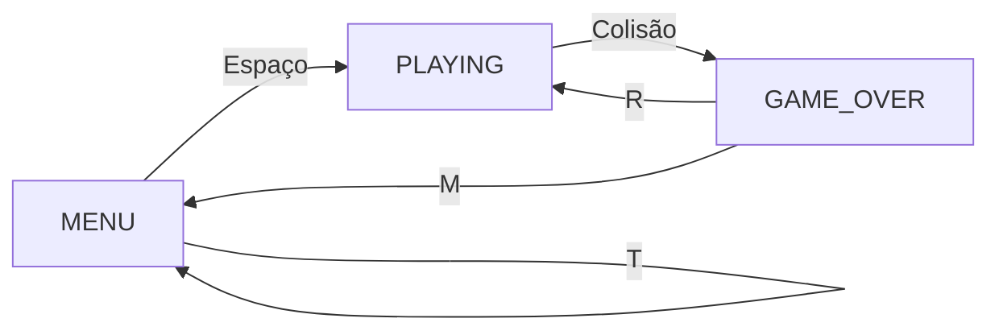
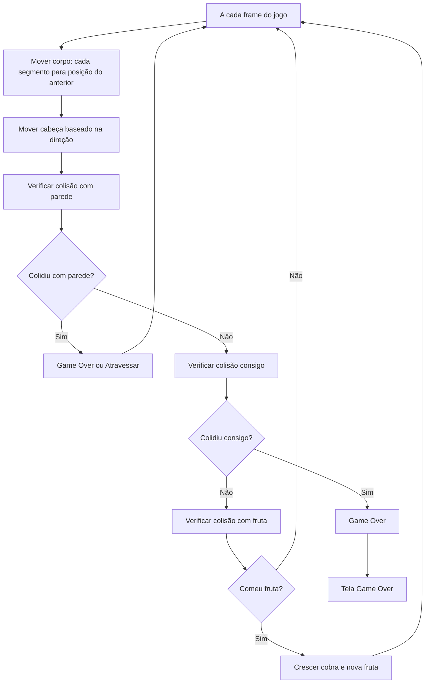

# Snake

Este tutorial ensina como criar o clássico jogo Snake do zero usando C++ e SFML. Vamos construir o conhecimento passo a passo, explicando cada mecânica e conceito de programação envolvido, desde o movimento básico até sistemas avançados de validação.

## O que é Snake

Imagine um jogo onde você controla uma cobra que cresce a cada fruta que come, mas nunca pode tocar em si mesma. É um dos jogos mais simples e viciantes já criados:

- Uma cobra se move continuamente pela tela
- Você controla apenas a direção (cima, baixo, esquerda, direita)
- A cobra cresce cada vez que come uma fruta
- O jogo termina se a cobra colidir consigo mesma ou com as paredes
- O objetivo é conseguir a maior pontuação possível comendo frutas

Este jogo nos permite aprender conceitos fundamentais como arrays, lógica de movimento, detecção de colisões e validação de entrada do usuário.

## Como Organizar o Jogo Snake

### Estados do Jogo - Controle de Fluxo

O Snake possui três estados principais que controlam toda a experiência:

- **Menu**: Tela inicial com instruções e configurações
- **Jogando**: Quando o jogo está ativo e a cobra se move
- **Game Over**: Quando o jogador perde, com opções de reiniciar



No código, implementamos isso com um enum simples:

```cpp
enum GameState {
    MENU,        // Tela inicial
    PLAYING,     // Jogando ativamente  
    GAME_OVER    // Perdeu o jogo
};

GameState currentState = MENU;  // Começa no menu
```

### Estruturas de Dados - Representando o Mundo do Jogo

#### Estrutura da Cobra

```cpp
struct Snake {
    int x, y;    // Posição na grade
} s[100];        // Array para até 100 segmentos

int num = 4;     // Número atual de segmentos da cobra
int dir = 0;     // Direção atual (0=baixo, 1=esquerda, 2=direita, 3=cima)
```

**Por que usar um array?**
- A cobra é uma sequência de segmentos conectados
- Cada segmento segue o movimento do anterior
- Array permite acesso direto e eficiente a qualquer segmento
- Tamanho fixo evita problemas de alocação dinâmica

#### Estrutura da Fruta

```cpp
struct Fruit {
    int x, y;    // Posição na grade
} f;

int score = 0;       // Pontuação atual
int highScore = 0;   // Maior pontuação já alcançada
```

### Sistema de Grade - Coordenadas Lógicas vs. Visuais

O jogo funciona em duas camadas de coordenadas:

```cpp
int N = 30, M = 20;  // Grade lógica: 30x20 células
int size = 16;       // Tamanho de cada célula em pixels
int w = size * N;    // Largura da janela: 480 pixels
int h = size * M;    // Altura da janela: 320 pixels
```

**Vantagens deste sistema:**
- **Lógica simples**: Posições são números inteiros (0 a 29, 0 a 19)
- **Movimento discreto**: A cobra se move célula por célula
- **Colisões precisas**: Comparação simples de coordenadas inteiras
- **Escalabilidade**: Fácil mudar tamanho do jogo alterando `size`

## As Principais Mecânicas do Jogo

### Movimento da Cobra - A Essência do Snake

O movimento da cobra é o coração do jogo. Cada segmento segue o anterior, criando o efeito de uma cobra se movendo:



#### Implementação do Movimento

```cpp
void Tick() {
    // 1. Mover o corpo da cobra (cada segmento segue o anterior)
    for (int i = num - 1; i > 0; --i) {
        s[i].x = s[i-1].x;  // Copia posição X do segmento anterior
        s[i].y = s[i-1].y;  // Copia posição Y do segmento anterior
    }
    
    // 2. Mover a cabeça da cobra baseado na direção
    if (dir == 0) s[0].y += 1;      // Baixo
    if (dir == 1) s[0].x -= 1;      // Esquerda
    if (dir == 2) s[0].x += 1;      // Direita
    if (dir == 3) s[0].y -= 1;      // Cima
    
    // 3. Resto da lógica de colisões...
}
```

**Por que esse algoritmo funciona?**
- **Movimento em cadeia**: Começamos do final (`num-1`) e vamos até o segundo segmento (`1`)
- **Preservação de posições**: Cada segmento "lembra" onde o anterior estava
- **Cabeça independente**: Só a cabeça (`s[0]`) se move baseada na direção do jogador
- **Efeito visual**: Cria a ilusão de uma cobra deslizando suavemente

### Controle de Direção - Prevenindo Morte Acidental

Um aspecto crucial é impedir que o jogador vá na direção oposta, o que causaria morte instantânea:

```cpp
// Input do jogo com validação
if (currentState == PLAYING) {
    // Validar input para evitar movimento na direção oposta
    if (Keyboard::isKeyPressed(Keyboard::Left) && dir != 2) dir=1;   // ← só se não estava indo →
    if (Keyboard::isKeyPressed(Keyboard::Right) && dir != 1) dir=2;  // → só se não estava indo ←
    if (Keyboard::isKeyPressed(Keyboard::Up) && dir != 0) dir=3;     // ↑ só se não estava indo ↓
    if (Keyboard::isKeyPressed(Keyboard::Down) && dir != 3) dir=0;   // ↓ só se não estava indo ↑
}
```

**Mapeamento das direções:**
- `dir = 0`: Baixo (↓) - **oposto**: Cima (3)
- `dir = 1`: Esquerda (←) - **oposto**: Direita (2)  
- `dir = 2`: Direita (→) - **oposto**: Esquerda (1)
- `dir = 3`: Cima (↑) - **oposto**: Baixo (0)

### Sistema de Colisões - Detectando Eventos do Jogo

#### Colisão com Parede

```cpp
bool checkWallCollision() {
    return (s[0].x < 0 || s[0].x >= N || s[0].y < 0 || s[0].y >= M);
}

void handleWallCollision() {
    if (wallCollisionEnabled) {
        // Modo clássico: game over ao bater na parede
        currentState = GAME_OVER;
    } else {
        // Modo wrap-around: atravessa para o outro lado
        if (s[0].x >= N) s[0].x = 0;      // Direita → Esquerda
        if (s[0].x < 0) s[0].x = N - 1;   // Esquerda → Direita
        if (s[0].y >= M) s[0].y = 0;      // Baixo → Cima
        if (s[0].y < 0) s[0].y = M - 1;   // Cima → Baixo
    }
}
```

**Dois modos de jogo:**
- **Clássico**: Colidir com parede = Game Over
- **Wrap-around**: Cobra atravessa as bordas (como Pac-Man)

#### Colisão Consigo Mesmo

```cpp
bool checkSelfCollision() {
    for (int i = 1; i < num; i++) {  // Começar do índice 1 (pular a cabeça)
        if (s[0].x == s[i].x && s[0].y == s[i].y) {
            return true;  // Cabeça tocou algum segmento do corpo
        }
    }
    return false;
}
```

**Por que começar do índice 1?**
- `s[0]` é a cabeça da cobra
- `s[1]` até `s[num-1]` são os segmentos do corpo
- A cabeça não pode colidir consigo mesma (índice 0)

#### Colisão com Fruta

```cpp
bool checkFruitCollision() {
    return (s[0].x == f.x && s[0].y == f.y);
}

// Quando come fruta
if (checkFruitCollision()) {
    num++;           // Aumenta o tamanho da cobra
    score += 10;     // Adiciona pontos
    if (score > highScore) {
        highScore = score;  // Atualiza recorde
    }
    spawnNewFruit(); // Gera nova fruta
}
```

### Geração Inteligente de Frutas

Gerar uma fruta em posição válida é mais complexo do que parece:

```cpp
void spawnNewFruit() {
    bool validPosition = false;
    int attempts = 0;
    
    while (!validPosition && attempts < 100) {
        f.x = rand() % N;  // Posição X aleatória
        f.y = rand() % M;  // Posição Y aleatória
        
        // Verifica se a fruta não está na cobra
        validPosition = true;
        for (int i = 0; i < num; i++) {
            if (f.x == s[i].x && f.y == s[i].y) {
                validPosition = false;  // Posição ocupada pela cobra
                break;
            }
        }
        attempts++;
    }
    
    // Fallback: se não achou posição em 100 tentativas
    if (!validPosition) {
        f.x = rand() % N;
        f.y = rand() % M;
    }
}
```

**Problemas que este algoritmo resolve:**
- **Fruta na cobra**: Impede gerar fruta onde já há segmentos
- **Loop infinito**: Limite de 100 tentativas evita travamento
- **Cobras grandes**: Funciona mesmo quando a cobra ocupa muito espaço
- **Fallback seguro**: Se não achar posição válida, pelo menos gera algo

## Gerenciamento de Estados e Interface

### Sistema de Menus - Múltiplas Interfaces

O jogo precisa de diferentes interfaces para cada estado:

```cpp
void drawMenu(RenderWindow& window, Font& font, bool fontLoaded) {
    if (fontLoaded) {
        // Interface com texto quando fonte está disponível
        Text title("SNAKE GAME", font, 50);
        title.setFillColor(Color::Green);
        title.setPosition(w/2 - 120, h/2 - 150);
        
        Text instruction("Pressione SPACE para jogar", font, 20);
        instruction.setFillColor(Color::White);
        instruction.setPosition(w/2 - 120, h/2 - 70);
        
        Text modeText("Modo: " + std::string(wallCollisionEnabled ? "Parede Mata" : "Atravessa Parede"), font, 18);
        modeText.setFillColor(Color::Cyan);
        modeText.setPosition(w/2 - 90, h/2 - 40);
        
        window.draw(title);
        window.draw(instruction);
        window.draw(modeText);
    } else {
        // Interface visual sem texto (fallback criativo)
        for (int i = 0; i < 5; i++) {
            RectangleShape segment(Vector2f(20, 20));
            segment.setFillColor(Color::Green);
            segment.setPosition(w/2 - 50 + i * 25, h/2 - 150);
            window.draw(segment);  // Desenha "SNAKE" visualmente
        }
    }
}
```

### Controle de Velocidade - Timing do Jogo

```cpp
Clock clock;
float timer = 0, delay = 0.1;  // Delay de 100ms entre movimentos

// No loop principal
float time = clock.getElapsedTime().asSeconds();
clock.restart();
timer += time;

if (currentState == PLAYING) {
    if (timer > delay) {
        timer = 0;
        Tick();  // Executar próximo movimento
    }
}
```

**Como funciona o timing:**
- **clock.getElapsedTime()**: Tempo desde última medição
- **timer**: Acumula tempo até atingir o delay
- **delay = 0.1**: Cobra se move 10 vezes por segundo
- **timer = 0**: Reset para próximo ciclo

### Função de Reset - Começar Nova Partida

```cpp
void resetGame() {
    num = 4;         // Tamanho inicial da cobra
    score = 0;       // Zerar pontuação
    dir = 0;         // Direção inicial (baixo)
    f.x = 10;        // Posição inicial da fruta
    f.y = 10;
    
    // Resetar posição da cobra (linha horizontal)
    for (int i = 0; i < 4; i++) {
        s[i].x = 4 - i;  // x: 4, 3, 2, 1
        s[i].y = 5;      // y: todos na linha 5
    }
    
    currentState = PLAYING;  // Iniciar jogo
}
```

**Posicionamento inicial:**
- **Cabeça**: `s[0]` na posição (4, 5)
- **Corpo**: `s[1]` (3,5), `s[2]` (2,5), `s[3]` (1,5)
- **Resultado**: Cobra horizontal de 4 segmentos indo para a direita

## Conceitos Avançados de Programação

### Validação de Dados - Prevenindo Bugs

```cpp
void validateGameState() {
    // Verificar se a cabeça está dentro dos limites
    if (s[0].x < 0 || s[0].x >= N || s[0].y < 0 || s[0].y >= M) {
        if (wallCollisionEnabled && currentState != GAME_OVER) {
            // Erro: deveria ter terminado o jogo
            // Útil para debug
        }
    }
    
    // Verificar colisão com próprio corpo
    for (int i = 1; i < num; i++) {
        if (s[0].x == s[i].x && s[0].y == s[i].y) {
            if (currentState != GAME_OVER) {
                // Erro: deveria ter terminado o jogo por auto-colisão
            }
        }
    }
}
```

**Propósito da validação:**
- **Debug**: Identificar bugs na lógica
- **Testes**: Verificar se o jogo está funcionando corretamente
- **Robustez**: Detectar estados inválidos
- **Manutenção**: Facilitar correção de problemas

### Fallback Gráfico - Funcionar Sem Recursos

O jogo funciona mesmo sem arquivos de imagem:

```cpp
// Tentar carregar texturas
Texture t1, t2;
if (!t1.loadFromFile("images/white.png")) {
    // Criar textura procedural branca
    Image whiteImage;
    whiteImage.create(16, 16, Color::White);
    t1.loadFromImage(whiteImage);
}

if (!t2.loadFromFile("images/red.png")) {
    // Criar textura procedural vermelha
    Image redImage;
    redImage.create(16, 16, Color::Red);
    t2.loadFromImage(redImage);
}
```

**Vantagens:**
- **Independência**: Jogo funciona em qualquer ambiente
- **Robustez**: Não quebra por arquivos faltando
- **Desenvolvimento**: Pode testar sem assets
- **Distribuição**: Menos arquivos para gerenciar

### Sistema de Pontuação Visual

Quando não há fonte disponível, criar visualização de pontuação:

```cpp
void drawScore(RenderWindow& window, Font& font, bool fontLoaded) {
    if (!fontLoaded) {
        // Score visual com barras
        int scoreBars = (score / 10) > 15 ? 15 : (score / 10);
        for (int i = 0; i < scoreBars; i++) {
            RectangleShape bar(Vector2f(6, 15));
            bar.setFillColor(Color::White);
            bar.setPosition(10 + i * 8, 10);
            window.draw(bar);
        }
        
        // High score visual
        int highScoreBars = (highScore / 10) > 15 ? 15 : (highScore / 10);
        for (int i = 0; i < highScoreBars; i++) {
            RectangleShape bar(Vector2f(6, 15));
            bar.setFillColor(Color::Yellow);
            bar.setPosition(w - 130 + i * 8, 10);
            window.draw(bar);
        }
    }
}
```

## Estrutura Completa do Main Loop

```cpp
int main() {
    srand(time(0));  // Seed para números aleatórios
    
    RenderWindow window(VideoMode(w, h), "Snake Game!");
    
    // Inicialização de recursos...
    
    while (window.isOpen()) {
        // 1. Controle de timing
        float time = clock.getElapsedTime().asSeconds();
        clock.restart();
        timer += time;
        
        // 2. Processar eventos
        Event e;
        while (window.pollEvent(e)) {
            if (e.type == Event::Closed) {
                window.close();
            }
            
            // Eventos específicos por estado...
        }
        
        // 3. Lógica do jogo
        if (currentState == PLAYING) {
            // Input com validação
            // Movimento automático com timer
        }
        
        // 4. Renderização
        window.clear();
        
        if (currentState == MENU) {
            drawMenu(window, font, fontLoaded);
        }
        else if (currentState == PLAYING) {
            // Desenhar fundo, cobra, fruta, interface
        }
        else if (currentState == GAME_OVER) {
            drawGameOver(window, font, fontLoaded);
        }
        
        window.display();
    }
    
    return 0;
}
```

## Conceitos de Programação Aprendidos

### 1. **Arrays e Indexação**
- Uso de arrays para representar sequências
- Manipulação de índices com cuidado
- Diferença entre tamanho lógico e físico

### 2. **Máquinas de Estado**
- Enum para representar estados
- Transições controladas entre estados
- Comportamento específico por estado

### 3. **Algoritmos de Movimento**
- Movimento em cadeia (seguir o líder)
- Coordenadas lógicas vs. físicas
- Controle de timing

### 4. **Detecção de Colisões**
- Colisão ponto-a-ponto
- Múltiplos tipos de colisão
- Ordem de verificação de colisões

### 5. **Validação de Entrada**
- Filtrar input inválido
- Prevenir estados inconsistentes
- Interface responsiva e segura

### 6. **Geração Procedural**
- Algoritmos de spawn inteligente
- Tratamento de casos extremos
- Fallbacks para situações problemáticas

Este jogo Snake demonstra como um conceito simples pode envolver múltiplas técnicas avançadas de programação, desde estruturas de dados básicas até algoritmos de validação robustos.