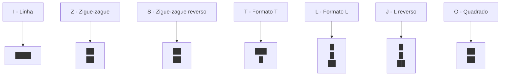
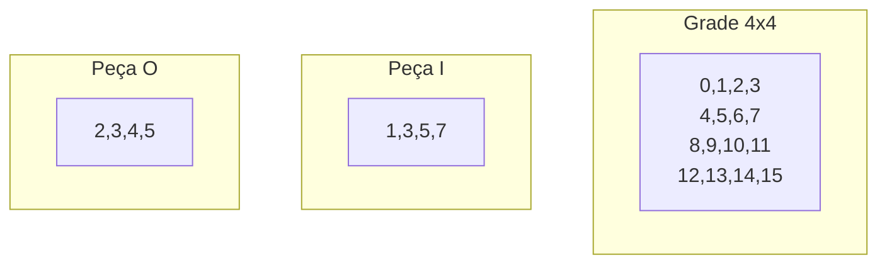
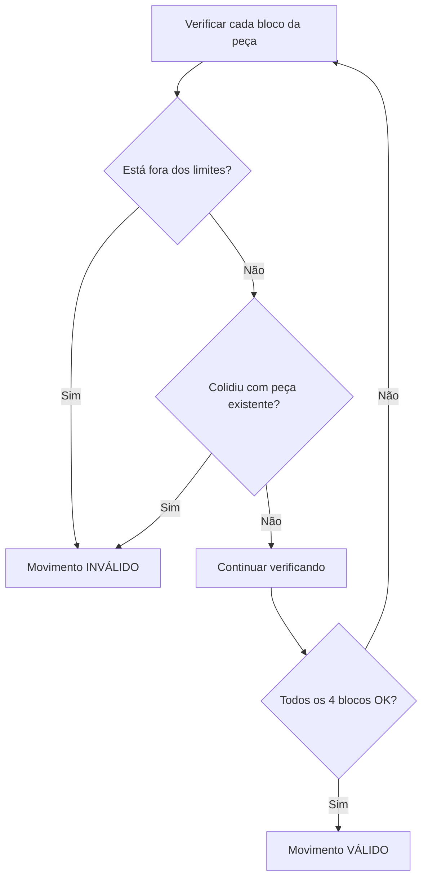
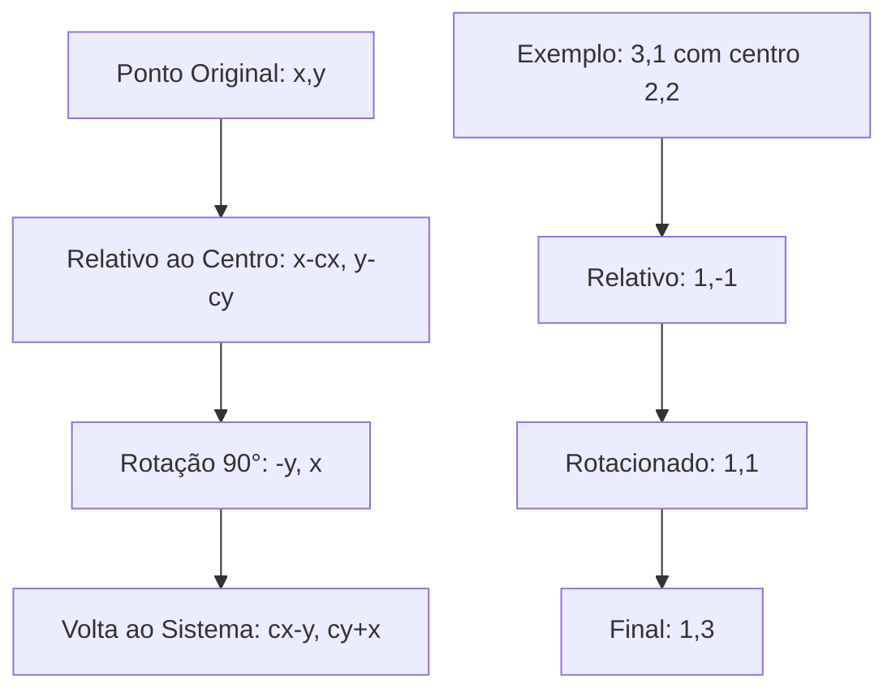
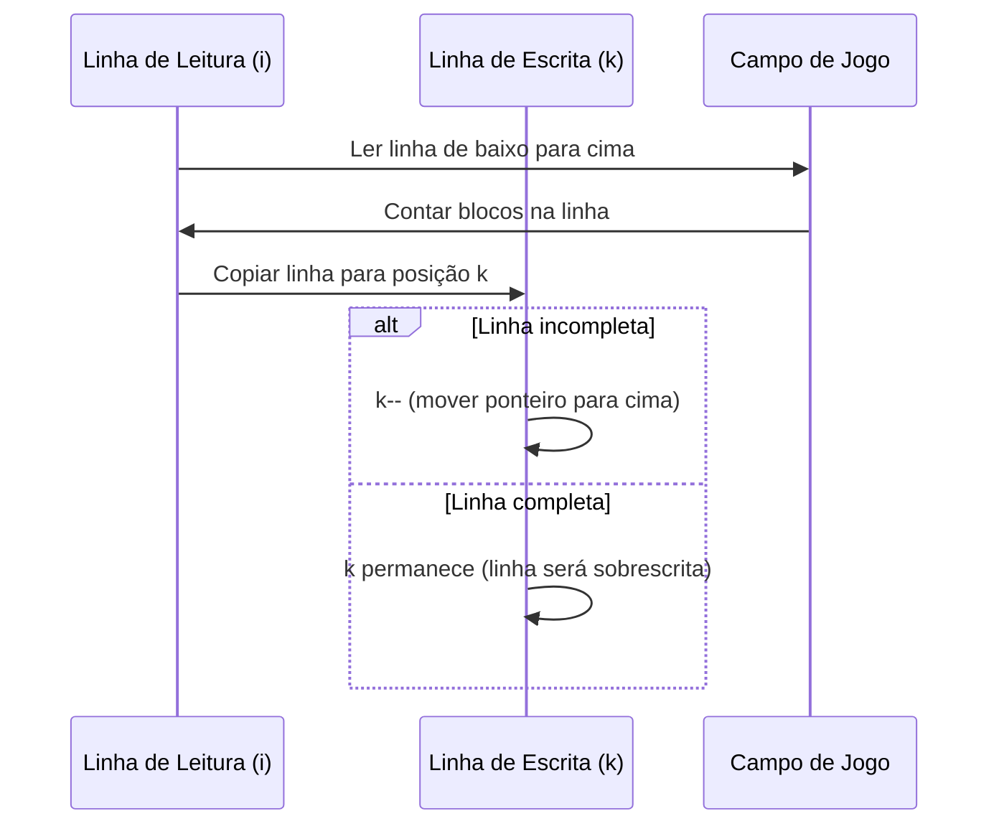

# Tetris

Este tutorial ensina como criar o jogo Tetris do zero usando C++ e SFML. Vamos começar com conceitos básicos e construir o conhecimento passo a passo, explicando cada parte de forma clara e detalhada.

## O que é Tetris

Imagine um jogo onde peças de diferentes formatos caem do céu como chuva, e você precisa organizá-las de forma inteligente para que se encaixem perfeitamente. É como um quebra-cabeças em movimento, onde:

- Peças geométricas (chamadas de "tetrominós") caem de cima para baixo
- Você pode mover as peças para esquerda e direita
- Você pode girar as peças para encaixá-las melhor
- Quando uma linha horizontal fica completamente preenchida, ela desaparece
- O objetivo é durar o máximo de tempo possível sem deixar as peças chegarem ao topo

Este jogo é perfeito para aprender conceitos fundamentais de programação como arrays bidimensionais, rotação de objetos, detecção de colisões e manipulação de dados.

## A Matemática Secreta dos Tetrominós

### O que são Tetrominós?

Tetrominós são formas geométricas feitas de exatamente 4 quadrados conectados. Existem apenas 7 formas diferentes possíveis:



### Como Representar Formas com Números

A parte mais inteligente do nosso Tetris é como representamos cada peça usando apenas números. Em vez de desenhar cada forma, usamos um sistema de coordenadas em uma grade 4x4:



Vamos entender como isso funciona:

```cpp
int figures[7][4] = {
    1, 3, 5, 7,  // I - Linha vertical
    2, 4, 5, 7,  // Z - Zigue-zague
    3, 5, 4, 6,  // S - Zigue-zague reverso
    3, 5, 4, 7,  // T - Formato T
    2, 3, 5, 7,  // L - Formato L
    3, 5, 7, 6,  // J - L reverso
    2, 3, 4, 5,  // O - Quadrado
};
```

**Como converter números em posições:**

Para transformar um número em coordenadas (x, y):
```cpp
int x = numero % 2;  // Resto da divisão por 2 = coluna
int y = numero / 2;  // Divisão inteira por 2 = linha
```

Por exemplo, o número 5:
- x = 5 % 2 = 1 (coluna 1)
- y = 5 / 2 = 2 (linha 2)

Isso significa que a posição 5 está na coluna 1, linha 2 da nossa grade 4x4.

## A Estrutura do Jogo

### O Campo de Jogo - Uma Grade Inteligente

O campo de jogo é como uma folha de papel quadriculado, onde cada quadradinho pode estar vazio (0) ou preenchido com uma cor (1 a 7):

```cpp
const int M = 20;  // 20 linhas de altura
const int N = 10;  // 10 colunas de largura
int field[M][N] = {0};  // Inicializa tudo com 0 (vazio)
```

**Por que 20x10?**
- É o tamanho clássico do Tetris original
- Oferece desafio suficiente sem ser impossível
- Permite que as peças tenham espaço para manobrar

### Representando as Peças Ativas

Cada peça tem 4 blocos, então usamos duas estruturas de dados:

```cpp
struct Point {
    int x, y;    // Coordenadas de cada bloco
} a[4], b[4];   // a = posição atual, b = posição anterior
```

**Por que duas arrays?**
- **a[4]**: Posição atual da peça (onde ela está agora)
- **b[4]**: Posição anterior da peça (onde ela estava antes)
- Se um movimento for inválido, copiamos b para a (desfazemos o movimento)

## As Principais Mecânicas do Jogo

### 1. Verificação de Colisões - A Função Mais Importante

Esta é a função que decide se um movimento é válido ou não:

```cpp
bool check() {
    for (int i = 0; i < 4; i++) {
        // Verifica se a peça saiu dos limites da tela
        if (a[i].x < 0 || a[i].x >= N || a[i].y >= M) return false;
        
        // Verifica se a peça colidiu com algo já no campo
        else if (field[a[i].y][a[i].x]) return false;
    }
    return true;  // Movimento é válido
}
```

**O que esta função verifica:**



### 2. Movimento Horizontal - Esquerda e Direita

O movimento horizontal é simples mas usa um truque inteligente:

```cpp
// Salvar posição atual
for (int i = 0; i < 4; i++) {
    b[i] = a[i];        // Guardar posição antiga
    a[i].x += dx;       // Mover para nova posição
}

// Se o movimento for inválido, desfazer
if (!check()) {
    for (int i = 0; i < 4; i++) {
        a[i] = b[i];    // Voltar para posição anterior
    }
}
```

**A estratégia "Tentar e Desfazer":**
1. Salvar a posição atual em `b`
2. Mover a peça para a nova posição em `a`
3. Verificar se a nova posição é válida
4. Se não for válida, copiar `b` de volta para `a`

### 3. Rotação - A Parte Mais Matemática

A rotação é baseada em matemática de transformação de coordenadas. Giramos cada bloco 90 graus ao redor do segundo bloco da peça:

```cpp
if (rotate) {
    Point p = a[1];  // Centro de rotação (segundo bloco)
    
    for (int i = 0; i < 4; i++) {
        // Calcular posição relativa ao centro
        int x = a[i].y - p.y;
        int y = a[i].x - p.x;
        
        // Aplicar rotação de 90 graus
        a[i].x = p.x - x;
        a[i].y = p.y + y;
    }
    
    // Se a rotação for inválida, desfazer
    if (!check()) {
        for (int i = 0; i < 4; i++) {
            a[i] = b[i];
        }
    }
}
```

**Como funciona a rotação matemática:**



### 4. Queda Automática - O Tick do Jogo

As peças caem sozinhas seguindo um cronômetro:

```cpp
float timer = 0, delay = 0.3;  // 0.3 segundos entre cada queda

if (timer > delay) {
    // Salvar posição atual
    for (int i = 0; i < 4; i++) {
        b[i] = a[i];
        a[i].y += 1;    // Mover para baixo
    }
    
    // Se não conseguir mover para baixo, fixar a peça
    if (!check()) {
        for (int i = 0; i < 4; i++) {
            field[b[i].y][b[i].x] = colorNum;  // Fixar no campo
        }
        
        // Gerar nova peça
        colorNum = 1 + rand() % 7;
        int n = rand() % 7;
        for (int i = 0; i < 4; i++) {
            a[i].x = figures[n][i] % 2;
            a[i].y = figures[n][i] / 2;
        }
    }
    
    timer = 0;  // Resetar cronômetro
}
```

## A Lógica de Eliminar Linhas

### Detectando Linhas Completas

A parte mais inteligente do Tetris é como removemos linhas completas. Usamos um algoritmo de "compactação":

```cpp
int k = M - 1;  // Ponteiro para onde escrever
for (int i = M - 1; i > 0; i--) {  // Ler de baixo para cima
    int count = 0;
    
    // Contar quantos blocos há nesta linha
    for (int j = 0; j < N; j++) {
        if (field[i][j]) count++;
        field[k][j] = field[i][j];  // Copiar linha
    }
    
    // Se a linha não está completa, manter ela
    if (count < N) k--;
}
```

### Como Funciona o Algoritmo



**Por que isso funciona:**
1. Começamos de baixo para cima
2. Copiamos cada linha para a posição `k`
3. Se a linha não está completa, movemos `k` para cima
4. Se a linha está completa, `k` não se move (linha será sobrescrita)
5. Linhas completas "desaparecem" naturalmente

**Exemplo prático:**
```
Antes:           Depois:
████████████     ████████████
██████████       ██████████
████████████     ████████████
████████████     ████████
████████         ████████
```

## Gerando Peças Aleatórias

### Como Criar Peças Novas

Quando uma peça é fixada, criamos uma nova peça aleatória:

```cpp
colorNum = 1 + rand() % 7;    // Cor aleatória de 1 a 7
int n = rand() % 7;           // Forma aleatória de 0 a 6

for (int i = 0; i < 4; i++) {
    a[i].x = figures[n][i] % 2;  // Posição X do bloco
    a[i].y = figures[n][i] / 2;  // Posição Y do bloco
}
```

### Por que Começar no Topo?

As peças novas sempre aparecem no topo da tela porque:
- figures[n][i] representa posições de 0 a 15
- figures[n][i] / 2 dá valores de 0 a 7 (linhas do topo)
- Isso garante que as peças sempre começam visíveis

## O Sistema de Cores

### Cada Peça Tem Sua Cor

```cpp
int colorNum = 1;  // Cor da peça atual (1 a 7)
```

**Mapeamento de cores:**
- 0: Vazio (preto)
- 1-7: Diferentes cores para cada tipo de peça

### Como Desenhar com Cores

```cpp
// Para peças já fixadas no campo
s.setTextureRect(IntRect(field[i][j] * 18, 0, 18, 18));

// Para a peça atual em movimento
s.setTextureRect(IntRect(colorNum * 18, 0, 18, 18));
```

Cada cor é uma seção de 18x18 pixels na textura.

## Otimizações Inteligentes

### Por que Usar Arrays de Tamanho Fixo?

```cpp
Point a[4], b[4];  // Sempre exatamente 4 pontos
```

**Vantagens:**
- Cada tetrominó tem exatamente 4 blocos
- Arrays de tamanho fixo são mais rápidos
- Menos uso de memória
- Código mais simples

### Por que Não Usar Vetores Dinâmicos?

Para um jogo simples como Tetris:
- A complexidade extra não vale a pena
- Arrays fixos são mais eficientes
- O código fica mais fácil de entender

## A Matemática do Timing

### Controlando a Velocidade

```cpp
float timer = 0, delay = 0.3;
```

**Como funciona:**
- `timer` acumula o tempo passado
- `delay` define quantos segundos entre cada queda
- Quando `timer > delay`, a peça desce um nível

### Calculando FPS

Se o jogo roda a 60 FPS:
- delay = 0.3 segundos
- Peça cai a cada 0.3 × 60 = 18 frames
- Isso dá tempo suficiente para o jogador pensar e agir

## Detecção de Game Over

### Quando o Jogo Termina?

O jogo termina quando uma nova peça não consegue ser colocada no topo:

```cpp
// Após gerar nova peça
if (!check()) {
    // Game Over - peça não cabe no topo
}
```

Embora o código atual não implemente explicitamente o game over, a lógica está lá: se `check()` retornar false para uma peça recém-criada, significa que o campo está cheio.

## Conceitos Avançados

### Por que Usar Coordenadas Relativas?

Quando geramos peças, usamos coordenadas relativas (0-15) que depois convertemos para coordenadas absolutas da tela. Isso permite:

1. **Fácil mudança de tamanho**: Alterar o tamanho dos blocos não quebra o jogo
2. **Rotação simples**: Matemática de rotação funciona melhor com coordenadas relativas
3. **Reutilização**: O mesmo código serve para diferentes posições na tela

### A Beleza da Simplicidade

O Tetris prova que jogos incríveis podem ter código simples:
- Apenas 154 linhas de código
- Usa conceitos básicos: arrays, loops, condicionais
- Sem classes complexas ou padrões de design rebuscados
- Foca na lógica do jogo, não em arquitetura

## Possíveis Melhorias

### 1. Sistema de Pontuação
```cpp
int score = 0;
int linesCleared = 0;

// Após eliminar linha
score += 100 * level;
linesCleared++;
```

### 2. Níveis de Dificuldade
```cpp
int level = 1;
delay = 0.5 - (level * 0.05);  // Fica mais rápido a cada nível
```

### 3. Previsão da Próxima Peça
```cpp
int nextPiece = rand() % 7;
// Mostrar nextPiece na interface
```

### 4. Sistema de Pausa
```cpp
bool paused = false;
if (Keyboard::isKeyPressed(Keyboard::P)) paused = !paused;
```

## Por que este Código Funciona Tão Bem

### 1. Separação Clara de Responsabilidades
- `check()`: Valida movimentos
- Loop principal: Gerencia input e timing
- Algoritmo de linha: Remove linhas completas

### 2. Uso Inteligente de Dados
- Arrays 2D para o campo
- Arrays 1D para peças
- Números simples para representar formas

### 3. Algoritmos Eficientes
- Verificação de colisão: O(1) por bloco
- Remoção de linhas: O(n) onde n é o número de linhas
- Rotação: O(1) por bloco

### 4. Matemática Simples mas Poderosa
- Módulo e divisão para conversão de coordenadas
- Rotação usando transformação linear
- Timing baseado em acumulação de tempo

## O Tetris Como Ferramenta de Aprendizado

Este jogo é perfeito para iniciantes porque ensina:

1. **Arrays bidimensionais**: O campo de jogo
2. **Estruturas de dados**: Points para representar blocos
3. **Algoritmos**: Detecção de colisão, remoção de linhas
4. **Matemática básica**: Rotação, conversão de coordenadas
5. **Game loop**: Timing, input, renderização
6. **Lógica booleana**: Verificações de validade

Cada conceito é usado de forma prática e imediata, tornando o aprendizado mais efetivo do que estudar teoria abstrata.

## Conclusão

O Tetris é um exemplo perfeito de como um jogo simples pode ensinar conceitos profundos de programação. Sua beleza está na simplicidade elegante: com menos de 200 linhas de código, temos um jogo completo e divertido que demonstra arrays, algoritmos, matemática e lógica de jogos.

O código não é apenas funcional - é educativo. Cada linha tem um propósito claro, cada algoritmo resolve um problema específico, e o resultado final é um jogo que diverte e ensina ao mesmo tempo.