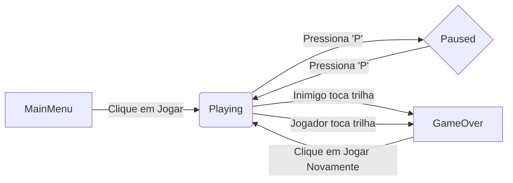
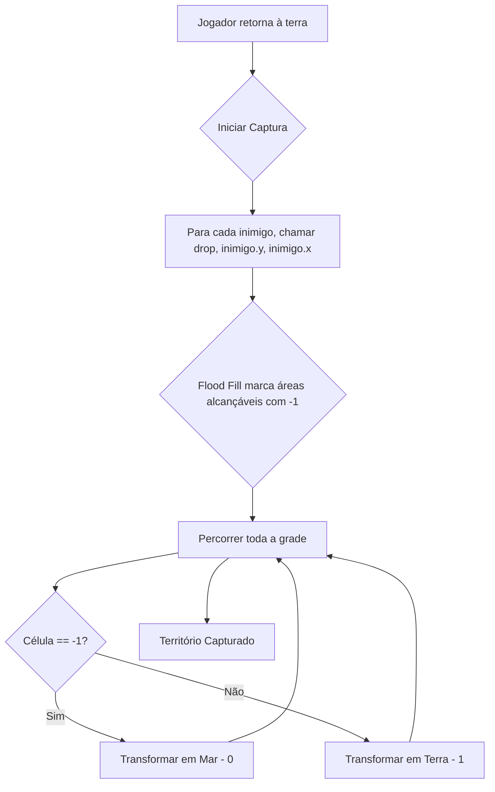

# Xonix

Este tutorial detalha a implementação do clássico jogo Xonix, uma fascinante mistura de ação e estratégia. Vamos explorar passo a passo como o jogo é construído, desde a estrutura básica até o algoritmo inteligente de captura de território, tornando-o um guia útil tanto para iniciantes quanto para desenvolvedores que buscam entender lógicas de jogos mais complexas.

## O que é Xonix?

Imagine um campo aberto (o "mar") com inimigos se movendo livremente. Você controla um cursor que começa na borda segura (a "terra"). Seu objetivo é se aventurar no mar para desenhar linhas e capturar novas porções de terra.

- **Captura de Território**: Você desenha uma trilha na área vazia. Ao retornar para a terra firme, a área que você cercou (e que não contém inimigos) é preenchida, tornando-se sua.
- **Inimigos**: Vários inimigos se movem pelo mar. Se eles tocarem sua trilha enquanto você a desenha, você perde.
- **Risco e Recompensa**: Quanto maior a área que você tenta capturar de uma vez, maior o risco, mas também maior a recompensa.

Este jogo ensina conceitos cruciais como manipulação de grades (arrays 2D), algoritmos de preenchimento (flood fill) e gerenciamento de estados.

## Como Organizar o Jogo

### Máquina de Estados do Jogo

Para gerenciar as diferentes telas e modos de jogo (menu, jogando, pausado, fim de jogo), usamos uma máquina de estados finitos. Isso nos ajuda a separar a lógica e manter o código organizado.

```cpp
enum GameState {
    MainMenu,
    Playing,
    Paused,
    GameOver
};

GameState gameState = MainMenu; // O jogo sempre começa no menu
```

O fluxo entre os estados é controlado pelas ações do jogador:



### A Estrutura de Dados Central: A Grade (`grid`)

O coração do Xonix é uma matriz 2D que representa o campo de jogo. Cada célula da grade pode ter um de quatro valores, cada um com um significado especial:

-   `grid[y][x] = 0`: Representa o "mar" – a área vazia e perigosa onde os inimigos se movem.
-   `grid[y][x] = 1`: Representa a "terra" – a área segura e já capturada. As bordas começam como terra.
-   `grid[y][x] = 2`: A trilha do jogador. Esta é a parte vulnerável que está sendo desenhada no mar.
-   `grid[y][x] = -1`: Um valor temporário usado exclusivamente pelo algoritmo de captura de território.

```cpp
const int M = 25; // Altura da grade
const int N = 40; // Largura da grade
int grid[M][N] = {0}; // Inicializa tudo como 0 (mar)
```

## As Principais Mecânicas do Jogo

### Movimento do Jogador e dos Inimigos

-   **Jogador**: Controlado pelas setas do teclado. Ao se mover a partir da terra (`1`) para o mar (`0`), ele deixa uma trilha de `2`s.
-   **Inimigos**: Cada inimigo (`Enemy`) tem uma posição e velocidade. Eles se movem em linha reta e ricocheteiam nas paredes (`grid == 1`), criando um movimento caótico e imprevisível.

```cpp
struct Enemy {
    int x, y, dx, dy; // Posição e velocidade

    void move() {
        x += dx;
        if (grid[y / ts][x / ts] == 1) { // Se bater na terra
            dx = -dx; // Inverte a direção horizontal
            x += dx;
        }
        y += dy;
        if (grid[y / ts][x / ts] == 1) { // Se bater na terra
            dy = -dy; // Inverte a direção vertical
            y += dy;
        }
    }
};
```

### Condições de Fim de Jogo

O jogo termina (estado `GameOver`) em duas situações:
1.  **Inimigo Colide com a Trilha**: Se um inimigo tocar uma célula com valor `2`.
2.  **Jogador Colide com a Própria Trilha**: Se o jogador, ao se mover, entrar em uma célula que já faz parte de sua trilha atual (valor `2`).

```cpp
// No loop de atualização do jogador
if (grid[y][x] == 2) gameState = GameOver;

// No loop de verificação de inimigos
for (int i = 0; i < enemyCount; i++)
    if (grid[a[i].y / ts][a[i].x / ts] == 2) gameState = GameOver;
```

### O Algoritmo de Captura de Território (Flood Fill)

Esta é a parte mais engenhosa do jogo. Quando o jogador retorna à terra firme (`grid == 1`), o jogo precisa decidir qual área será preenchida.

O processo ocorre em duas fases:

**Fase 1: Marcar as áreas dos inimigos**

O jogo usa um algoritmo de **flood fill** (preenchimento de área) para descobrir quais partes do "mar" são alcançáveis pelos inimigos.

1.  A função `drop(y, x)` é chamada para a posição de **cada inimigo**.
2.  Esta função é recursiva: se uma célula é mar (`0`), ela a marca como temporária (`-1`) e chama a si mesma para todos os vizinhos que também são mar.
3.  Ao final, todas as células do mar que um inimigo pode alcançar estarão marcadas com `-1`.

```cpp
void drop(int y, int x) {
    if (grid[y][x] == 0) grid[y][x] = -1; // Marca a célula
    // Chama recursivamente para os vizinhos
    if (y > 0 && grid[y - 1][x] == 0) drop(y - 1, x);
    if (y < M - 1 && grid[y + 1][x] == 0) drop(y + 1, x);
    if (x > 0 && grid[y][x - 1] == 0) drop(y, x - 1);
    if (x < N - 1 && grid[y][x + 1] == 0) drop(y, x + 1);
}
```

**Fase 2: Preencher a área capturada**

Após marcar as áreas dos inimigos, o jogo percorre toda a grade para tomar a decisão final:

```cpp
// Este loop é executado após a chamada de drop() para todos os inimigos
for (int i = 0; i < M; i++)
    for (int j = 0; j < N; j++)
        if (grid[i][j] == -1) grid[i][j] = 0; // Se foi alcançada por um inimigo, volta a ser mar
        else grid[i][j] = 1; // Caso contrário, torna-se terra firme!
```

Qualquer célula que **não** foi marcada com `-1` (ou seja, a trilha do jogador e qualquer porção do mar que ficou isolada dos inimigos) é convertida em terra (`1`).



## Estrutura do Código no `main.cpp`

O loop principal do jogo é organizado em torno da máquina de estados.

```cpp
int main() {
    // ... Inicialização de janela, texturas, fontes, etc. ...
    GameState gameState = MainMenu;

    while (window.isOpen()) {
        // ... Processamento de eventos (input do jogador) ...
        // A lógica de input muda com base no gameState (menu, jogo, etc.)

        // Lógica de atualização do jogo
        if (gameState == Playing) {
            // Mover jogador
            // Mover inimigos
            // Verificar colisões
            // Verificar se o jogador capturou uma área
        }

        // Lógica de renderização
        window.clear();
        if (gameState == MainMenu) {
            // Desenhar menu
        } else {
            // Desenhar a grade (terra, mar, trilha)
            // Desenhar jogador
            // Desenhar inimigos
            if (gameState == Paused) {
                // Desenhar texto "Pausado"
            }
            if (gameState == GameOver) {
                // Desenhar tela de "Game Over" e menu
            }
        }
        window.display();
    }
    return 0;
}
```

## Conceitos Importantes Aprendidos

-   **Manipulação de Grid 2D**: Como usar uma matriz para representar um mundo de jogo complexo com diferentes tipos de terreno.
-   **Algoritmo de Flood Fill**: Uma aplicação prática e poderosa de recursão para análise de áreas conectadas. É um algoritmo fundamental em muitos jogos e aplicações gráficas.
-   **Máquina de Estados Finitos**: Um padrão de design essencial para organizar o fluxo de um jogo, tornando o código mais limpo e fácil de gerenciar.
-   **Lógica de Risco vs. Recompensa**: O design do jogo incentiva o jogador a tomar decisões estratégicas, equilibrando o perigo de criar uma trilha longa com a vantagem de capturar mais território.

## Extensões Possíveis

O código atual é uma base excelente para adicionar novas funcionalidades:
-   **Sistema de Pontuação**: Adicionar pontos com base no tamanho da área capturada.
-   **Níveis e Dificuldade**: Aumentar o número ou a velocidade dos inimigos a cada nível.
-   **Vidas**: Permitir que o jogador perca mais de uma vez antes do "Game Over".
-   **Power-ups**: Itens que podem congelar os inimigos ou aumentar a velocidade do jogador temporariamente.
